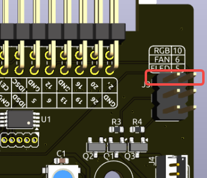

.. include:: /index.rst
   :start-after: start_hello_message
   :end-before: end_hello_message

Extension IO
================

LED RGB
------------

.. image:: img/io_board_rgb.png

La carte intègre 4 LED RGB WS2812 entièrement personnalisables. Vous pouvez les allumer/éteindre, modifier leur couleur, ajuster la luminosité, changer de mode d'affichage et régler la vitesse de transition.

* Pour allumer ou éteindre les LED RGB : ``true`` pour activer, ``false`` pour désactiver.

.. code-block:: shell

  sudo pironman5 -re true

* Pour changer la couleur, entrez une valeur hexadécimale, comme ``fe1a1a``.

.. code-block:: shell

  sudo pironman5 -rc fe1a1a

* Pour ajuster la luminosité (valeurs de 0 à 100 %) :

.. code-block:: shell

  sudo pironman5 -rb 100

* Pour changer le mode d'affichage des LED RGB, choisissez parmi : ``solid/breathing/flow/flow_reverse/rainbow/rainbow_reverse/hue_cycle`` :

.. note::

  Si vous utilisez les modes ``rainbow``, ``rainbow_reverse`` ou ``hue_cycle``, la commande ``pironman5 -rc`` ne permettra plus de définir une couleur fixe.

.. code-block:: shell

  sudo pironman5 -rs breathing

* Pour ajuster la vitesse de transition (0 à 100 %) :

.. code-block:: shell

  sudo pironman5 -rp 80

Broche de contrôle des LED RGB
-----------------------------------

Les LED RGB sont pilotées via SPI et connectées à **GPIO10**, qui correspond également à la broche MOSI. Les deux broches illustrées permettent de relier les LED RGB à GPIO10. Retirez le cavalier si vous ne souhaitez pas les utiliser.

Sortie RGB
-------------------------

.. image:: img/io_board_rgb_out.png

Les LED WS2812 supportent la connexion en série, ce qui permet d'ajouter un ruban LED RGB externe. Connectez la broche **SIG** à la broche **DIN** du ruban.

Par défaut, 4 LED RGB sont actives. Pour ajouter des LED supplémentaires et mettre à jour le nombre :

.. code-block:: shell

  sudo pironman5 --rgb-led-count [quantity]

Exemple :

.. code-block:: shell

  sudo pironman5 --rgb-led-count 12

Connecteur écran OLED
----------------------------

Le connecteur OLED utilise l'adresse 0x3C.

.. image:: img/io_board_oled.png

Si l'écran OLED n'affiche rien ou présente des erreurs, procédez aux vérifications suivantes :

Assurez-vous que la nappe FPC de l’écran est bien connectée.

#. Affichez les journaux d'exécution pour détecter d'éventuelles erreurs :

    .. code-block:: shell

        cat /var/log/pironman5/pm_auto.oled.log

#. Vérifiez que l’adresse i2c 0x3C est bien détectée :

    .. code-block:: shell
        
        sudo i2cdetect -y 1

#. Si aucune erreur n’est détectée, essayez de redémarrer le service pironman5 :

    .. code-block:: shell

        sudo systemctl restart pironman5.service

Déclencheur de Réveil
-------------------------

.. image:: img/io_board_vib.png

Le commutateur de vibration intégré est utilisé pour réveiller l'écran OLED du mode veille. Lorsqu'une vibration est détectée, un signal est envoyé pour réactiver l'OLED, permettant à l'affichage de rester éteint lorsqu'il est inactif et de se rallumer automatiquement lorsqu'un mouvement est détecté.

Si vous retirez le cavalier identifié pour le commutateur de vibration, la fonction de réveil sera désactivée. Une fois que l'OLED est entré en mode veille, il ne pourra plus se rallumer. Cette option est destinée aux utilisateurs avancés souhaitant réutiliser la broche GPIO correspondante pour d'autres applications.

.. note::

  Cavalier installé : le réveil par vibration est activé.

  Cavalier retiré : l'OLED ne peut pas être rallumé une fois éteint. La broche est libérée pour d'autres utilisations.

Récepteur infrarouge
---------------------------

.. image:: img/io_board_receiver.png

* **Modèle** : IRM-56384, fréquence 38 kHz  
* **Connexion** : relié à **GPIO13**  
* **D1** : témoin de réception infrarouge, clignote lors de la détection  
* **J8** : broche d’activation du récepteur IR. Par défaut, un cavalier est en place. Retirez-le si vous souhaitez libérer GPIO13.

Pour utiliser le récepteur IR, vérifiez la connexion et installez le module requis :

* Vérifiez la détection du périphérique :

  .. code-block:: shell

    sudo ls /dev |grep lirc

* Installez le module ``lirc`` :

  .. code-block:: shell

    sudo apt-get install lirc -y

* Lancez le test :

  .. code-block:: shell

    mode2 -d /dev/lirc0

* Appuyez sur une touche de la télécommande : le code correspondant s’affichera.

Connecteurs ventilateurs RGB
---------------------------------

La carte d’extension IO prend en charge jusqu’à deux ventilateurs 5V non-PWM. Les deux ventilateurs sont contrôlés simultanément.

**J4** et **J5** sont deux ensembles de ports pour ventilateurs. Vous devez y connecter les ventilateurs.

.. image:: img/io_board_fan.png

Il existe deux ensembles de connecteurs à 2 broches et deux cavaliers utilisés pour contrôler les ventilateurs RGB et leurs LED.  
Par défaut, les cavaliers sont placés sur ces broches, ce qui permet de piloter les ventilateurs et les LED via les GPIO6 et GPIO5.  
Si le fonctionnement des ventilateurs n’est pas nécessaire, ces cavaliers peuvent être retirés pour libérer les GPIO5 et GPIO6.

.. image:: img/io_board_fan_j9.png

Une fois les cavaliers retirés, les ventilateurs ou leurs LED seront éteints par défaut.  
Si une activation permanente est souhaitée, il est possible de souder un pont entre les deux pastilles situées en dessous.  
Une fois connectés, les ventilateurs/LED s’allumeront à la mise sous tension du système et s’éteindront à son extinction,  
mais ne pourront plus être contrôlés via le port IO.

.. image:: img/io_board_fan_hanpan.png

.. **D2** est un témoin d'activité du ventilateur.

.. .. image:: img/io_board_fan_d2.png

.. You can use command to configure the operating mode of the two RGB fans. These modes determine the conditions under which the RGB fans will activate.

Par exemple, en mode **1: Performance**, les ventilateurs s’activent à 50°C.

.. code-block:: shell

  sudo pironman5 -gm 3

* **4: Quiet** : activation à 70°C  
* **3: Balanced** : activation à 67,5°C  
* **2: Cool** : activation à 60°C  
* **1: Performance** : activation à 50°C  
* **0: Always On** : toujours allumés

Si vous utilisez une autre broche de contrôle pour les ventilateurs RGB, vous pouvez la modifier via cette commande :

.. code-block:: shell

  sudo pironman5 -gp 18

Broches GPIO
--------------

.. image:: img/io_board_pin_header.png

Deux connecteurs coudés étendent les GPIO du Raspberry Pi. Attention : le récepteur IR, les LED RGB et les ventilateurs occupent certaines broches. Retirez les cavaliers pour les réaffecter.

.. list-table:: 
  :widths: 25 25
  :header-rows: 1

  * - Pironman 5 MAX
    - Raspberry Pi 5
  * - Récepteur IR (optionnel)
    - GPIO13
  * - OLED SDA
    - SDA
  * - OLED SCL
    - SCL
  * - Ventilateur (optionnel)
    - GPIO6
  * - LED ventilateur (optionnel)
    - GPIO5  
  * - RGB (optionnel)
    - GPIO10
