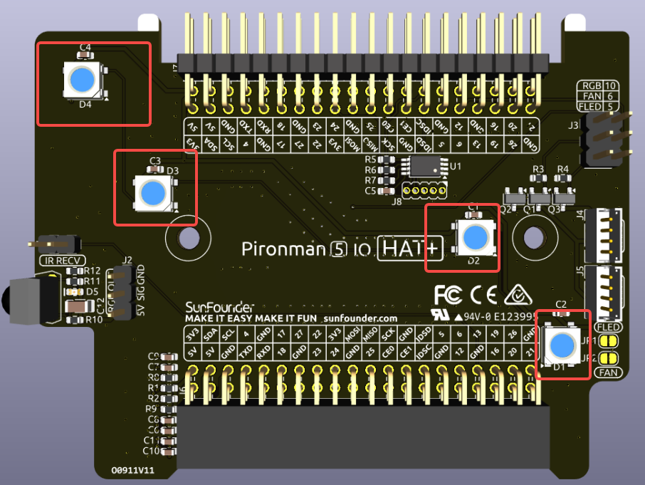
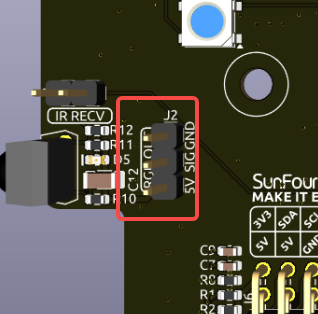
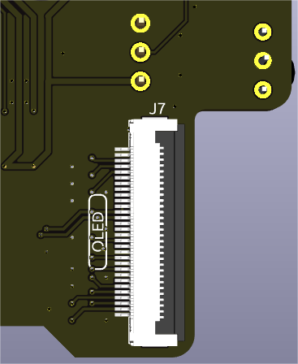
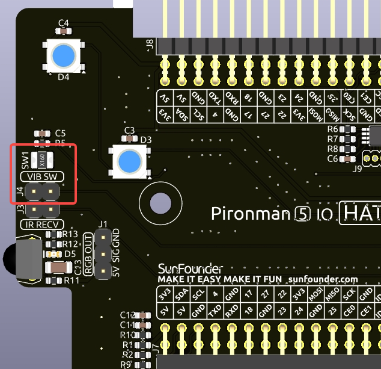
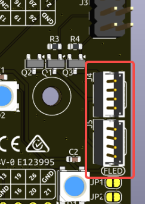
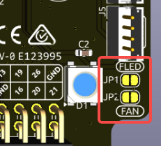
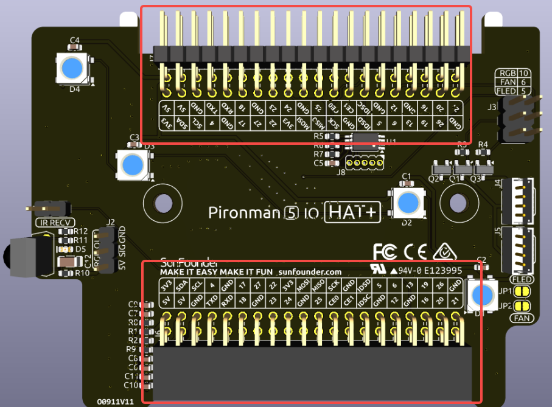

.. include:: /index.rst
   :start-after: start_hello_message
   :end-before: end_hello_message

IO Expander
================

RGB LEDs
------------

La placa cuenta con 4 LED RGB WS2812 totalmente personalizables. Los usuarios pueden encenderlos o apagarlos, cambiar el color, ajustar el brillo, seleccionar modos de visualización y modificar la velocidad de cambio.

* Para modificar el estado de encendido/apagado de los LED RGB, usa ``true`` para encenderlos y ``false`` para apagarlos:

.. code-block:: shell

  sudo pironman5 -re true

* Para cambiar el color, introduce los valores hexadecimales del color deseado, por ejemplo ``fe1a1a``:

.. code-block:: shell

  sudo pironman5 -rc fe1a1a

* Para ajustar el brillo de los LED RGB (rango: 0 ~ 100%):

.. code-block:: shell

  sudo pironman5 -rb 100

* Para cambiar el modo de visualización, selecciona entre: ``solid/breathing/flow/flow_reverse/rainbow/rainbow_reverse/hue_cycle``:

.. note::

  Si seleccionas los modos ``rainbow``, ``rainbow_reverse`` o ``hue_cycle``, no será posible cambiar el color mediante ``pironman5 -rc``.

.. code-block:: shell

  sudo pironman5 -rs breathing

* Para ajustar la velocidad de cambio (rango: 0 ~ 100%):

.. code-block:: shell

  sudo pironman5 -rp 80

RGB Control Pin
-------------------------

El LED RGB se controla por SPI y está conectado al **GPIO10**, que también funciona como pin MOSI de SPI. Los dos pines mostrados permiten la conexión del RGB al GPIO10. Si no se utiliza, se puede retirar el jumper.

  .. image:: img/io_board_rgb_pin.png

RGB OUT Pins
-------------------------

Los LED RGB WS2812 admiten conexión en serie, lo que permite conectar una tira LED RGB externa. Conecta el pin **SIG** al pin **DIN** de la tira para expansión.

La configuración predeterminada incluye 4 LED RGB. Para añadir más, conéctalos y actualiza la cantidad con:

.. code-block:: shell

  sudo pironman5 --rgb-led-count [quantity]

Ejemplo:

.. code-block:: shell

  sudo pironman5 --rgb-led-count 12

OLED Screen Connector
----------------------------

El conector para pantalla OLED tiene la dirección 0x3C y es una característica clave.

Si la pantalla OLED no se muestra correctamente, sigue estos pasos para solucionarlo:

Verifica que el cable FPC de la pantalla esté correctamente conectado.

#. Consulta los registros del programa para detectar errores:

    .. code-block:: shell

        cat /var/log/pironman5/pironman5.log

#. Alternativamente, verifica si la dirección I2C 0x3C de la OLED es reconocida:

    .. code-block:: shell

        sudo i2cdetect -y 1

#. Si no se encuentran problemas, intenta reiniciar el servicio pironman5:

    .. code-block:: shell

        sudo systemctl restart pironman5.service

Disparador de Activación
--------------------------

El interruptor de vibración incorporado se utiliza para activar la pantalla OLED desde el modo de suspensión. Cuando se detecta una vibración, se envía una señal para reactivar la OLED, lo que permite que la pantalla permanezca apagada cuando está inactiva y se active automáticamente al detectar movimiento.

Si se retira el puente (jumper) etiquetado para el interruptor de vibración, la función de activación se desactivará. Una vez que la OLED entre en modo de suspensión, ya no podrá activarse. Esta opción está pensada para usuarios avanzados que deseen reutilizar el pin GPIO correspondiente para otras aplicaciones.

.. note::

  Puente instalado: Activación por vibración habilitada.

  Puente retirado: La OLED no puede activarse una vez que se apaga. El pin queda libre para otros usos.

Infrared Receiver
---------------------------

.. image:: img/io_board_receiver.png

* **Modelo**: IRM-56384, opera a 38KHz.
* **Conexión**: El receptor IR se conecta a **GPIO13**.
* **D1**: Indicador que parpadea al recibir señal IR.
* **J8**: Pin de habilitación de la función IR. Por defecto, incluye un jumper para funcionamiento inmediato. Retíralo si deseas liberar GPIO13.

Para utilizar el receptor IR, asegúrate de su conexión e instala el módulo necesario:

* Verifica la conexión:

  .. code-block:: shell

    sudo ls /dev |grep lirc

* Instala el módulo ``lirc``:

  .. code-block:: shell

    sudo apt-get install lirc -y

* Prueba el receptor IR ejecutando:

  .. code-block:: shell

    mode2 -d /dev/lirc0

* Luego, pulsa un botón del control remoto y se imprimirá el código correspondiente.

RGB Fan Pins
---------------

La placa de expansión IO admite hasta dos ventiladores de 5V sin control CPU, que se controlan de forma conjunta.

**J4** y **J5** son dos conjuntos de puertos para ventiladores. Debe conectar los ventiladores aquí.

Hay dos juegos de conectores de 2 pines y dos jumpers que controlan los ventiladores GPIO y sus LED. 
Por defecto, los jumpers permiten el control a través de **GPIO6** y **GPIO5**. Si no se requieren, retira los jumpers para liberar los GPIO.

.. image:: img/io_board_fan_j9.png

Al retirar los jumpers, el ventilador o sus LED se apagarán por defecto. 
Si deseas que se activen al encender el sistema, puedes puentear las almohadillas con soldadura. 
De esta forma, se encenderán con el sistema, pero no se podrán controlar desde el puerto IO.

.. **D2** es un indicador que se ilumina cuando el ventilador está en funcionamiento.

.. .. image:: img/io_board_fan_d2.png

.. Puedes usar comandos para configurar el modo de funcionamiento de los ventiladores GPIO, determinando la temperatura de activación.

Por ejemplo, en modo **1: Performance**, los ventiladores se activan a 50 °C:

.. code-block:: shell

  sudo pironman5 -gm 3

* **4: Quieto**: Activación a 70 °C.
* **3: Equilibrado**: Activación a 67.5 °C.
* **2: Fresco**: Activación a 60 °C.
* **1: Rendimiento**: Activación a 50 °C.
* **0: Siempre encendidos**: Funcionan continuamente.

Si cambias el pin de control del ventilador GPIO a otro en la Raspberry Pi, usa este comando para actualizar el número de pin:

.. code-block:: shell

  sudo pironman5 -gp 18

Pin Headers
--------------

Dos conectores de pines en ángulo recto extienden el GPIO de la Raspberry Pi, pero ten en cuenta que el receptor IR, el LED RGB y el ventilador utilizan algunos pines. Retira sus jumpers correspondientes para liberar esos pines.

.. list-table:: 
  :widths: 25 25
  :header-rows: 1

  * - Pironman 5 MAX
    - Raspberry Pi 5
  * - IR Receiver(Optional)
    - GPIO13
  * - OLED SDA
    - SDA
  * - OLED SCL
    - SCL
  * - FAN(Optional)
    - GPIO6
  * - FLED(Optional)
    - GPIO5  
  * - RGB(Optional)
    - GPIO10
