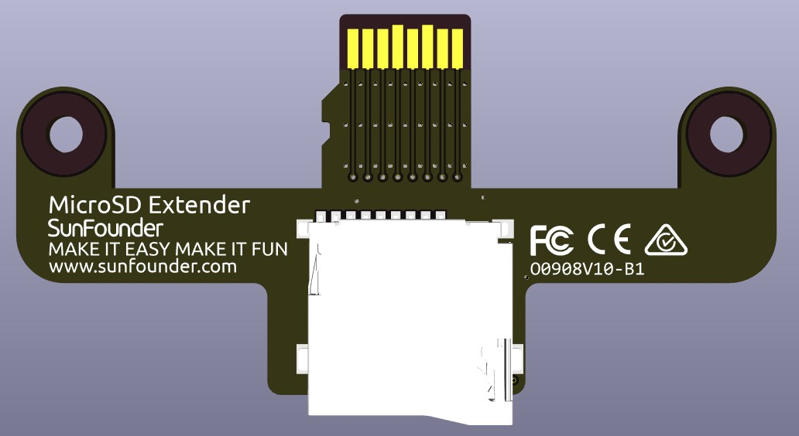

.. note:: 

    Ciao, benvenuto nella community Facebook degli appassionati di Raspberry Pi, Arduino ed ESP32 targata SunFounder! Approfondisci le tue conoscenze su Raspberry Pi, Arduino ed ESP32 insieme ad altri appassionati come te.

    **Perché unirsi?**

    - **Supporto esperto**: Risolvi problemi post-vendita e difficoltà tecniche con l’aiuto della nostra community e del nostro team.
    - **Impara e condividi**: Condividi suggerimenti e tutorial per migliorare le tue competenze.
    - **Anteprime esclusive**: Ottieni accesso anticipato a nuovi annunci di prodotto e anteprime esclusive.
    - **Sconti speciali**: Approfitta di sconti esclusivi sui nostri prodotti più recenti.
    - **Promozioni festive e giveaway**: Partecipa a promozioni festive e concorsi a premi.

    👉 Pronto a esplorare e creare con noi? Clicca su [|link_sf_facebook|] ed entra nella community oggi stesso!

Estensore MicroSD
======================

Si tratta di una scheda di espansione per schede Micro SD, che consente di estendere all’esterno lo slot MicroSD del Raspberry Pi e integra uno slot con meccanismo a molla per facilitare l’inserimento e la rimozione della scheda.

