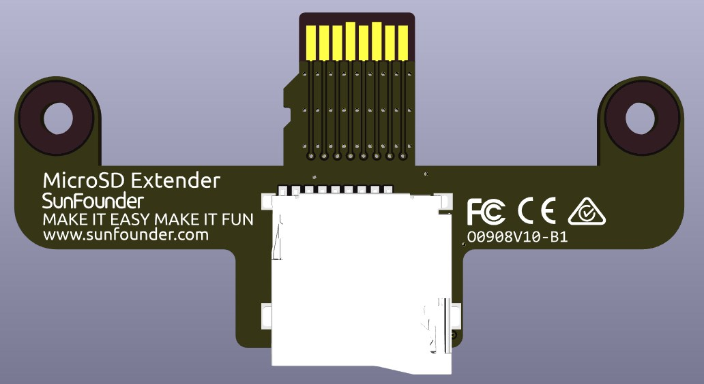

.. include:: /index.rst
   :start-after: start_hello_message
   :end-before: end_hello_message

MicroSD-Erweiterung
========================

Dies ist ein MicroSD-Karten-Erweiterungsboard, das den MicroSD-Kartensteckplatz des Raspberry Pi nach außen verlängert und einen federbelasteten Steckplatz hinzufügt.

