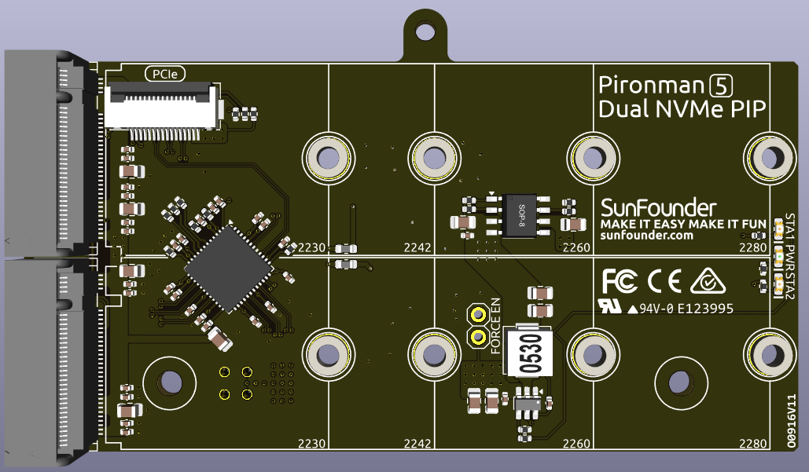
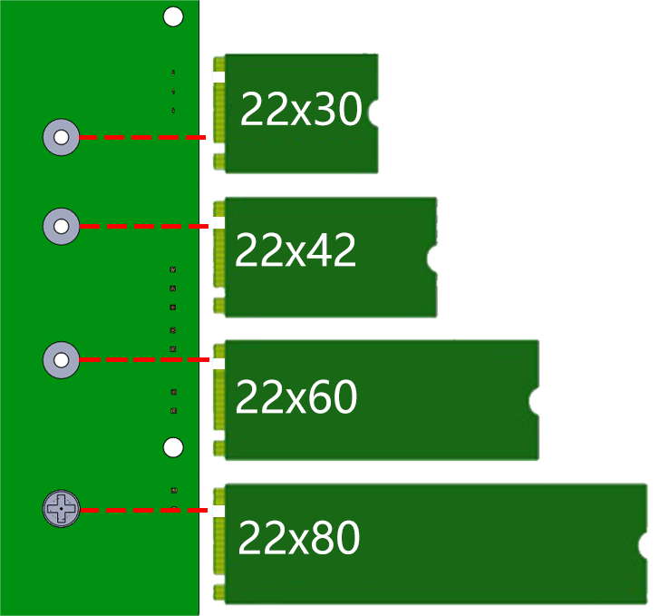

.. note:: 

    Hallo, willkommen in der SunFounder Raspberry Pi & Arduino & ESP32 Enthusiasten-Community auf Facebook! Tauche tiefer in die Welt von Raspberry Pi, Arduino und ESP32 ein und tausche dich mit anderen Enthusiasten aus.

    **Warum beitreten?**

    - **Expertensupport**: Löse nach dem Kauf auftretende Probleme und technische Herausforderungen mit Hilfe unserer Community und unseres Teams.
    - **Lernen & Teilen**: Tausche Tipps und Tutorials aus, um deine Fähigkeiten zu verbessern.
    - **Exklusive Einblicke**: Erhalte frühzeitigen Zugang zu neuen Produktankündigungen und exklusiven Vorschauen.
    - **Sonderrabatte**: Profitiere von exklusiven Rabatten auf unsere neuesten Produkte.
    - **Festliche Aktionen und Verlosungen**: Nimm an Verlosungen und saisonalen Sonderaktionen teil.

    👉 Bereit, mit uns zu entdecken und zu kreieren? Klicke auf [|link_sf_facebook|] und werde noch heute Mitglied!

Dual NVMe PIP
=====================

Das **Dual NVMe PIP** (PCIe-Peripherie-Board), wie von der Raspberry Pi Foundation definiert, ist ein PCIe-Adapter, der speziell für NVMe-SSDs entwickelt wurde.  

Die PCIe-Schnittstelle des Raspberry Pi 5 bietet nativ eine einzelne **Gen2 x1**-Lane (500 MB/s). Durch die Integration des **ASM1182e** PCIe-Switch-Chips erweitert das Dual NVMe PIP diese auf **zwei unabhängige Gen2 x1-Lanes**, sodass du Folgendes anschließen kannst:

* **Zwei M.2 NVMe-SSDs**, oder
* **Eine M.2 NVMe-SSD + einen M.2 Hailo-8/8L KI-Beschleuniger**

**Wichtige Hinweise**:

* Gen3 wird nicht unterstützt  
* Unterstützt NVMe-SSD-Größen: **2230**, **2242**, **2260**, **2280** (alle in M.2-M-Key-Slots)

* Das Board wird über ein 16P-0,5mm-Reverse-FFC- (Flexible Flat Cable) oder ein kundenspezifisches impedanzangepasstes FPC- (Flexible Printed Circuit) Kabel angeschlossen.  
* **STA**: Status-LED-Anzeige.  
* **PWR**: Power-LED-Anzeige.  
* Die integrierte 3,3V-Stromversorgung kann bis zu 3A Ausgang unterstützen. Da die PCIe-Schnittstelle des Raspberry Pi jedoch auf 5V/1A Ausgang (entspricht 5W) begrenzt ist, kann zusätzliche Leistung für 3,3V/3A über den J3-Anschluss von einer 5V-Quelle bereitgestellt werden.  
* **FORCE ENABLE**: Die integrierte Stromversorgung wird durch das Schaltsignal der PCIe-Schnittstelle aktiviert. Nachdem der Raspberry Pi eingeschaltet ist, sendet er ein Signal, um die 3,3V-Stromversorgung einzuschalten. Falls einige Systeme das Schaltsignal nicht unterstützen oder aus anderen Gründen, kannst du J4 FORCE ENABLE durch das Löten eines Drahtes zwischen den beiden offenen Pads überbrücken, um die integrierte 3,3V-Stromversorgung dauerhaft für die NVMe zu aktivieren.

Über das Modell
---------------------------

M.2-SSDs, die für ihre kompakte Größe bekannt sind, gibt es in verschiedenen Typen, die hauptsächlich durch ihre Keying-Form (Riegel-Design am Anschluss) und die verwendete Schnittstelle unterschieden werden. Hier sind die wichtigsten Typen:

* **M.2 SATA SSDs**: Diese verwenden die SATA-Schnittstelle, ähnlich wie 2,5-Zoll SATA-SSDs, aber im kleineren M.2-Formfaktor. Sie sind durch die SATA-III-Maximalgeschwindigkeiten von etwa 600 MB/s begrenzt. Diese SSDs sind mit M.2-Steckplätzen kompatibel, die für B- und M-Keys vorgesehen sind.
* **M.2 NVMe SSDs**: Diese SSDs verwenden das NVMe-Protokoll über PCIe-Lanes und sind deutlich schneller als M.2 SATA-SSDs. Sie eignen sich für Anwendungen, die hohe Lese-/Schreibgeschwindigkeiten erfordern, wie Gaming, Videobearbeitung und datenin­ten­sive Aufgaben. Diese SSDs benötigen in der Regel M-Key-Steckplätze. Diese Laufwerke nutzen die PCIe (Peripheral Component Interconnect Express)-Schnittstelle, mit verschiedenen Versionen wie 3.0, 4.0 und 5.0. Jede neue Version von PCIe verdoppelt die Datenübertragungs­geschwindigkeit im Vergleich zur vorherigen. Der Raspberry Pi 5 verwendet jedoch eine PCIe 3.0-Schnittstelle, die Übertragungsgeschwindigkeiten von bis zu 3.500 MB/s liefern kann.

M.2-SSDs gibt es in drei Haupttypen: B-Key, M-Key und B+M-Key. Später wurde der B+M-Key eingeführt, der die Funktionen des B-Keys und M-Keys kombiniert. Dadurch ersetzte er den eigenständigen B-Key. Siehe das Bild unten.

.. image:: img/ssd_key.png

Im Allgemeinen sind M.2 SATA-SSDs B+M-keyed (können in Steckplätze für B-Key- und M-Key-Module eingesetzt werden), während M.2 NVMe-SSDs für PCIe 3.0 x4-Lanes M-keyed sind.

.. image:: img/ssd_model2.png

Über die Länge
-----------------------

M.2-Module gibt es in verschiedenen Größen und sie können auch für Wi-Fi, WWAN, Bluetooth, GPS und NFC verwendet werden.

Der Pironman 5 MAX unterstützt vier NVMe M.2 SSD-Größen (PCIe Gen 2.0 / PCIe Gen 3.0), basierend auf ihren Namen: 2230, 2242, 2260 und 2280. Die "22" ist die Breite in Millimetern (mm), und die beiden folgenden Zahlen sind die Länge. Je länger das Laufwerk, desto mehr NAND-Flash-Chips können montiert werden; daher steigt die Kapazität.

