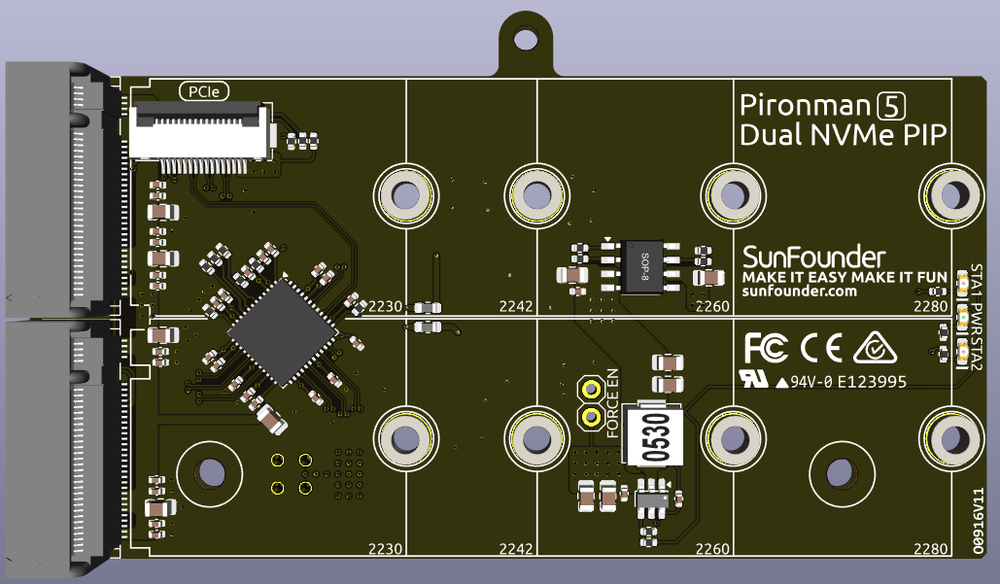
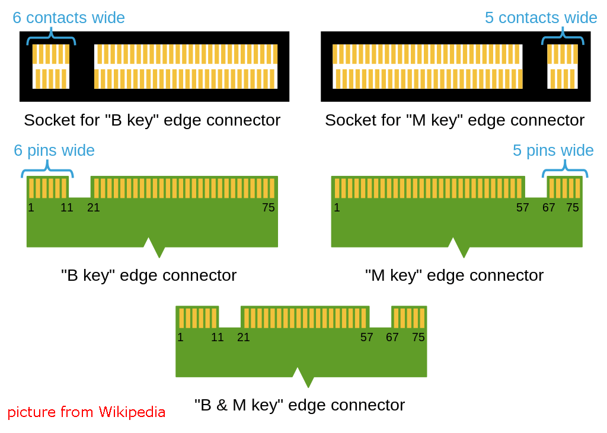

.. include:: /index.rst
   :start-after: start_hello_message
   :end-before: end_hello_message

Dual Pi5 NVMe PIP
=====================

Il **Dual NVMe PIP** (Scheda Periferica PCIe), come definito dalla Raspberry Pi Foundation, è un adattatore PCIe progettato specificamente per unità a stato solido NVMe.

L’interfaccia PCIe del Raspberry Pi 5 offre nativamente una singola corsia **Gen2 x1** (500 MB/s). Integrando il chip switch PCIe **ASM1182e**, il Dual NVMe PIP la espande in **due corsie Gen2 x1 indipendenti**, permettendoti di collegare:

* **Due SSD NVMe M.2**, oppure
* **Un SSD NVMe M.2 + un acceleratore AI M.2 Hailo-8/8L**

**Note Importanti**:

* Gen3 non è supportato  
* Supporta formati di SSD NVMe: **2230**, **2242**, **2260**, **2280** (tutti negli slot M.2 M-key)

* La scheda si collega tramite un cavo FFC (Flexible Flat Cable) inverso a 16 pin 0,5mm o un cavo FPC (Flexible Printed Circuit) personalizzato con impedenza abbinata.  
* **STA**: Indicatore LED di stato.  
* **PWR**: Indicatore LED di alimentazione.  
* L’alimentazione integrata da 3,3V può supportare fino a 3A in uscita. Tuttavia, poiché l’interfaccia PCIe del Raspberry Pi è limitata a fornire 5V/1A in uscita (equivalente a 5W), un’alimentazione supplementare per l’uso a 3,3V/3A può essere fornita tramite il connettore J3 da una fonte a 5V.  
* **FORCE ENABLE**: L’alimentazione integrata è attivata dal segnale di switch dell’interfaccia PCIe. Dopo l’accensione del Raspberry Pi, questo invia un segnale per attivare l’alimentazione a 3,3V. Se alcuni sistemi non supportano il segnale di switch o per altri motivi, puoi cortocircuitare J4 FORCE ENABLE saldando un filo tra i due pad flottanti per forzare l’alimentazione a 3,3V integrata a fornire energia all’NVMe.

Informazioni sul modello
---------------------------

Gli SSD M.2, noti per le loro dimensioni compatte, si distinguono principalmente per il tipo di chiave (tacca sul connettore) e per l’interfaccia utilizzata. Ecco i principali tipi:

* **SSD M.2 SATA**: Utilizzano l’interfaccia SATA, come gli SSD SATA da 2,5", ma nel formato più compatto M.2. Le prestazioni sono limitate alla velocità massima SATA III di circa 600 MB/s. Questi SSD sono compatibili con slot M.2 con chiavi B e M.
* **SSD M.2 NVMe**: Utilizzano il protocollo NVMe su linee PCIe e offrono prestazioni significativamente superiori rispetto agli SSD M.2 SATA. Ideali per applicazioni che richiedono alte velocità di lettura/scrittura, come gaming, editing video e carichi di lavoro intensivi. Richiedono tipicamente slot con chiave M. Questi SSD usano l’interfaccia PCIe (Peripheral Component Interconnect Express), disponibile in versioni come 3.0, 4.0 e 5.0. Ogni versione raddoppia la velocità rispetto alla precedente. Il Raspberry Pi 5 utilizza l’interfaccia PCIe 3.0, in grado di raggiungere velocità di trasferimento fino a 3.500 MB/s.

Gli SSD M.2 sono disponibili in tre versioni di chiave: B, M e B+M. In seguito è stato introdotto lo standard B+M, che unisce le funzionalità di entrambe le chiavi, sostituendo di fatto la chiave B singola. Vedi immagine seguente:

In genere, gli SSD M.2 SATA hanno chiave B+M (compatibili con slot B o M), mentre gli SSD M.2 NVMe per PCIe 3.0 x4 utilizzano la chiave M.

.. image:: img/ssd_model2.png

Informazioni sulla lunghezza
----------------------------------------

I moduli M.2 esistono in diverse dimensioni e possono essere utilizzati anche per Wi-Fi, WWAN, Bluetooth, GPS e NFC.

Pironman 5 MAX supporta quattro formati di SSD M.2 NVMe (PCIe Gen 2.0 / Gen 3.0): 2230, 2242, 2260 e 2280. Il numero “22” indica la larghezza in millimetri (mm), mentre i numeri successivi rappresentano la lunghezza. Maggiore è la lunghezza, maggiore è lo spazio disponibile per i chip di memoria NAND e, di conseguenza, maggiore è la capacità.

.. image:: img/m2_ssd_size.png
  :width: 600

