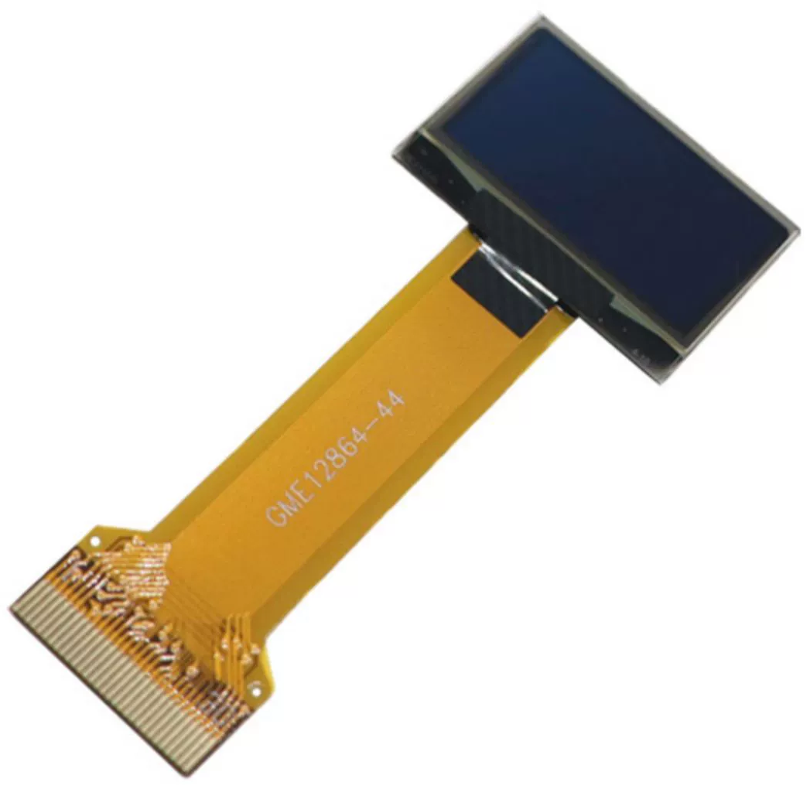

.. include:: /index.rst
   :start-after: start_hello_message
   :end-before: end_hello_message

Écran OLED
===================

* **Taille** : 0,96''  
* **Technologie** : OLED PM  
* **Couleur** : Blanc  
* **Contrôleur** : SSD1306  
* **Tension** : 3,3 V  
* **Résolution** : 128 × 64  
* **Zone d’affichage** : 21,74 × 10,86 mm  
* **Dimensions du panneau** : 26,70 × 19,26 × 1,42 mm  
* **Pas de pixel** : 0,17 × 0,17 mm  
* **Taille du pixel** : 0,154 × 0,154 mm  
* **Angle de vue** : Grand angle / Vue complète  
* **Température de fonctionnement** : -20 ~ 70 °C  
* **Méthode de communication** : IIC / SPI / Parallèle  
* **Méthode de connexion** : FPC à insertion, pas de 0,5 mm  

