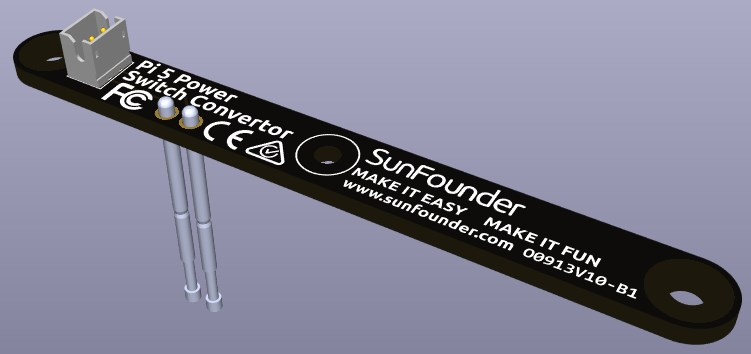

.. include:: /index.rst
   :start-after: start_hello_message
   :end-before: end_hello_message

Convertitore Interruttore di Alimentazione
===============================================

Questo modulo consente di estendere all’esterno il pulsante di accensione del Raspberry Pi 5.

**Aggiunta del pulsante di accensione**

* Il Raspberry Pi 5 è dotato di un jumper **J2**, situato tra il connettore della batteria RTC e il bordo della scheda. Questo connettore consente di collegare un pulsante di accensione personalizzato utilizzando un interruttore momentaneo normalmente aperto (NO) sui due pad. Una breve pressione del pulsante simula la funzionalità del pulsante di accensione integrato.

   .. image:: img/pi5_j2.jpg

* Sul Pironman 5 è presente un **Convertitore Interruttore di Alimentazione** che estende il jumper **J2** a un pulsante esterno tramite due pin Pogo.

   .. image:: img/power_switch_convertor.png

* Ora è possibile accendere e spegnere il Raspberry Pi 5 utilizzando il pulsante di accensione.

   .. image:: img/pironman_button.JPG

**Ciclo di alimentazione**

Quando accendi per la prima volta il Raspberry Pi 5, si avvierà automaticamente e caricherà il sistema operativo senza la necessità di premere alcun pulsante.

Se utilizzi il sistema Raspberry Pi Desktop, una breve pressione del pulsante di accensione avvierà la procedura di spegnimento sicuro. Apparirà un menu con le opzioni per spegnere, riavviare o disconnettere l’utente. Selezionando un’opzione o premendo nuovamente il pulsante si procederà con lo spegnimento sicuro.

.. image:: img/button_shutdown.png

**Spegnimento**

    * Se utilizzi il sistema **Raspberry Pi OS Desktop**, puoi premere due volte rapidamente il pulsante per spegnere.
    * Se utilizzi il sistema **Raspberry Pi OS Lite** senza interfaccia grafica, una singola pressione avvierà lo spegnimento.
    * Per forzare lo spegnimento immediato, tieni premuto il pulsante di accensione.

**Accensione**

    * Se la scheda Raspberry Pi è spenta ma ancora alimentata, una singola pressione riattiverà il dispositivo.

.. note::

    Se stai utilizzando un sistema che non supporta il pulsante di spegnimento, puoi tenere premuto per 5 secondi per forzare lo spegnimento immediato e premere una volta per riaccendere da stato spento.

