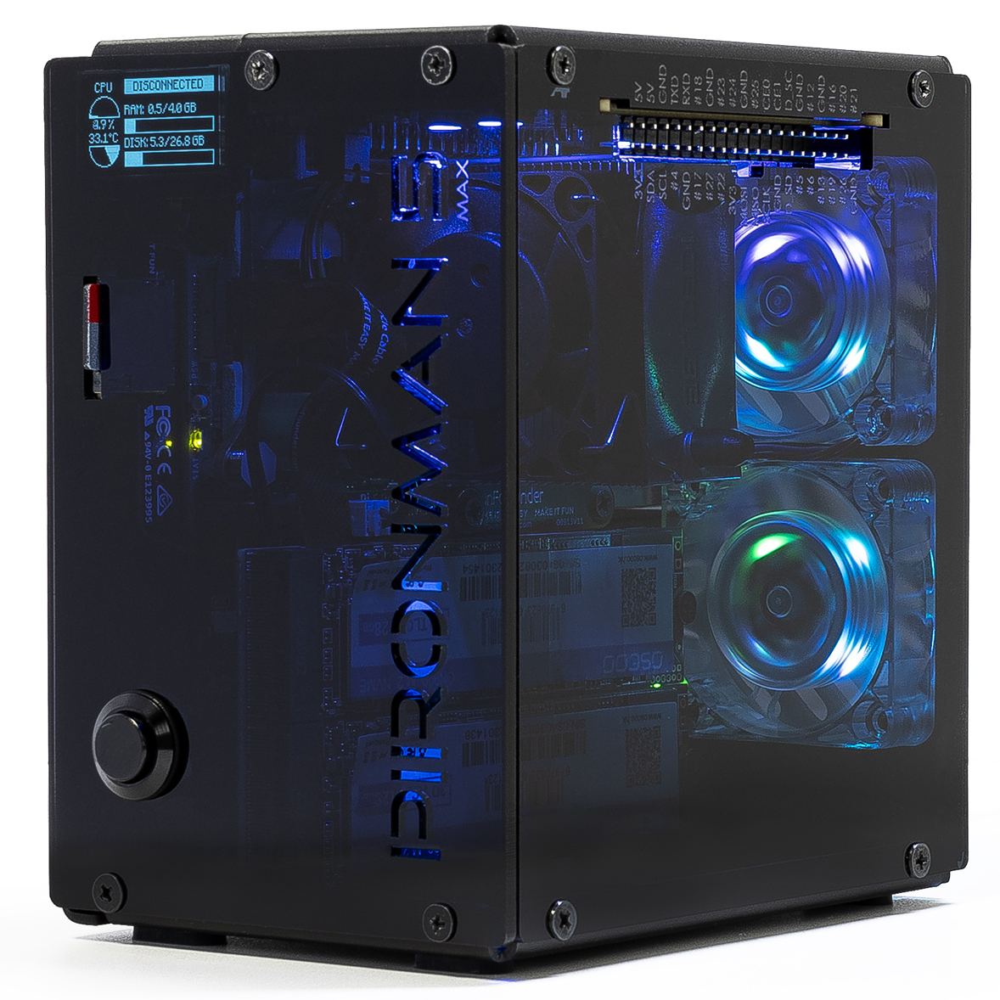

.. note::

    Hello, welcome to the SunFounder Raspberry Pi & Arduino & ESP32 Enthusiasts Community on Facebook! Dive deeper into Raspberry Pi, Arduino, and ESP32 with fellow enthusiasts.

    **Why Join?**

    * **Expert Support**: Solve post-sale issues and technical challenges with help from our community and team.
    * **Learn & Share**: Exchange tips and tutorials to enhance your skills.
    * **Exclusive Previews**: Get early access to new product announcements and sneak peeks.
    * **Special Discounts**: Enjoy exclusive discounts on our newest products.
    * **Festive Promotions and Giveaways**: Take part in giveaways and holiday promotions.

    👉 Ready to explore and create with us? Click [|link_sf_facebook|] and join today!

.. _intro_pironman5_max:

Pironman 5 MAX
================================================================================

Thanks for choosing our |link_pironman5_max|.

    
Take your Raspberry Pi 5 to the next level with |link_pironman5_max|, a high-end aluminum case engineered for performance, cooling, and expansion. Perfect for NAS, AI, media centers, and advanced projects.

**Key Features**:

* **Dual NVMe & AI Expansion**: PCIe Gen 2 switch with two M.2 M-key slots (2230/2242/2260/2280) for SSDs or AI accelerators. Fully compatible with Hailo-8/8L.
* **Extreme Cooling**: Tower cooler with PWM fan plus two RGB fans, keeping a 100% load Pi at just 39°C in a 25°C room.
* **Smart OLED Display**: Real-time CPU, memory, temperature, disk usage, IP address, and more. Tap to wake with built-in vibration sensor.
* **Customizable RGB Lighting**: Four WS2812 addressable LEDs light up your setup with vibrant effects.
* **Enhanced Connectivity**: Dual standard HDMI ports, IR receiver for media apps, safe retro-style power button, and labeled external GPIO extender.
* **Premium Build**: Durable aluminum chassis with dark acrylic side panel and spring-loaded card slot for easy access.
* **Flexible Configurations**: RAID 0/1 NAS, SSD + AI combo, or dual AI accelerators for heavy AI workloads.

.. note::

  It is recommended to use the official 27W power supply or |link_sf_27w_supply| for the Pironman 5 series products to avoid insufficient power supply, which may cause the Raspberry Pi 5 to reboot.

.. raw:: html

    

.. toctree::
    :maxdepth: 1

    About this Kit <self>
    what_do_we_need    
    assembly_instructions
    install/install_the_os
    set_up/set_up_pironman5
    control/control_pironman5
    advanced/advanced
    optional_modules/optional_modules
    home_server/home_server
    compitable_nvme_ssd
    faq

**Parameters**

* Dimension: 111.9 x 78.5 x 117mm (with tower cooler)
* Material
    * Main Body: Dark Aluminum Alloy
    * Two Side Panels: Dark Acrylic
* Support Platform: Raspberry Pi 5
* Power Input: USB Type C, 5V/5A or official 27W supply
* Interfaces
    * Raspberry Pi standard 40-Pin GPIO (with external GPIO extender and pin labels)
    * Micro SD socket with spring-loaded card slot
    * USB Type C power input
    * 2 x USB 2.0
    * 2 x USB 3.0
    * Gigabit LAN port
    * 2 x Standard HDMI Ports
* Cooling System
    * 1 x Tower Cooler with PWM Fan (system controlled)
    * 2 x RGB Fans (GPIO controlled)
* Display
    * 0.96" OLED Display (CPU, RAM, temperature, disk usage, IP address)
    * Built-in vibration switch to wake display by tapping the case
* Storage & Expansion
    * Integrated PCIe Gen 2 Switch
    * 2 x PCIe 2.0 M.2 M key slots for NVMe SSDs or AI accelerators
    * Supports M.2 sizes: 2230, 2242, 2260, 2280
* Lighting & Control
    * 4 x WS2812 Addressable RGB LEDs
    * IR Receiver for multimedia center applications (e.g., Kodi, Volumio)
    * Retro-style Metal Power Button for safe shutdown
* Build
    * Aluminum Alloy main body with Dark Acrylic side panels
    * Premium design with enhanced durability and aesthetics

