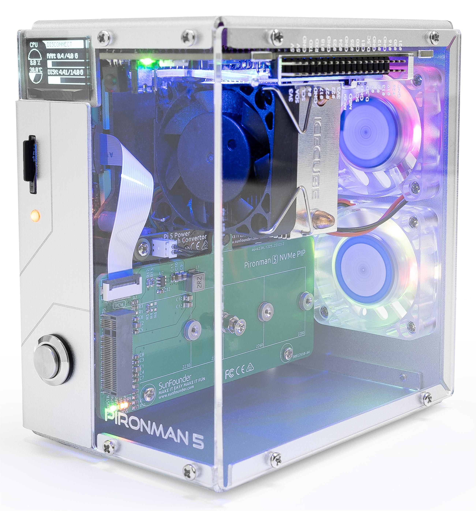

.. note::

    Hello, welcome to the SunFounder Raspberry Pi & Arduino & ESP32 Enthusiasts Community on Facebook! Dive deeper into Raspberry Pi, Arduino, and ESP32 with fellow enthusiasts.

    **Why Join?**

    - **Expert Support**: Solve post-sale issues and technical challenges with help from our community and team.
    - **Learn & Share**: Exchange tips and tutorials to enhance your skills.
    - **Exclusive Previews**: Get early access to new product announcements and sneak peeks.
    - **Special Discounts**: Enjoy exclusive discounts on our newest products.
    - **Festive Promotions and Giveaways**: Take part in giveaways and holiday promotions.

    👉 Ready to explore and create with us? Click [|link_sf_facebook|] and join today!

Pironman 5 MAX - NVMe M.2 SSD PCIe Mini PC Case for Raspberry Pi 5
================================================================================

Thanks for choosing our Pironman 5 MAX.

The Pironman 5 Max is the new flagship product in our Pironman Raspberry Pi case series, 
exclusively compatible with the latest Raspberry Pi 5. 

A standout feature of the Pironman 5 Max is its dual transparent sides, 
reminiscent of a PC case, combined with RGB LEDs and two RGB fans, 
adding an impressive flair to the product. 
It includes an OLED screen that displays basic information about the Raspberry Pi, 
and has expanded features such as power on/off buttons and status indicators. 
The micro HDMI port has been converted to a standard HDMI port for more common use, 
and the power and HDMI ports have been relocated to the same side as the Raspberry Pi’s USB ports, 
enhancing the aesthetics of the wiring. Equipped with three fans and a tower-style heatsink, 
it greatly assists in reducing the high temperatures of the Raspberry Pi 5. 

The case integrates a PCIe Gen 2 Switch with two M.2 M key PCIe slots supporting 2230, 
2242, 2260, and 2280, allowing the installation of two NVMe Gen2 SSDs or AI accelerators. 
Users can set up two NVMe SSDs in software RAID 0 or RAID 1 for NAS configurations; 
combine one AI accelerator and one NVMe SSD to boost AI performance; 
or use two AI accelerators for even stronger AI capabilities. 
Additionally, GPIO expansion is provided for convenient extension of the Raspberry Pi’s functionality.

.. .. note::

..     This document is available in the following languages.

..     * |link_german_tutorials|
..     * |link_jp_tutorials|
..     * |link_en_tutorials|
..     * |link_fr_tutorials|
..     * |link_es_tutorials|
..     * |link_it_tutorials|
    
..     Please click on the respective links to access the document in your preferred language.

    

Elevate your Raspberry Pi 5 with the |link_pironman5|, our top-tier case designed for unmatched style and functionality. It's the perfect blend of aesthetics and performance:

* Raspberry Pi 5 mini PC
* 0.96" OLED Display showing Raspberry Pi's CPU usage, temperature, disk usage, IP address, RAM usage etc.
* With a built-in vibration switch, tapping the case gently wakes up the OLED display.
* Tower cooler can cool a 100% CPU load Pi to 39°C at 25°C room temperature
* 2 RGB Fans, with GPIO control
* 1 PWM Fan on the Tower Cooler is controlled by the Raspberry Pi system.
* Integrated PCIe Gen 2 Switch with two M.2 M key PCIe interfaces, which can install two NVMe Gen2 solid-state drives or AI accelerators.
* Supports four (PCIe Gen 2.0) NVMe M.2 SSD sizes: 2230, 2242, 2260, and 2280.
* 4 WS2812 Addressable RGB LED light up the whole case with cool light effect
* IR Receiver for multi-media center like Kodi or Volumio
* Retro metal power button for safe shut down
* External GPIO extender with pin name label, for easy access
* Equipped with a spring-loaded socket for easy card removal
* Aluminum main body with dark Acrylic side panel
* Features two standard HDMI ports

The |link_pironman5| is not just a case; it's an upgrade that transforms your Raspberry Pi 5 into a powerful, efficient, and stylish device. Get yours now and experience the future of Raspberry Pi cases!

.. note::

    You need to install an OS that supports Raspberry Pi 5. Please use the latest Raspberry Pi Imager tool for system installation. The currently tested systems are:

   .. image:: install/img/compitable_os.png

If you have any questions, please send an email to service@sunfounder.com and we will respond as soon as possible.

.. raw:: html

    

.. toctree::
    :maxdepth: 1

    About this Kit <self>
    what_do_we_need    
    assembly_instructions
    install/install_the_os
    omv
    set_up/set_up_pironman5
    control/control_pironman5
    advanced/advanced
    compitable_nvme_ssd
    faq

**Copyright Notice**

All contents including but not limited to texts, images, and code in this manual are owned by the SunFounder Company. You should only use it for personal study,investigation, enjoyment, or other non-commercial or nonprofit purposes, under therelated regulations and copyrights laws, without infringing the legal rights of the author and relevant right holders. For any individual or organization that uses these for commercial profit without permission, the Company reserves the right to take legal action.

