.. _max_omv_5_max: 

(Facoltativo) Configurazione di OpenMediaVault
====================================================

.. warning::

   OpenMediaVault **non supporta** l'installazione sul sistema operativo desktop di Raspberry Pi.

   Assicurati di aver installato il sistema operativo corretto e di aver configurato la rete.
   La procedura è coerente con :ref:`max_install_os_sd_rpi`, ma quando selezioni l'immagine, scegli Raspberry Pi OS Lite da Raspberry Pi OS (altri).

   .. image:: img/omv/omv-install-1.png

OpenMediaVault (abbreviato OMV) è un sistema operativo NAS (Network Attached Storage) open-source basato su Debian Linux, progettato per ambienti domestici e piccoli uffici, con l’obiettivo di semplificare la gestione dello storage e offrire ricche funzionalità di rete.

Segui questi passaggi per installare OpenMediaVault sul tuo Raspberry Pi:

1. Connessione al Raspberry Pi tramite SSH
-----------------------------------------------------------

   Inserisci il seguente comando nel terminale:

   .. code-block:: bash

      ssh pi@raspberrypi.local

   Se utilizzi Windows, usa PuTTY o un altro client SSH per collegarti al Raspberry Pi.

2. Installazione di OpenMediaVault
---------------------------------------

   Inserisci i seguenti comandi nel terminale:

   .. code-block:: bash

      wget https://github.com/OpenMediaVault-Plugin-Developers/installScript/raw/master/install  
      chmod +x install  
      sudo ./install -n

   Questo comando scarica ed esegue lo script di installazione di OpenMediaVault. Non riavviare il Raspberry Pi al termine dell’installazione.

3. Accesso a OpenMediaVault
--------------------------------

   Inserisci il seguente URL nel browser per accedere a OpenMediaVault:

   .. code-block:: bash

      http://raspberrypi.local

   .. note:: Se non riesci ad accedere all’URL sopra indicato, prova con l’indirizzo IP, ad esempio http://192.168.1.100.

   Verrà visualizzata la schermata di login. Accedi con le credenziali predefinite: utente ``admin``, password ``openmediavault``.

   .. image:: img/omv/omv-login.png

   Dopo il login, vedrai l’interfaccia principale di OpenMediaVault.

   .. image:: img/omv/omv-main.png

   A questo punto hai installato correttamente OpenMediaVault e puoi iniziare a configurare e gestire lo storage.

6. Configurazione RAID (Facoltativo)
---------------------------------------

   Il RAID NVMe è una soluzione che combina più SSD NVMe utilizzando la tecnologia RAID per massimizzare le prestazioni e la ridondanza. I modelli più comuni sono RAID 0 e RAID 1 per configurazioni con due SSD.

   * RAID 0 suddivide i dati in blocchi distribuiti su più dischi, migliorando la velocità di lettura/scrittura. Tuttavia, non offre ridondanza.
  
   * RAID 1 crea una copia esatta dei dati su più dischi, offrendo protezione in caso di guasto di un’unità.

   .. note:: Per RAID 0 o RAID 1 è necessario montare almeno due dischi. In RAID 0 la capacità è la somma di tutti i dischi; in RAID 1 equivale a quella del disco più piccolo.

   1. In ``Sistema``, clicca su ``Plugin``, cerca ``openmediavault-md`` e installalo.

   .. image:: img/omv/omv-raid-1.png

   2. In ``Storage`` > ``Dischi``, inizializza due SSD.

   .. image:: img/omv/omv-raid-2.png

   3. Attenzione: questa operazione cancella tutti i dati. Effettua prima un backup.

   .. image:: img/omv/omv-raid-3.png

   4. Seleziona la modalità ``QUICK``.

   .. image:: img/omv/omv-raid-4.png

   5. Vai su ``Multiple Device`` e clicca ``Create``.

   .. image:: img/omv/omv-raid-5.png

   6. Seleziona Stripe (RAID 0) o Mirror (RAID 1) e i dischi da utilizzare. Clicca ``Save``.

   .. image:: img/omv/omv-raid-6.png

   .. note:: Se appare un errore 500, prova a riavviare OMV.

   7. Applica la configurazione cliccando ``Apply``.

   .. image:: img/omv/omv-raid-7.png

   8. Attendi che lo stato del RAID raggiunga il ``100%``.

   .. image:: img/omv/omv-raid-8.png

   9. A configurazione completata, potrai usare l’array RAID come singola unità.

5. Configurazione dello storage
-------------------------------

   Nell’interfaccia principale, clicca su ``Storage`` > ``Disks``. Verifica che l’unità NVMe sia collegata.

   .. image:: img/omv/omv-disk.png

   1. Nella barra laterale, vai su ``File System``. Crea e monta un file system ``ext4``.

   .. image:: img/omv/omv-mount.png

2. Seleziona il dispositivo e clicca su "Salva".

.. note:: Se hai configurato il RAID, vedrai il dispositivo RAID nell’elenco. Selezionalo e clicca su "Salva".

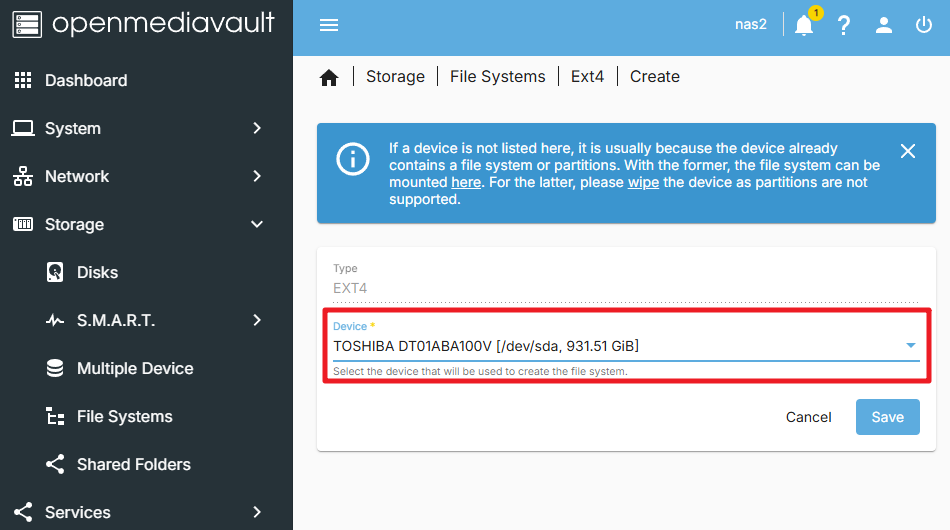

3. Apparirà una finestra che ti informa della creazione del file system. Attendi qualche istante.

.. image:: img/omv/omv-mount-3.png

4. Al termine, accederai all’interfaccia ``Mount``. Seleziona il file system appena creato e montalo sul tuo Raspberry Pi.

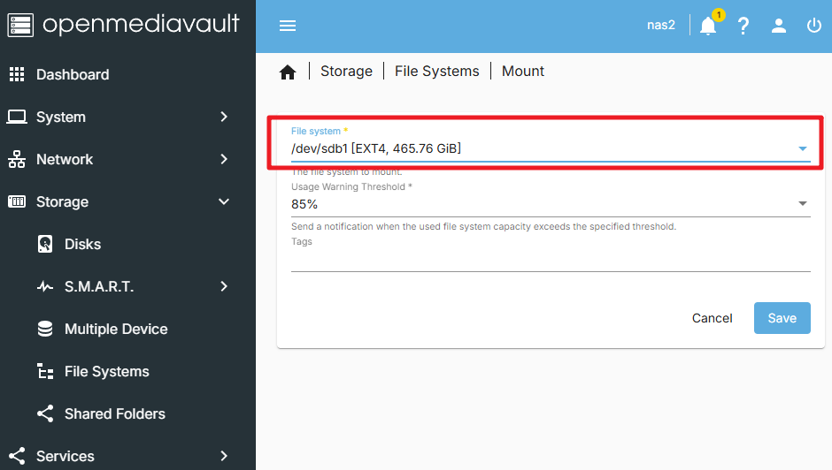

.. note:: Se stai usando due dischi rigidi (senza RAID), ripeti i passaggi per montare anche il secondo disco.

5. Dopo il montaggio, clicca su "Applica", e potrai visualizzare i dati dei tuoi dischi nella sezione file system.

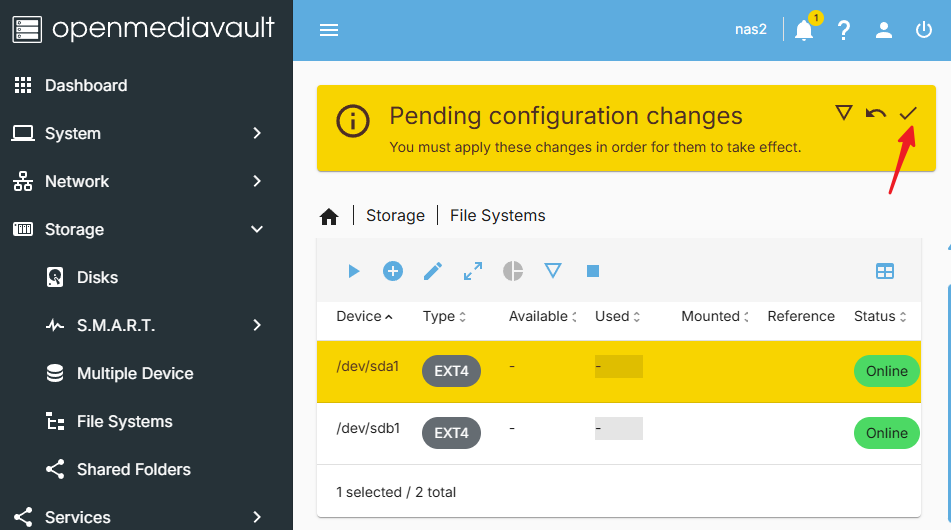

A questo punto, hai configurato correttamente OpenMediaVault e montato i tuoi dischi. Ora puoi utilizzare OMV per gestire lo storage.

6. Creazione di una Cartella Condivisa
----------------------------------------------

1. Nella pagina ``Storage``, vai alla scheda ``Shared Folders`` e clicca su ``Create``.

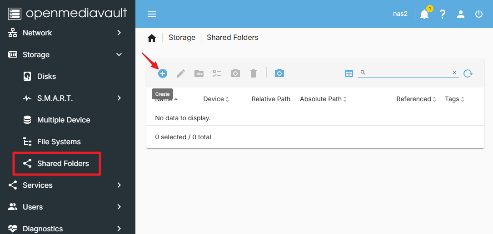

2. Nella schermata ``Create Shared Folder``, inserisci il nome, seleziona il disco da condividere, imposta il percorso e i permessi. Poi clicca su ``Save``.

.. image:: img/omv/omv-share-2.png

3. Ora visualizzerai la cartella condivisa appena creata. Verifica che sia corretta, quindi clicca su ``Apply``.

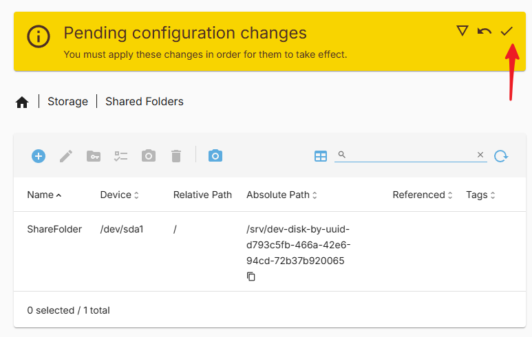

Hai creato con successo una cartella condivisa.

7. Creazione di un Nuovo Utente
---------------------------------------

Per accedere alla cartella condivisa, è necessario creare un nuovo utente. Segui questi passaggi:

1. Vai alla sezione ``User`` e clicca su ``Create``.

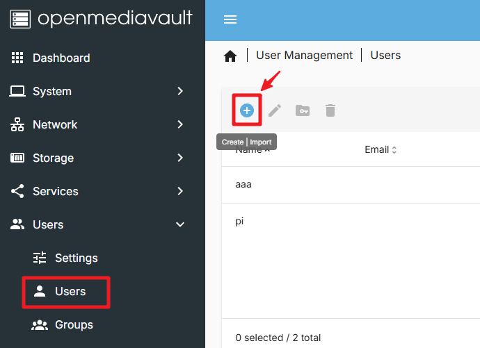

2. Nella schermata ``Create User``, inserisci nome utente e password. Clicca su ``Save``.

.. image:: img/omv/omv-user-2.png

Hai creato con successo un nuovo utente.

8. Impostare i Permessi per il Nuovo Utente
------------------------------------------------

1. Nella sezione ``Shared Folders``, clicca sulla cartella appena creata. Poi clicca su ``Permissions``.

.. image:: img/omv/omv-user-3.png

2. Nella schermata ``Permissions``, imposta i permessi e clicca su ``Save``.

.. image:: img/omv/omv-user-4.png

3. Al termine, clicca su ``Apply``.

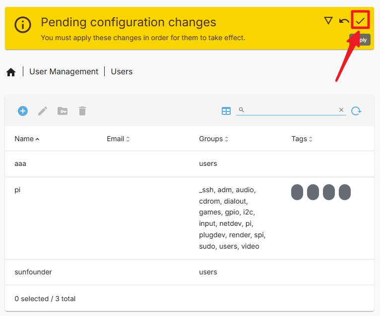

Ora puoi accedere alla cartella condivisa con il nuovo utente.

9. Configurazione del Servizio SMB
----------------------------------------

1. Nella sezione ``Services``, trova ``SMB/CIFS`` > ``Setting`` e abilita l’opzione ``Enable``. Poi clicca su ``Save``.

.. image:: img/omv/omv-smb-1.png

2. Clicca su ``Apply`` per applicare le modifiche.

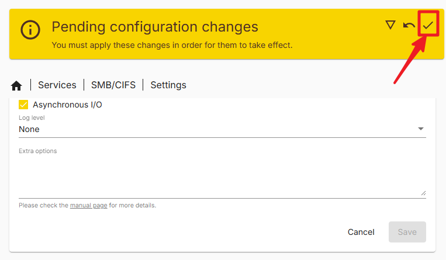

3. Vai alla sezione ``Shares`` e clicca su ``Create``.

.. image:: img/omv/omv-smb-3.png

4. Nella schermata ``Create Share``, seleziona il percorso della cartella condivisa. Clicca su ``Save``. Puoi configurare anche altre opzioni, se necessario.

.. image:: img/omv/omv-smb-4.png

5. Clicca su ``Apply``.

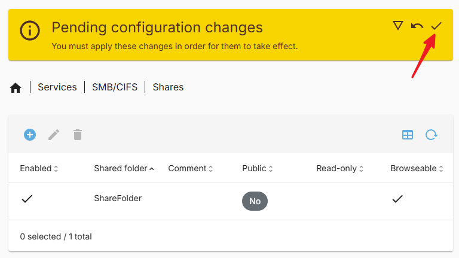

Hai configurato con successo il servizio SMB. Ora puoi accedere alla cartella condivisa tramite protocollo SMB.

10. Accesso alla Cartella Condivisa su Windows
-----------------------------------------------

1. Apri ``Questo PC`` e clicca su ``Connetti unità di rete``.

.. image:: img/omv/omv-network-location-1.png

2. Nella finestra di dialogo, inserisci l’IP del Raspberry Pi nel campo ``Cartella``, ad esempio ``\\192.168.1.100\`` oppure ``\\pi.local\``.

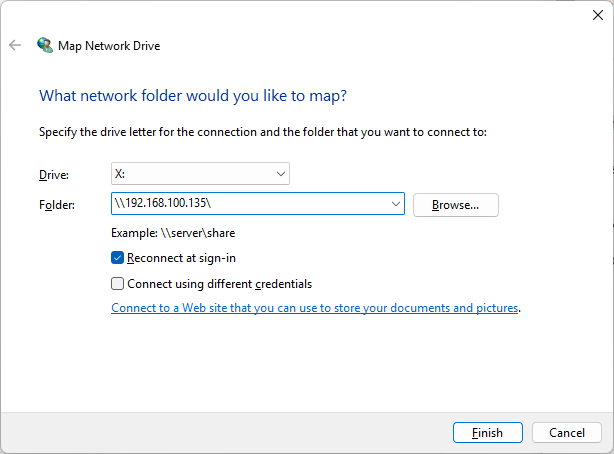

3. Clicca su "Sfoglia", seleziona la cartella desiderata. Ti verrà richiesto di inserire le credenziali create in precedenza.

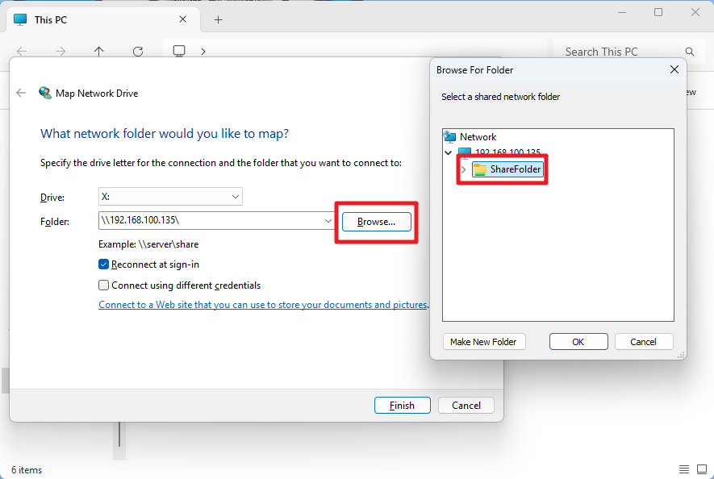

4. Spunta l’opzione "Riconnetti all’accesso" e clicca su ``Fine``.

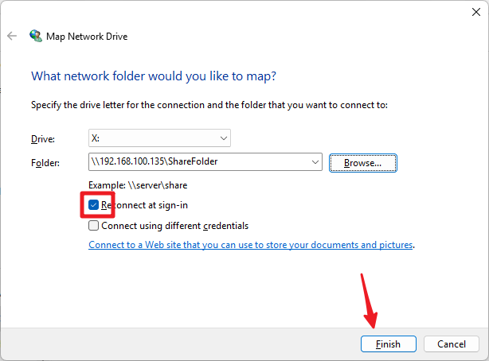

5. Ora puoi accedere alla cartella condivisa del NAS.

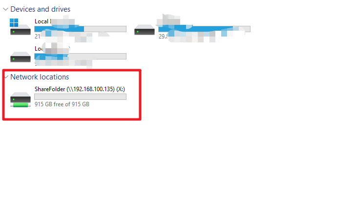

10. Accesso alla Cartella Condivisa su Mac
-------------------------------------------

1. Nel menu ``Go``, clicca su ``Connect to Server``.

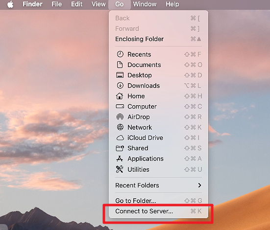

2. Inserisci l’indirizzo IP del Raspberry Pi, ad esempio ``smb://192.168.1.100`` o il nome host, ad esempio ``smb://pi.local``.

.. image:: img/omv/omv-mac-2.png

3. Clicca su ``Connetti``.

.. image:: img/omv/omv-mac-3.png

4. Inserisci le credenziali dell’utente creato e clicca su ``Connetti``.

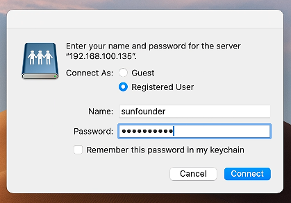

5. Ora puoi accedere alla cartella condivisa NAS.

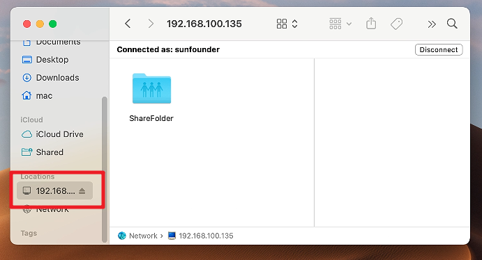
