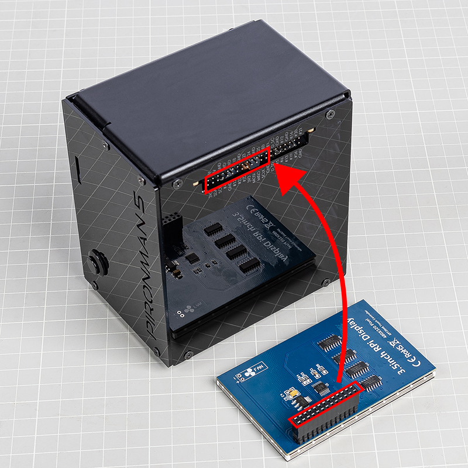
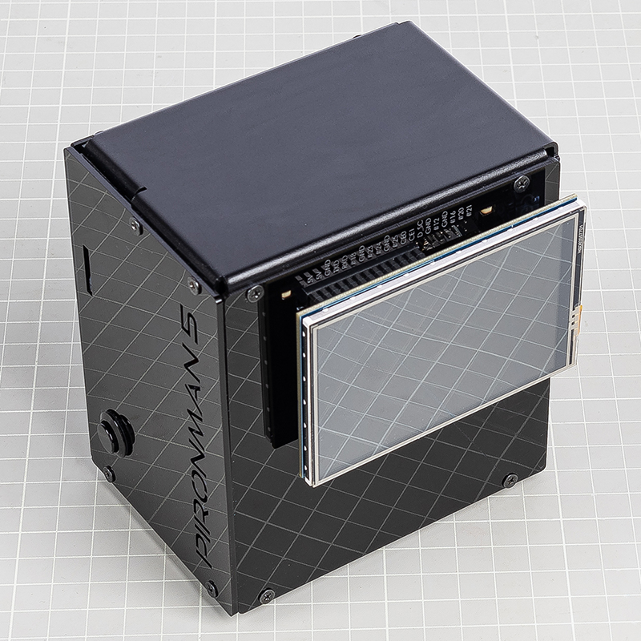

.. note::

    Ciao, benvenuto nella Community SunFounder Raspberry Pi & Arduino & ESP32 Enthusiasts su Facebook! Approfondisci Raspberry Pi, Arduino ed ESP32 insieme ad altri appassionati.

    **Perché unirsi?**

    - **Supporto esperto**: Risolvi problemi post-vendita e sfide tecniche con l'aiuto della nostra comunità e del nostro team.
    - **Impara e condividi**: Scambia consigli e tutorial per migliorare le tue competenze.
    - **Anteprime esclusive**: Ottieni accesso anticipato agli annunci dei nuovi prodotti e alle anteprime.
    - **Sconti speciali**: Approfitta di sconti esclusivi sui nostri prodotti più recenti.
    - **Promozioni festive e giveaway**: Partecipa a giveaway e promozioni festive.

    👉 Pronto a esplorare e creare con noi? Clicca [|link_sf_facebook|] e unisciti oggi stesso!

Schermo Touch da 3,5 pollici
=============================

.. note::

    La serie Pironman 5 non include uno schermo touch da 3,5 pollici.  
    Dovrai procurartene uno oppure acquistarlo dal nostro sito ufficiale:

   * `Schermo Touch da 3,5 pollici <https://www.sunfounder.com/products/touchscreen-02>`_

Lo schermo touch da 3,5 pollici si collega direttamente al connettore GPIO del Raspberry Pi,  
fornendo sia la visualizzazione che il controllo touch per il Pironman 5.  
Segui attentamente i passaggi per garantire una corretta installazione ed evitare danni hardware.

Maggiori dettagli sono disponibili qui:  
`Documentazione Schermo Touch da 3,5 pollici <http://wiki.sunfounder.cc/index.php?title=3.5_Inch_LCD_Touch_Screen_Monitor_for_Raspberry_Pi>`_.

**Assemblaggio**

.. warning:: 
   
   Quando installi lo schermo touch da 3,5 pollici sul Pironman 5, assicurati che i pin siano perfettamente allineati.  
   L’header deve combaciare con l’interfaccia GPIO del Raspberry Pi senza alcuno spostamento.  
   Un disallineamento potrebbe danneggiare lo schermo o persino il Raspberry Pi.  
   Ricontrolla i collegamenti prima di accendere l’alimentazione!

**Rimozione del Jumper RGB**

Quando utilizzi il Pironman 5 con lo schermo touch da 3,5 pollici,  
nota che i LED RGB sull’IO Expander condividono lo stesso pin SPI MOSI (GPIO10) con lo schermo.  
Per evitare conflitti e garantire il corretto funzionamento:

1. Sull’IO Expander, rimuovi il cappuccio jumper dai **pin dei LED RGB** (sopra J9).

   .. image:: img/lcd_to_max0.jpg
      :width: 600
      :align: center

2. Disattiva il servizio di controllo dei LED RGB:

   .. code-block:: bash

      sudo pironman5 -re false
      sudo systemctl restart pironman5.service

Questo libera l’interfaccia SPI per lo schermo touch da 3,5 pollici ed evita problemi di visualizzazione.

**Installazione Driver**

Prima di utilizzare lo schermo touch da 3,5 pollici, è necessario installare i driver.

Suggerimenti generali:

* Assicurati che git sia installato (``sudo apt install git``).  
* L’installazione dei driver richiede 1–3 minuti.  
* Il sistema si riavvierà automaticamente.

Segui le istruzioni per il tuo sistema operativo:

* **Per Raspberry Pi OS**:

  .. code-block:: bash
  
     sudo rm -rf LCD-show 
     git clone https://github.com/sunfounder/LCD-show.git 
     chmod -R 755 LCD-show 
     cd LCD-show/ 
     sudo ./LCD35-show
  
  Dopo l’installazione, il desktop verrà visualizzato sullo schermo touch da 3,5 pollici.
  
  Per ruotare lo schermo:
  
  .. code-block:: bash
  
     cd LCD-show/
     sudo ./rotate.sh 90   
  
  Il sistema si riavvierà e lo schermo ruoterà di 90°.  
  Puoi sostituire ``90`` con ``0``, ``180`` o ``270`` a seconda delle necessità.

* **Per Ubuntu**:

  .. code-block:: bash
  
     sudo rm -rf LCD-show-ubuntu 
     git clone https://github.com/sunfounder/LCD-show-ubuntu.git 
     chmod -R 755 LCD-show-ubuntu 
     cd LCD-show-ubuntu/ 
     sudo ./LCD35-show
  
  Dopo l’installazione, il desktop verrà visualizzato sullo schermo touch da 3,5 pollici.
  
  Per ruotare:
  
  .. code-block:: bash
  
     cd LCD-show-ubuntu/
     sudo ./rotate.sh 90   
  
  Il riavvio seguirà automaticamente.  
  Sostituisci ``90`` con ``0``, ``180`` o ``270`` a seconda delle necessità.

* **Per Kali Linux**:

  .. code-block:: bash
  
     sudo rm -rf LCD-show-kali 
     git clone https://github.com/sunfounder/LCD-show-kali.git 
     chmod -R 755 LCD-show-kali 
     cd LCD-show-kali/ 
     sudo ./LCD35-show
  
  Dopo l’installazione, il desktop verrà visualizzato sullo schermo touch da 3,5 pollici.
  
  Per ruotare:
  
  .. code-block:: bash
  
     cd LCD-show-kali/
     sudo ./rotate.sh 90   
  
  Il sistema si riavvierà con la nuova rotazione.  
  Sostituisci ``90`` con ``0``, ``180`` o ``270`` a seconda delle necessità.
