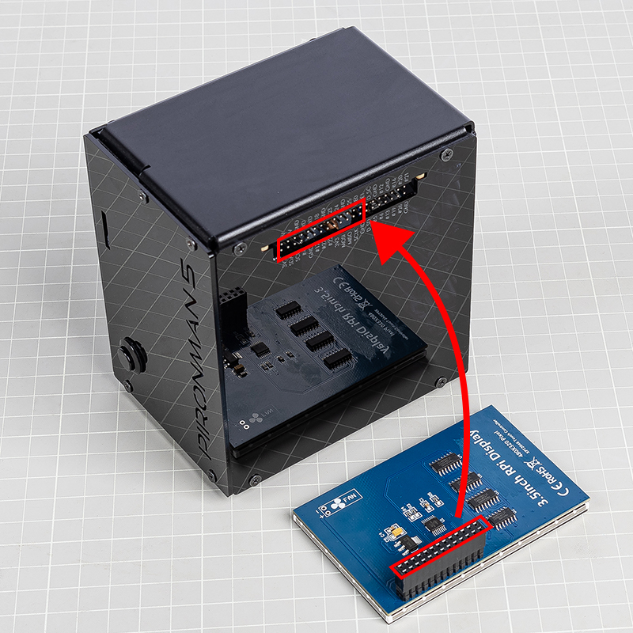
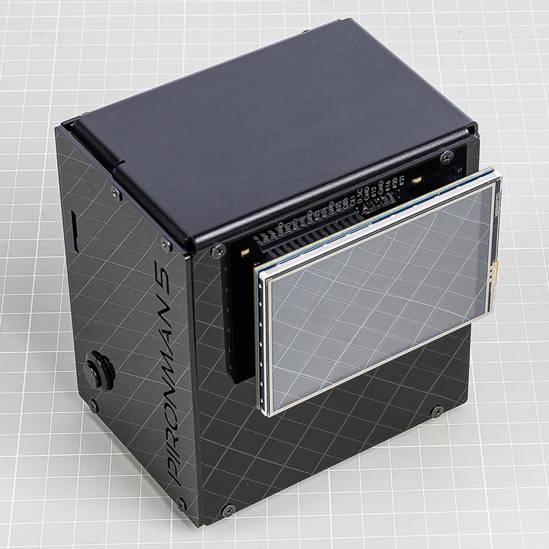

.. include:: /index.rst
   :start-after: start_hello_message
   :end-before: end_hello_message

3,5-Zoll-Touchscreen
=============================

.. note::

    Die Pironman-5-Serie enthält keinen 3,5-Zoll-Touchscreen.  
    Du musst einen selbst vorbereiten oder auf unserer offiziellen Website kaufen:

   * `3,5-Zoll-Touchscreen <https://www.sunfounder.com/products/touchscreen-02>`_

Der 3,5-Zoll-Touchscreen wird direkt an den GPIO-Header des Raspberry Pi angeschlossen  
und bietet sowohl Anzeige- als auch Touch-Steuerung für den Pironman 5.  
Bitte folge den Schritten sorgfältig, um eine korrekte Installation sicherzustellen und Hardwareschäden zu vermeiden.

Weitere Details findest du hier:  
`3,5-Zoll-Touchscreen-Dokumentation <https://docs.sunfounder.com/projects/35-ips-screen/en/latest/get_started/get_started.html>`_.

**Montage**

.. warning:: 
   
   Achte beim Installieren des 3,5-Zoll-Touchscreens auf den Pironman 5 darauf, dass die Pins perfekt ausgerichtet sind.  
   Der Header muss exakt mit der GPIO-Schnittstelle des Raspberry Pi übereinstimmen, ohne Versatz.  
   Eine falsche Ausrichtung kann den Bildschirm oder sogar den Raspberry Pi beschädigen.  
   Überprüfe die Verbindungen vor dem Einschalten doppelt!

**RGB-Jumper entfernen**

Beim Einsatz des Pironman 5 mit dem 3,5-Zoll-Touchscreen  
beachte, dass die RGB-LEDs am IO-Expander denselben SPI-MOSI-Pin (GPIO10) wie der Bildschirm verwenden.  
Um Konflikte zu vermeiden und einen ordnungsgemäßen Betrieb sicherzustellen:

1. Entferne auf dem IO-Expander die Jumper-Kappe von den **RGB-LED-Pins** (über J9).

   .. image:: img/lcd_to_max0.jpg
      :width: 600
      :align: center

2. Deaktiviere den RGB-LED-Steuerungsdienst:

   .. code-block:: bash

      sudo pironman5 -re false
      sudo systemctl restart pironman5.service

Dies gibt die SPI-Schnittstelle für den 3,5-Zoll-Touchscreen frei und verhindert Anzeigefehler.

**Treiberinstallation**

Für detaillierte Anweisungen siehe |link_3.5_screen|, das die Installation des Treibers für verschiedene Systeme beschreibt.
