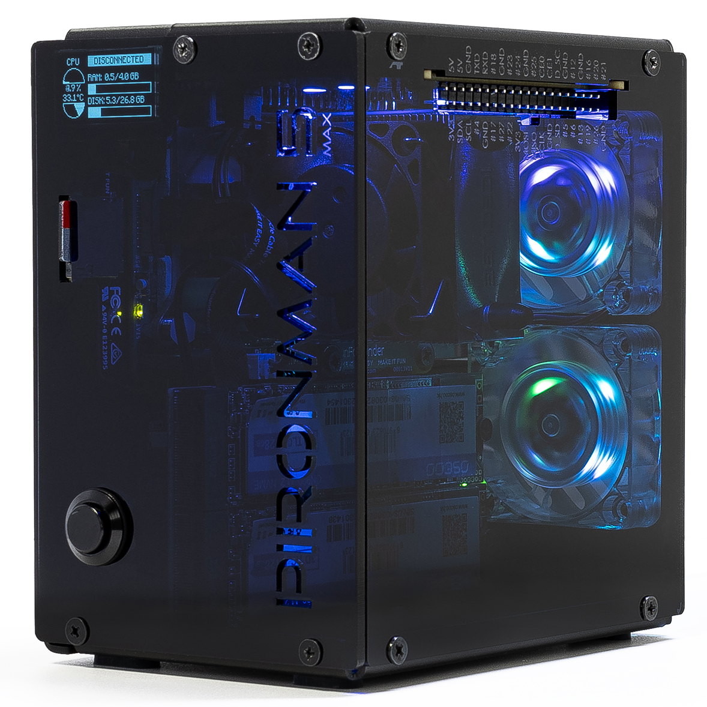

.. include:: /index.rst
   :start-after: start_hello_message
   :end-before: end_hello_message

.. _set_up_os_max:

在 Raspberry Pi OS/Ubuntu/Kali Linux/Homebridge 上的配置
===================================================================

如果你在 Raspberry Pi 上安装了 Raspberry Pi OS、Ubuntu、Kali Linux 或 Homebridge，则需要使用命令行来配置 Pironman 5 MAX。

.. note::

  在进行配置之前，请先启动并登录到你的 Raspberry Pi。
  如果不确定如何登录，可以访问 Raspberry Pi 官方网站：|link_rpi_get_start|。

.. _safe_shutdown_max:

1. 配置关机时关闭 GPIO 电源
------------------------------------------------------------

为防止 Raspberry Pi 关机后由 GPIO 供电的 OLED 屏幕和 GPIO 风扇仍保持运行，必须配置 Raspberry Pi 在关机时关闭 GPIO 电源。

#. 打开 EEPROM 配置工具：

   .. code-block::

      sudo raspi-config

#. 进入 **Advanced Options → A12 Shutdown Behaviour**。

   .. image:: img/shutdown_behaviour.png

#. 选择 **B1 Full Power Off...**。

   .. image:: img/run_power_off.png

#. 保存更改。系统会提示你重启以使新设置生效。

.. _install_pironman5_module_max:

2. 下载并安装 ``pironman5`` 模块
-----------------------------------------------------------

.. note::

   对于 Raspberry Pi OS Lite 系统，请先安装所需工具，如 ``git`` 和 ``python3``。

   .. code-block:: shell

      sudo apt-get install git -y
      sudo apt-get install python3 python3-pip python3-setuptools -y

#. 从 GitHub 下载并安装 ``pironman5`` 模块。

   .. code-block:: shell

      curl -sSL "https://raw.githubusercontent.com/sunfounder/sunfounder-installer-scripts/main/pironman5/install.sh" | sudo bash

   .. note::

      如果你将 Pironman 5 系列与 PiPower 5 一起使用，请改为运行以下命令：

      .. code-block:: shell

         curl -sSL "https://raw.githubusercontent.com/sunfounder/sunfounder-installer-scripts/main/pironman5/install.sh" | sudo bash -s -- --pipower5

#. 安装程序运行后，选择你的 Pironman 5 型号（1~4）。

   .. code-block:: shell

      Pironman 5 Installer v1.0.1
      Supports: 5 | 5 Mini | 5 Max | 5 Pro Max

      Please select your product model:
      1) Pironman 5
      2) Pironman 5 Mini
      3) Pironman 5 Max
      4) Pironman 5 Pro Max

      Enter number [1-4]:

#. 安装完成后，按提示重启 Raspberry Pi。首次启动可能需要最多 30 秒，因为服务正在初始化。

#. Pironman 5 MAX 成功启动后，检查以下组件是否正常工作。

   * **OLED 屏幕**

     * 显示 CPU 使用率、RAM 使用率、CPU 温度和 IP 地址。
     * 10 秒后自动关闭。
     * 短按电源按钮可唤醒屏幕或切换页面。

   * **电源按钮**

     * 短按：开机 / 唤醒 OLED / 切换 OLED 页面。
     * 长按 2 秒：安全关机（需配置 :ref:`safe_shutdown_max`）。
     * 长按 5 秒：强制关机。

   * **WS2812 RGB LED**

     * 以蓝色呼吸灯效果亮起。

   * **两个 GPIO 风扇**

     * 默认设置为 **Always On** 模式。
     * 可通过命令或仪表盘更改工作模式。

   * **CPU 风扇（塔式散热器风扇）**

     * 根据 CPU 温度自动调节转速。
     * 默认风扇曲线：

       * < 50°C：关闭（0%）
       * 50°C+：低速（30%）
       * 60°C+：中速（50%）
       * 67.5°C+：高速（70%）
       * 75°C+：全速（100%）

      * :ref:`faq_pwm_fan_max`

#. 使用 ``systemctl`` 管理 ``pironman5.service``。

   .. code-block:: shell

      sudo systemctl restart pironman5.service

   根据需要将 ``restart`` 替换为 ``start``、 ``stop`` 或 ``status`` 来管理服务。

.. note::

   Pironman 5 MAX 现已准备就绪，可以开始使用。

   如需高级控制和仪表盘功能，请参阅 :ref:`control_commands_dashboard_max`。
