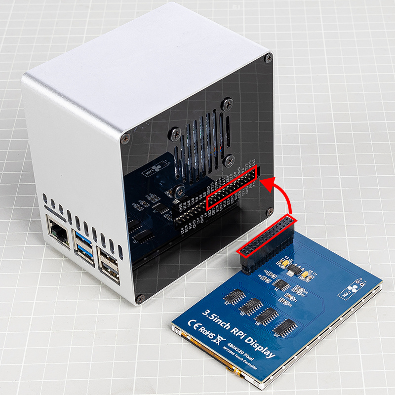

Combine With 3.5 inch LCD
=============================

Questa sezione è destinata agli utenti di Pironman 5 che hanno acquistato anche il `display LCD da 3,5 pollici <https://www.sunfounder.com/products/touchscreen-02?_pos=2&_sid=839d5db5b&_ss=r>`_.

Il display LCD può essere montato direttamente sull’intestazione GPIO del Raspberry Pi, fornendo funzionalità di visualizzazione e controllo touch per il Pironman 5. Si prega di seguire correttamente i passaggi di installazione per garantire il corretto funzionamento ed evitare danni all’hardware.

Puoi trovare maggiori informazioni sul display LCD e il suo utilizzo al seguente link:  
`Documentazione LCD da 3,5 pollici <http://wiki.sunfounder.cc/index.php?title=3.5_Inch_LCD_Touch_Screen_Monitor_for_Raspberry_Pi>`_.

**Assemble**

.. image:: ../img/lcd_to_mini2.jpg
    :width: 340

.. warning:: Durante l’installazione del display LCD da 3,5 pollici sul Pironman 5, assicurati che i pin siano perfettamente allineati. L’intestazione del modulo LCD deve corrispondere esattamente all’interfaccia GPIO del Raspberry Pi, senza alcuno spostamento o disallineamento. Collegamenti errati possono danneggiare il display LCD o anche il Raspberry Pi. Controlla attentamente tutte le connessioni prima di accendere l’alimentazione!

**Remove RGB Jumper**

Quando si utilizza il Pironman 5 con il display LCD da 3,5 pollici, il LED RGB e il display condividono gli stessi pin SPI. Per evitare conflitti e garantire il corretto funzionamento del display, è necessario disattivare la connessione del LED RGB.

Segui i passaggi seguenti:

1. Sulla **scheda di espansione IO**, **rimuovi il ponticello collegato ai pin RGB** per scollegare il LED RGB dall’interfaccia SPI.

   .. image:: ../img/lcd_to_mini0.jpg
      :width: 600
      :align: center

2. Esegui i seguenti comandi per **disattivare il servizio di controllo del LED RGB**:

   .. code-block:: bash

      pironman5 -re false
      sudo systemctl restart pironman5.service 

In questo modo l’interfaccia SPI sarà disponibile per l’uso da parte del display LCD, evitando conflitti o problemi di visualizzazione.

**Driver Installation**

Questo modulo LCD richiede l’installazione di un driver prima dell’uso. I passaggi variano in base al sistema operativo.

* Per Raspberry Pi OS, puoi installare il driver con il seguente comando:

   .. code-block:: bash

      sudo rm -rf LCD-show 
      git clone https://github.com/sunfounder/LCD-show.git 
      chmod -R 755 LCD-show 
      cd LCD-show/ 
      sudo ./LCD35-show

   Dopo l’esecuzione con successo, vedrai il desktop del Raspberry Pi sul display LCD da 3,5 pollici.

   Se desideri ruotare lo schermo, esegui il seguente comando:

   .. code-block:: bash

      cd LCD-show/
      sudo ./rotate.sh 90   

   Al termine, il sistema si riavvierà automaticamente e lo schermo verrà ruotato di 90 gradi con visualizzazione e tocco corretti. Puoi sostituire '90' con 0, 90, 180 o 270 per impostare l’angolo desiderato.

* Per Ubuntu, puoi installare il driver con il seguente comando:

   .. code-block:: bash

      sudo rm -rf LCD-show-ubuntu 
      git clone https://github.com/sunfounder/LCD-show-ubuntu.git 
      chmod -R 755 LCD-show-ubuntu 
      cd LCD-show-ubuntu/ 
      sudo ./LCD35-show

   Dopo l’esecuzione con successo, vedrai il desktop del Raspberry Pi sul display LCD da 3,5 pollici.

   Se desideri ruotare lo schermo, esegui il seguente comando:

   .. code-block:: bash

      cd LCD-show/
      sudo ./rotate.sh 90   

   Al termine, il sistema si riavvierà automaticamente e lo schermo verrà ruotato di 90 gradi con visualizzazione e tocco corretti. Puoi sostituire '90' con 0, 90, 180 o 270 per impostare l’angolo desiderato.

* Per Kali Linux, puoi installare il driver con il seguente comando:

   .. code-block:: bash

      sudo rm -rf LCD-show-kali 
      git clone https://github.com/sunfounder/LCD-show-kali.git 
      chmod -R 755 LCD-show-kali 
      cd LCD-show-kali/ 
      sudo ./LCD35-show

   Dopo l’esecuzione con successo, vedrai il desktop del Raspberry Pi sul display LCD da 3,5 pollici.

   Se desideri ruotare lo schermo, esegui il seguente comando:

   .. code-block:: bash

      cd LCD-show/
      sudo ./rotate.sh 90   

   Al termine, il sistema si riavvierà automaticamente e lo schermo verrà ruotato di 90 gradi con visualizzazione e tocco corretti. Puoi sostituire '90' con 0, 90, 180 o 270 per impostare l’angolo desiderato.
