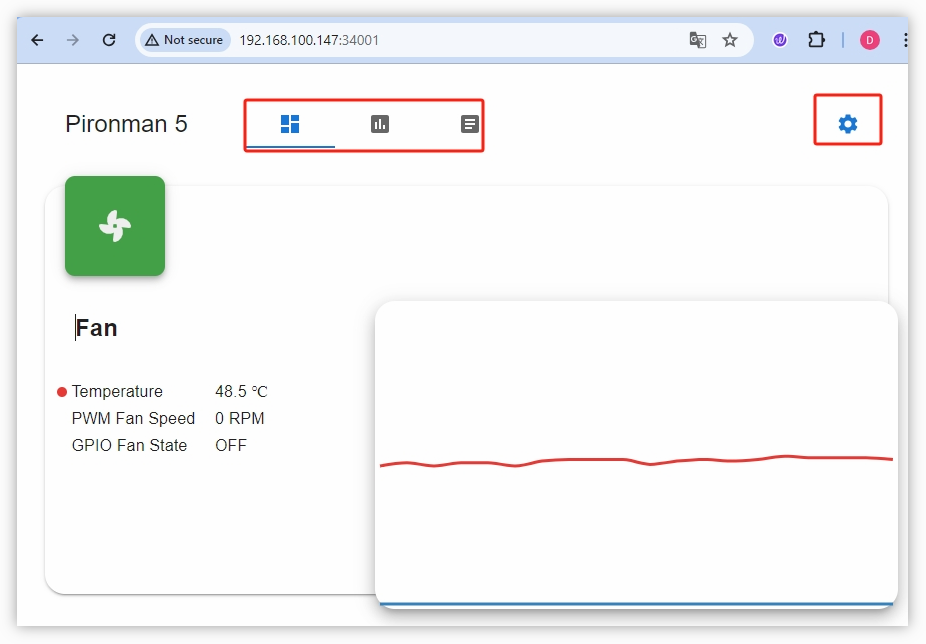
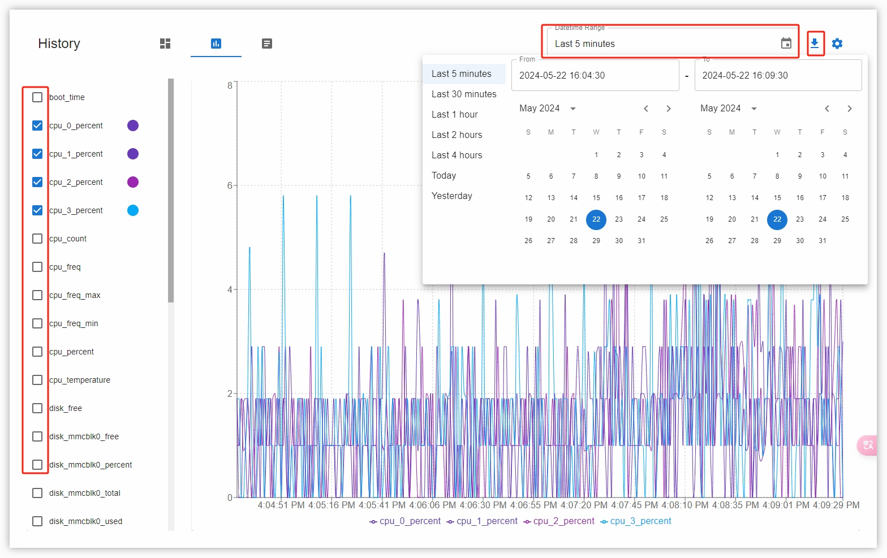
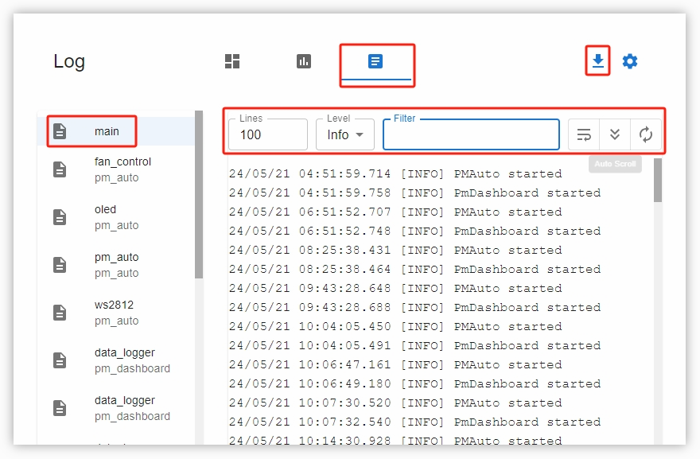
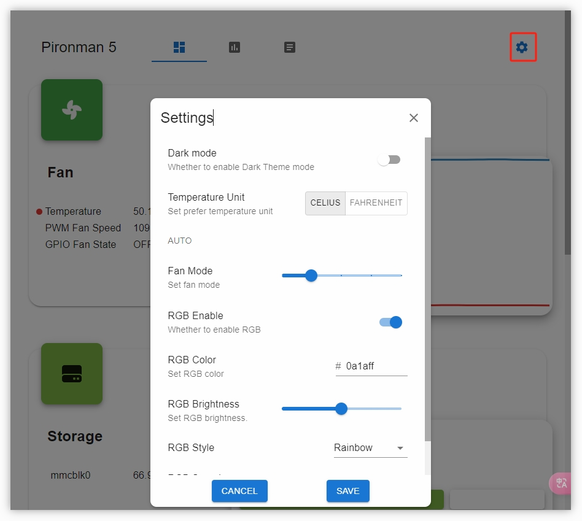

.. note::

    こんにちは！SunFounderのRaspberry Pi・Arduino・ESP32 愛好者向けFacebookコミュニティへようこそ！同じ情熱を持つ仲間たちと一緒に、Raspberry Pi・Arduino・ESP32の世界をより深く探求しましょう。

    **Why Join?**

    - **Expert Support**：購入後のトラブルや技術的な課題を、コミュニティおよびサポートチームがサポートします。
    - **Learn & Share**：ヒントやチュートリアルを共有してスキルアップを目指しましょう。
    - **Exclusive Previews**：新製品の発表や先行情報をいち早く入手できます。
    - **Special Discounts**：最新製品に関するメンバー限定の特別割引をご提供。
    - **Festive Promotions and Giveaways**：プレゼント企画や季節ごとのキャンペーンにも参加可能です。

    👉 一緒に創造と発見を楽しみましょう！[|link_sf_facebook|] をクリックして今すぐ参加！

.. _view_control_dashboard_mini:

ダッシュボードからの表示と操作
=========================================

``pironman5`` モジュールを正常にインストールすると、再起動時に ``pironman5.service`` が自動的に起動します。

ブラウザで ``http://<ip>:34001`` にアクセスすると、Raspberry Pi の情報を確認したり、RGB設定やファンの制御などを行うためのモニタリングページを開くことができます。

このページには **Dashboard**、 **History**、 **Log**、 **Settings** の各タブがあります。

  
Dashboard（ダッシュボード）
-----------------------------

Raspberry Piの各種ステータスを確認するためのカードが複数用意されています：

* **Fan**：CPU温度およびPWMファンの回転速度を表示します。 **GPIO Fan State** はRGBファンの状態を示します。現在の温度ではRGBファンはオフです。

  .. image:: img/dashboard_pwm_fan.png
    :width: 90%

* **Storage**：Raspberry Pi のストレージ使用状況を表示します。ディスクごとの使用容量と空き容量が確認できます。

  .. image:: img/dashboard_storage.png
    :width: 90%

* **Memory**：RAM使用量およびその割合を表示します。

  .. image:: img/dashboard_memory.png
    :width: 90%

* **Network**：現在のネットワーク接続方式、アップロード・ダウンロード速度を表示します。

  .. image:: img/dashboard_network.png
    :width: 90%

* **Processor**：CPUの動作状況を表示します。4コアの使用率、動作周波数、全体のCPU使用率が確認できます。

  .. image:: img/dashboard_processor.png
    :width: 90%

History（履歴）
------------------

履歴ページでは、過去のデータを確認できます。左のサイドバーで表示したいデータを選択し、期間を指定することで、指定期間のデータをグラフで確認できます。データのダウンロードも可能です。

Log（ログ）
--------------

ログページでは、現在動作中の pironman5 サービスのログを確認できます。pironman5 には複数のサブサービスが含まれており、それぞれにログがあります。閲覧したいログを選択すると、右側に内容が表示されます。何も表示されない場合は、ログが存在しない可能性があります。

* 各ログの最大サイズは10MBで、超えると次のログファイルが自動生成されます。
* 同一サービスのログは最大10ファイルまで保存され、それを超えると古いものから自動で削除されます。
* ログ表示画面には、ログレベル選択、キーワード検索、 **Line Wrap** 、 **Auto Scroll** 、 **Auto Update** などの便利なツールがあります。
* ログはローカルにダウンロードすることも可能です。

Settings（設定）
-------------------

画面右上に設定メニューがあります。

.. note::

    変更を加えた後は、画面下部の **SAVE** ボタンをクリックして保存してください。

* **Dark Mode**：ライトテーマとダークテーマの切り替え。設定はブラウザのキャッシュに保存されます。ブラウザを変更したりキャッシュを削除するとデフォルトに戻ります。
* **Temperature Unit**：表示される温度の単位を設定します。
* **Fan Mode**：RGBファンの動作モードを設定できます。設定に応じて、ファンが起動する温度が変わります。

    * **Quiet**：70°Cで起動
    * **Balanced**：67.5°Cで起動
    * **Cool**：60°Cで起動
    * **Performance**：50°Cで起動
    * **Always On**：常時オン

たとえば、 **Performance** モードに設定した場合、RGBファンは50°Cで作動を開始します。

設定を保存した後、CPUの温度が50°Cを超えると、Dashboard上の **GPIO Fan State** がONに変わり、RGBファンが回転を始めます。

  .. image:: img/dashboard_rgbfan_on.png
    :width: 300

* **RGB Brightness**：スライダーでRGB LEDの明るさを調整できます。
* **RGB Color**：RGB LEDのカラーを指定します。
* **RGB Style**：RGB LEDの表示モードを選択できます。モードは **Solid**、 **Breathing**、 **Flow**、 **Flow_reverse**、 **Rainbow**、 **Rainbow Reverse**、 **Hue Cycle** などがあります。

.. note::

  **RGB Style** を **Rainbow**、 **Rainbow Reverse**、 **Hue Cycle** に設定した場合、RGBカラーの個別設定はできません。

* **RGB Speed**：RGB LEDの変化スピードを設定します。