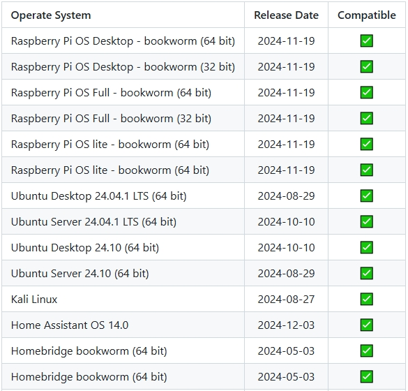
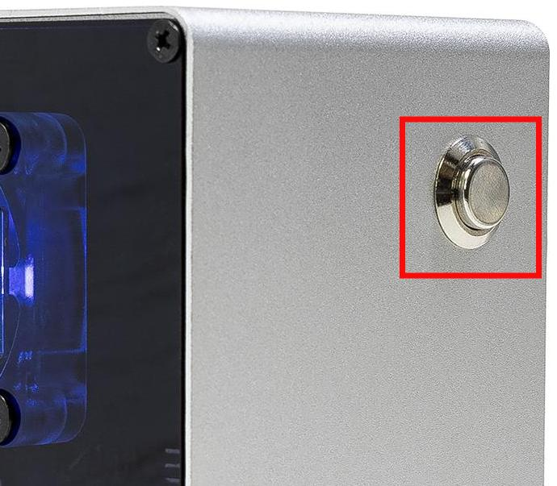
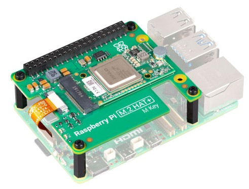

.. note::

    ¡Hola! Bienvenido a la comunidad de entusiastas de SunFounder Raspberry Pi, Arduino y ESP32 en Facebook. Profundiza en el mundo de Raspberry Pi, Arduino y ESP32 junto a otros entusiastas.

    **¿Por qué unirte?**

    - **Soporte experto**: Resuelve problemas técnicos y postventa con la ayuda de nuestra comunidad y equipo.
    - **Aprende y comparte**: Intercambia consejos y tutoriales para mejorar tus habilidades.
    - **Avances exclusivos**: Obtén acceso anticipado a nuevos productos y adelantos.
    - **Descuentos especiales**: Disfruta de descuentos exclusivos en nuestros productos más recientes.
    - **Promociones festivas y sorteos**: Participa en sorteos y promociones especiales.

    👉 ¿Listo para explorar y crear con nosotros? Haz clic en [|link_sf_facebook|] y únete hoy mismo.

FAQ
============

1. Sobre los sistemas compatibles
------------------------------------

Sistemas que han pasado la prueba en Raspberry Pi 5:

2. Sobre el botón de encendido
---------------------------------------

El botón de encendido expone la función del botón de encendido del Raspberry Pi 5 y actúa de la misma manera.

* **Apagado**

  * Si estás usando el sistema Raspberry Pi **Bookworm Desktop**, presiona el botón de encendido dos veces rápidamente para apagar.
  * Si estás usando el sistema Raspberry Pi **Bookworm Lite**, presiona una vez para iniciar el apagado.
  * Para un apagado forzado, mantén presionado el botón.

* **Encendido**

  * Si la Raspberry Pi está apagada pero sigue recibiendo energía, presiona una vez para encenderla.

* Si tu sistema no admite el botón de apagado, mantén presionado por 5 segundos para forzar el apagado, y presiona una vez para encenderla.

3. Sobre el Raspberry Pi AI HAT+
----------------------------------------------------------

El Raspberry Pi AI HAT+ no es compatible con el Pironman 5.

.. image::  img/output3.png
   :width: 400

El kit Raspberry Pi AI combina el M.2 HAT+ con el módulo acelerador de IA Hailo.

Puede separar el módulo acelerador Hailo AI del Raspberry Pi AI Kit e insertarlo directamente en el HAT del Pironman 5 Mini.

   .. .. image::  img/output4.png
   ..      :width: 800

4. ¿El PI5 no arranca (LED rojo)?
-------------------------------------------

Este problema puede deberse a una actualización del sistema, cambios en el orden de arranque o un cargador de arranque dañado. Puede intentar los siguientes pasos para resolver el problema:

#. Vuelva a conectar la fuente de alimentación y verifique si el PI5 inicia correctamente.

#. Restaurar el cargador de arranque

   * Si el PI5 aún no puede arrancar, es posible que el cargador de arranque esté dañado. Puede seguir esta guía: :ref:`update_bootloader_mini` y elegir si desea arrancar desde la tarjeta SD o NVMe/USB.
   * Inserte la tarjeta SD preparada en el PI5, enciéndalo y espere al menos 10 segundos. Una vez completada la recuperación, retire y reformatee la tarjeta SD. 
   * Luego, use Raspberry Pi Imager para grabar la última versión del sistema operativo Raspberry Pi OS, inserte nuevamente la tarjeta y pruebe iniciar otra vez.

.. ¿El Pironman 5 Mini es compatible con sistemas de retro gaming?
.. --------------------------------------------------------------

.. Sí, es compatible. Sin embargo, la mayoría de los sistemas de retro gaming son versiones simplificadas que no pueden instalar ni ejecutar software adicional. Esta limitación puede hacer que algunos componentes del Pironman 5 Mini, como el ventilador RGB y los 4 LED RGB, no funcionen correctamente, ya que estos componentes requieren la instalación de los paquetes de software del Pironman 5.

5. ¿Los LED RGB no funcionan?
---------------------------------

#. Los dos pines del Mini HAT se utilizan para conectar los LED RGB al GPIO10. Asegúrese de que el puente (jumper) esté correctamente colocado sobre estos dos pines.

   .. image:: hardware/img/io_board_rgb_pin.png
      :width: 300
      :align: center

#. Verifica que tu Raspberry Pi esté ejecutando un sistema operativo compatible:

   .. image:: img/compitable_os.png
      :width: 600
      :align: center

   Si tu sistema no es compatible, sigue esta guía para instalar uno que sí lo sea: :ref:`install_the_os_mini`.

#. Ejecuta ``sudo raspi-config``, navega a **3 Interfacing Options** -> **I3 SPI** -> **YES**, selecciona **OK** y **Finish** para habilitar SPI. Luego reinicia.

Si el problema persiste, escríbenos a service@sunfounder.com.

6. ¿El ventilador del CPU no funciona?
----------------------------------------------

Cuando la temperatura de la CPU no ha alcanzado el umbral establecido, el ventilador de la CPU no funcionará.

**Fan Speed Control Based on Temperature**

El ventilador PWM funciona de manera dinámica, ajustando su velocidad según la temperatura de la Raspberry Pi 5:

* **Por debajo de 50 °C**: El ventilador permanece apagado (0 % de velocidad).  
* **A 50 °C**: El ventilador funciona a baja velocidad (30 %).  
* **A 60 °C**: El ventilador aumenta a velocidad media (50 %).  
* **A 67,5 °C**: El ventilador sube a velocidad alta (70 %).  
* **A 75 °C o más**: El ventilador funciona a máxima velocidad (100 %).

Más detalles en : :ref:`fan_mini`

7. ¿Cómo desactivar el panel web?
------------------------------------------------------

Después de instalar el módulo ``pironman5``, se habilita el :ref:`view_control_dashboard_mini`.

Si no necesitas esta función, puedes desactivarla con el parámetro ``--disable-dashboard`` durante la instalación:

.. code-block:: shell

   cd ~/pironman5
   sudo python3 install.py --disable-dashboard

Si ya has instalado ``pironman 5``, puedes eliminar el módulo ``dashboard`` y ``influxdb``, y luego reiniciar pironman5 para aplicar los cambios:

.. code-block:: shell

   /opt/pironman5/env/bin/pip3 uninstall pm-dashboard influxdb
   sudo apt purge influxdb
   sudo systemctl restart pironman5

8. ¿Cómo controlar los componentes con el comando ``pironman5``?
----------------------------------------------------------------------
Consulta este tutorial para controlar los componentes del Pironman 5 con el comando ``pironman5``:

* :ref:`view_control_commands_mini`

9. ¿Cómo cambiar el orden de arranque de la Raspberry Pi mediante comandos?
------------------------------------------------------------------------------

Puedes cambiar el orden de arranque si ya estás conectado a la Raspberry Pi:

* :ref:`configure_boot_ssd_mini`

10. ¿Cómo modificar el orden de arranque con Raspberry Pi Imager?
---------------------------------------------------------------------

Además de modificar el ``BOOT_ORDER`` en la configuración de la EEPROM, también puedes utilizar el **Raspberry Pi Imager** para cambiar el orden de arranque de tu Raspberry Pi.

Se recomienda utilizar una tarjeta de repuesto para este paso.

* :ref:`update_bootloader_mini`

11. ¿Cómo copiar el sistema desde la SD al NVMe SSD?
-------------------------------------------------------------

Si no tienes adaptador NVMe, primero instala el sistema en la SD. Luego, al arrancar correctamente, puedes copiarlo al SSD:

* :ref:`copy_sd_to_nvme_rpi_mini`

12. ¿Cómo retirar el protector de las placas acrílicas?
-----------------------------------------------------------------

Ambas placas tienen película protectora amarilla o transparente por ambos lados. Usa un destornillador para levantar una esquina y despegarla con cuidado.

.. image:: img/peel_off_film.jpg
    :width: 500
    :align: center

.. _openssh_powershell_mini:

13. ¿Cómo instalar OpenSSH mediante PowerShell?
--------------------------------------------------------

Cuando intentas conectarte a tu Raspberry Pi usando ``ssh <username>@<hostname>.local`` (o ``ssh <username>@<IP address>``) y aparece el siguiente mensaje de error:

    .. code-block::

        ssh: The term 'ssh' is not recognized as the name of a cmdlet, function, script file, or operable program. Check the
        spelling of the name, or if a path was included, verify that the path is correct and try again.

Significa que tu sistema operativo es demasiado antiguo y no tiene `OpenSSH <https://learn.microsoft.com/en-us/windows-server/administration/openssh/openssh_install_firstuse?tabs=gui>`_ preinstalado. Debes seguir el siguiente tutorial para instalarlo manualmente.

#. Escribe ``powershell`` en el cuadro de búsqueda del escritorio de Windows, haz clic derecho sobre ``Windows PowerShell`` y selecciona ``Run as administrator`` en el menú que aparece.

   .. image:: img/powershell_ssh.png
      :width: 90%
      

#. Utiliza el siguiente comando para instalar ``OpenSSH.Client``.

   .. code-block::

        Add-WindowsCapability -Online -Name OpenSSH.Client~~~~0.0.1.0

#. Tras la instalación, deberías ver una salida como la siguiente:

   .. code-block::

        Path          :
        Online        : True
        RestartNeeded : False

#. Verifica que la instalación se haya realizado correctamente con el siguiente comando:

   .. code-block::

        Get-WindowsCapability -Online | Where-Object Name -like 'OpenSSH*'

#. Esto confirmará que ``OpenSSH.Client`` se ha instalado exitosamente.

.. code-block::

    Name  : OpenSSH.Client~~~~0.0.1.0
    State : Installed

    Name  : OpenSSH.Server~~~~0.0.1.0
    State : NotPresent

.. warning:: 

    Si no ves ese mensaje, tu sistema es demasiado antiguo. Usa una herramienta externa como |link_putty|.

#. Reinicia PowerShell como administrador. Ahora podrás usar el comando ``ssh`` para conectarte a tu Raspberry Pi.

   .. image:: img/powershell_login.png
