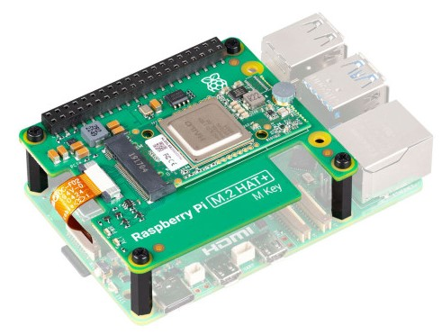
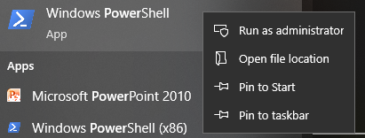

.. include:: /index.rst
   :start-after: start_hello_message
   :end-before: end_hello_message

FAQ
============

Dépannage rapide
-------------------------------

* Bouton d'alimentation ne fonctionne pas → :ref:`faq_power_button_not_work_mini`
* LED RVB ne fonctionnent pas → :ref:`faq_rgb_mini`
* Ventilateur CPU ne tourne pas → :ref:`faq_pwm_fan_mini`
* Le tableau de bord n'affiche aucune donnée → :ref:`faq_dashboard_mini`
* Le PI5 ne démarre pas → :ref:`faq_pi5_boot_fail_mini`

1. Matériel
-------------------------------

.. _com_os_mini:

Systèmes compatibles
^^^^^^^^^^^^^^^^^^^^^^^^^^^^

.. include:: ../pironman5/faq.rst
   :start-after: start_faq_com_os
   :end-before: end_faq_com_os

Bouton d'alimentation
^^^^^^^^^^^^^^^^^^^^^^^^^^^^

Le bouton d'alimentation reprend les fonctions du bouton physique du Raspberry Pi 5.

.. image:: img/power_button.jpg
    :width: 400
    :align: center

* **Arrêt**

  * Si vous utilisez le système **Raspberry Pi OS Desktop**, vous pouvez appuyer deux fois rapidement sur le bouton d'alimentation pour éteindre.
  * Si vous utilisez le système **Raspberry Pi OS Lite** sans interface graphique, appuyez une seule fois sur le bouton d'alimentation pour lancer l'arrêt.
  * Pour forcer un arrêt brutal, maintenez le bouton d'alimentation enfoncé.

* **Allumage**

  * Si la carte Raspberry Pi est éteinte mais toujours alimentée, une simple pression permet de la rallumer.

* Si votre système ne prend pas en charge cette fonctionnalité, maintenez le bouton enfoncé pendant 5 secondes pour un arrêt forcé, puis appuyez une fois pour rallumer.

.. _faq_power_button_not_work_mini:

Le bouton d'alimentation ne fonctionne pas ?
^^^^^^^^^^^^^^^^^^^^^^^^^^^^^^^^^^^^^^^^^^^^

.. include:: ../pironman5/faq.rst
   :start-after: start_faq_power_button_not_work
   :end-before: end_faq_power_button_not_work

Raspberry Pi AI HAT+
^^^^^^^^^^^^^^^^^^^^^^^^^^^^

Le Raspberry Pi AI HAT+ n'est pas compatible avec le Pironman 5.

.. image:: img/output3.png
    :width: 400

Le kit AI Raspberry Pi combine le HAT+ M.2 et le module d'accélération Hailo AI.

Vous pouvez détacher le module accélérateur Hailo AI du kit Raspberry Pi AI et l'insérer directement dans le HAT du Pironman 5 Mini.

Câble Micro HDMI
^^^^^^^^^^^^^^^^^^^^^^^^^^^^

Nous recommandons d'utiliser le câble Micro HDMI officiel de Raspberry Pi. Certains câbles tiers avec une longueur de connecteur inférieure à 65 mm peuvent provoquer un mauvais contact et des problèmes d'affichage.

.. image:: img/need_mini_hdmi.png
   :width: 400

2. Refroidissement et ventilateurs
----------------------------------

.. _faq_pwm_fan_mini:

Le ventilateur CPU ne fonctionne pas ?
^^^^^^^^^^^^^^^^^^^^^^^^^^^^^^^^^^^^^^^^

.. include:: ../pironman5/faq.rst
   :start-after: start_faq_pwm_fan
   :end-before: end_faq_pwm_fan

3. RVB
-------------------------------

.. |link_compatible_systems| replace:: :ref:`com_os_mini`

.. _faq_rgb_mini:

Les LED RVB ne fonctionnent pas ?
^^^^^^^^^^^^^^^^^^^^^^^^^^^^^^^^^^^^

.. include:: ../pironman5/faq.rst
   :start-after: start_faq_rgb
   :end-before: end_faq_rgb

4. Tableau de bord et logiciel
-------------------------------

.. _faq_dashboard_mini:

Le tableau de bord n'affiche aucune donnée
^^^^^^^^^^^^^^^^^^^^^^^^^^^^^^^^^^^^^^^^^^^^

.. include:: ../pironman5/faq.rst
   :start-after: start_faq_dashboard
   :end-before: end_faq_dashboard

.. |link_view_control_dashboard| replace:: :ref:`view_control_dashboard_mini`

Comment désactiver le tableau de bord web ?
^^^^^^^^^^^^^^^^^^^^^^^^^^^^^^^^^^^^^^^^^^^^^

.. include:: ../pironman5/faq.rst
   :start-after: start_faq_disable_dashboard
   :end-before: end_faq_disable_dashboard

Comment désinstaller et réinstaller le logiciel Pironman 5 ?
^^^^^^^^^^^^^^^^^^^^^^^^^^^^^^^^^^^^^^^^^^^^^^^^^^^^^^^^^^^^^

.. include:: ../pironman5/faq.rst
   :start-after: start_faq_reinstall_pironman5
   :end-before: end_faq_reinstall_pironman5

.. |link_view_control_commands| replace:: :ref:`view_control_commands_mini`

Comment contrôler les composants avec la commande ``pironman5`` ?
^^^^^^^^^^^^^^^^^^^^^^^^^^^^^^^^^^^^^^^^^^^^^^^^^^^^^^^^^^^^^^^^^

.. include:: ../pironman5/faq.rst
   :start-after: start_faq_pironman5_command
   :end-before: end_faq_pironman5_command

5. Démarrage et stockage
-------------------------------

.. |link_update_bootloader| replace:: :ref:`update_bootloader_mini`

.. _faq_pi5_boot_fail_mini:

Le PI5 ne démarre pas (LED rouge) ?
^^^^^^^^^^^^^^^^^^^^^^^^^^^^^^^^^^^^^

Ce problème peut être causé par une mise à jour du système, une modification de l'ordre de démarrage ou un chargeur de démarrage corrompu. Vous pouvez essayer les étapes suivantes pour le résoudre :

#. Reconnectez l'alimentation et vérifiez si le PI5 démarre correctement.

#. Testez le PI5 en dehors du boîtier

   * Retirez le PI5 du boîtier Pironman 5 Mini.
   * Alimentez le PI5 directement avec l'adaptateur secteur (sans le boîtier).
   * Vérifiez s'il démarre normalement.

#. Restaurer le chargeur de démarrage

   * Si le PI5 ne démarre toujours pas, il est possible que le chargeur de démarrage soit corrompu. Vous pouvez suivre ce guide : |link_update_bootloader| et choisir de démarrer depuis la carte SD ou NVMe/USB.
   * Insérez la carte SD préparée dans le PI5, allumez-le et attendez au moins 10 secondes. Une fois la récupération terminée, retirez et reformatez la carte SD.
   * Ensuite, utilisez Raspberry Pi Imager pour flasher la dernière version de Raspberry Pi OS et essayez de démarrer à nouveau.

.. |link_configure_boot_ssd| replace:: :ref:`configure_boot_ssd_mini`

Comment modifier l'ordre de démarrage via les commandes ?
^^^^^^^^^^^^^^^^^^^^^^^^^^^^^^^^^^^^^^^^^^^^^^^^^^^^^^^^^^

.. include:: ../pironman5/faq.rst
   :start-after: start_faq_boot_order_command
   :end-before: end_faq_boot_order_command

Comment modifier l'ordre de démarrage avec Raspberry Pi Imager ?
^^^^^^^^^^^^^^^^^^^^^^^^^^^^^^^^^^^^^^^^^^^^^^^^^^^^^^^^^^^^^^^^

.. include:: ../pironman5/faq.rst
   :start-after: start_faq_boot_order_imager
   :end-before: end_faq_boot_order_imager

.. |link_copy_sd_to_nvme| replace:: :ref:`copy_sd_to_nvme_mini`

Comment copier le système de la carte SD vers un SSD NVMe ?
^^^^^^^^^^^^^^^^^^^^^^^^^^^^^^^^^^^^^^^^^^^^^^^^^^^^^^^^^^^^

.. include:: ../pironman5/faq.rst
   :start-after: start_faq_copy_sd_to_nvme
   :end-before: end_faq_copy_sd_to_nvme

6. Utilisation avancée
-------------------------------

Comment retirer le film protecteur ?
^^^^^^^^^^^^^^^^^^^^^^^^^^^^^^^^^^^^^

.. include:: ../pironman5/faq.rst
   :start-after: start_faq_remove_film
   :end-before: end_faq_remove_film

.. _openssh_powershell_mini:

Comment installer OpenSSH via PowerShell ?
^^^^^^^^^^^^^^^^^^^^^^^^^^^^^^^^^^^^^^^^^^^

Lorsque vous utilisez ``ssh <username>@<hostname>.local`` (ou ``ssh <username>@<IP address>``) pour vous connecter à votre Raspberry Pi, mais que le message d'erreur suivant apparaît.

Cela signifie que votre système d'exploitation est trop ancien et ne dispose pas de `OpenSSH <https://learn.microsoft.com/en-us/windows-server/administration/openssh/openssh_install_firstuse>`_ installé, et vous devez l'installer.

#. Ouvrez Windows PowerShell en tant qu'administrateur.

   .. image:: img/powershell_ssh.png
      :width: 90%

#. Utilisez la commande suivante pour installer ``OpenSSH.Client``.

   .. code-block:: powershell

      Add-WindowsCapability -Online -Name OpenSSH.Client~~~~0.0.1.0

   .. code-block:: text

      Path          :
      Online        : True
      RestartNeeded : False

      Caption       : OpenSSH.Client~~~~0.0.1.0
      Description   : OpenSSH.Client~~~~0.0.1.0
      DownloadSize  : 4533945
      InstallSize   : 1709965

   .. note::

      Si le message ci-dessus n'apparaît pas, vérifiez si vous exécutez `Windows PowerShell en tant qu'Administrateur`.

#. Une fois l'installation terminée, vous devriez pouvoir vous connecter normalement avec la commande ``ssh``.

   .. image:: img/powershell_login.png
