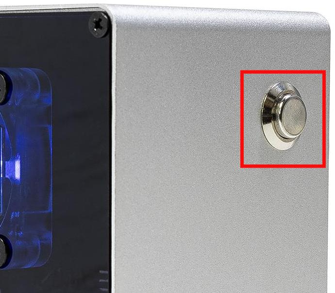
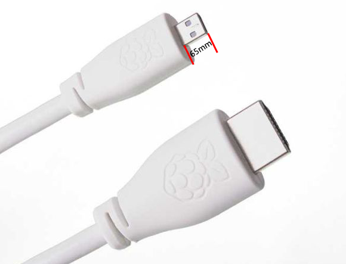

.. include:: /index.rst
   :start-after: start_hello_message
   :end-before: end_hello_message

FAQ
============

Quick Troubleshooting
-------------------------------

* Power button not working → :ref:`faq_power_button_not_work_mini`
* RGB LEDs not working → :ref:`faq_rgb_mini`
* CPU fan not spinning → :ref:`faq_pwm_fan_mini`
* Dashboard shows no data → :ref:`faq_dashboard_mini`
* PI5 fails to boot → :ref:`faq_pi5_boot_fail_mini`

1. Hardware
-------------------------------

.. _com_os_mini:

Compatible Systems
^^^^^^^^^^^^^^^^^^^^^^^^^^^^

.. include:: ../pironman5/faq.rst
   :start-after: start_faq_com_os
   :end-before: end_faq_com_os

Power Button
^^^^^^^^^^^^^^^^^^^^^^^^^^^^

The power button brings out the power button of the Raspberry Pi 5, and it functions just like the power button of the Raspberry Pi 5.

* **Shutdown**

  * If you run **Raspberry Pi OS Desktop** system, you can press the power button twice in quick succession to shutdown.
  * If you run **Raspberry Pi OS Lite** system, press the power button a single time to initiate a shutdown.
  * To force a hard shutdown, press and hold the power button.

* **Power on**

  * If the Raspberry Pi board is shut down, but still powered, single-press to power on from a shutdown state.

* If you are running a system that does not support a shutdown button, you can hold it for 5 seconds to force a hard shutdown, and single-press to power on from a shutdown state.

.. _faq_power_button_not_work_mini:

Power Button Not Working?
^^^^^^^^^^^^^^^^^^^^^^^^^^^^

.. include:: ../pironman5/faq.rst
   :start-after: start_faq_power_button_not_work
   :end-before: end_faq_power_button_not_work

Raspberry Pi AI HAT+
^^^^^^^^^^^^^^^^^^^^^^^^^^^^

The Raspberry Pi AI HAT+ is not compatible with the Pironman 5.

   .. image::  img/output3.png
        :width: 400

The Raspberry Pi AI Kit combines the Raspberry Pi M.2 HAT+ and the Hailo AI accelerator module.

   .. image::  img/output2.jpg
        :width: 400

You can detach the Hailo AI accelerator module from the Raspberry Pi AI Kit and directly insert it into the HAT of the Pironman 5 Mini.

Micro HDMI Cable
^^^^^^^^^^^^^^^^^^^^^^^^^^^^

We recommend using the official Raspberry Pi Micro HDMI cable. Some third-party cables with a connector length shorter than 65 mm may cause poor contact and display issues.

2. Cooling and Fans
-------------------------------

.. _faq_pwm_fan_mini:

CPU Fan Not Working?
^^^^^^^^^^^^^^^^^^^^^^^^^^^^

.. include:: ../pironman5/faq.rst
   :start-after: start_faq_pwm_fan
   :end-before: end_faq_pwm_fan

3. RGB
-------------------------------

.. |link_compatible_systems| replace:: :ref:`com_os_mini`

.. _faq_rgb_mini:

RGB LEDs Not Working?
^^^^^^^^^^^^^^^^^^^^^^^^^^^^

.. include:: ../pironman5/faq.rst
   :start-after: start_faq_rgb
   :end-before: end_faq_rgb

4. Dashboard and Software
-------------------------------

.. _faq_dashboard_mini:

The Dashboard Shows No Data
^^^^^^^^^^^^^^^^^^^^^^^^^^^^^^^^^^^^

.. include:: ../pironman5/faq.rst
   :start-after: start_faq_dashboard
   :end-before: end_faq_dashboard

.. |link_view_control_dashboard| replace:: :ref:`view_control_dashboard_mini`

How to Disable the Web Dashboard
^^^^^^^^^^^^^^^^^^^^^^^^^^^^^^^^^^^^

.. include:: ../pironman5/faq.rst
   :start-after: start_faq_disable_dashboard
   :end-before: end_faq_disable_dashboard

How to Uninstall and Reinstall the Pironman 5 Software
^^^^^^^^^^^^^^^^^^^^^^^^^^^^^^^^^^^^^^^^^^^^^^^^^^^^^^^^^^

.. include:: ../pironman5/faq.rst
   :start-after: start_faq_reinstall_pironman5
   :end-before: end_faq_reinstall_pironman5

.. |link_view_control_commands| replace:: :ref:`view_control_commands_mini`

How to Control Components Using the ``pironman5`` Command
^^^^^^^^^^^^^^^^^^^^^^^^^^^^^^^^^^^^^^^^^^^^^^^^^^^^^^^^^^^^^

.. include:: ../pironman5/faq.rst
   :start-after: start_faq_pironman5_command
   :end-before: end_faq_pironman5_command

5. Boot and Storage
-------------------------------

.. |link_update_bootloader| replace:: :ref:`update_bootloader_mini`

.. _faq_pi5_boot_fail_mini:

PI5 Fails to Boot (Red LED)?
^^^^^^^^^^^^^^^^^^^^^^^^^^^^

This issue may be caused by a system update, changes to the boot order, or a corrupted bootloader. You can try the following steps to resolve the problem:

#. Reconnect the power supply and check if the PI5 boots successfully.

#. Test PI5 Outside the Case

   * Remove the PI5 from the Pironman 5 Mini case.
   * Power the PI5 directly with the power adapter (without the case).
   * Check if it can boot normally.

#. Restore the Bootloader

   * If the PI5 still cannot boot, the bootloader may be corrupted. You can follow this guide: |link_update_bootloader| and choose whether to boot from SD card or NVMe/USB.
   * Insert the prepared SD card into the PI5, power it on, and wait at least 10 seconds. Once the recovery is complete, remove and reformat the SD card.
   * Then use Raspberry Pi Imager to flash the latest Raspberry Pi OS and try booting again.

.. |link_configure_boot_ssd| replace:: :ref:`configure_boot_ssd_mini`

How to Change the Raspberry Pi Boot Order Using Commands
^^^^^^^^^^^^^^^^^^^^^^^^^^^^^^^^^^^^^^^^^^^^^^^^^^^^^^^^^^^^

.. include:: ../pironman5/faq.rst
   :start-after: start_faq_boot_order_command
   :end-before: end_faq_boot_order_command

How to Modify the Boot Order with Raspberry Pi Imager
^^^^^^^^^^^^^^^^^^^^^^^^^^^^^^^^^^^^^^^^^^^^^^^^^^^^^^^^^^

.. include:: ../pironman5/faq.rst
   :start-after: start_faq_boot_order_imager
   :end-before: end_faq_boot_order_imager

.. |link_copy_sd_to_nvme| replace:: :ref:`copy_sd_to_nvme_mini`

How to Copy the System from the SD Card to an NVMe SSD
^^^^^^^^^^^^^^^^^^^^^^^^^^^^^^^^^^^^^^^^^^^^^^^^^^^^^^^^^^

.. include:: ../pironman5/faq.rst
   :start-after: start_faq_copy_sd_to_nvme
   :end-before: end_faq_copy_sd_to_nvme

6. Advanced Usage
-------------------------------

How to Remove the Protective Film
^^^^^^^^^^^^^^^^^^^^^^^^^^^^^^^^^^^^

.. include:: ../pironman5/faq.rst
   :start-after: start_faq_remove_film
   :end-before: end_faq_remove_film

.. _openssh_powershell_mini:

How to Install OpenSSH via Powershell?
^^^^^^^^^^^^^^^^^^^^^^^^^^^^^^^^^^^^^^^^

When you use ``ssh <username>@<hostname>.local`` (or ``ssh <username>@<IP address>``) to connect to your Raspberry Pi, but the following error message appears.

    .. code-block::

        ssh: The term 'ssh' is not recognized as the name of a cmdlet, function, script file, or operable program. Check the
        spelling of the name, or if a path was included, verify that the path is correct and try again.

It means your computer system is too old and does not have `OpenSSH <https://learn.microsoft.com/en-us/windows-server/administration/openssh/openssh_install_firstuse?tabs=gui>`_ pre-installed, you need to follow the tutorial below to install it manually.

#. Type ``powershell`` in the search box of your Windows desktop, right click on the ``Windows PowerShell``, and select ``Run as administrator`` from the menu that appears.

   .. image:: img/powershell_ssh.png
      :width: 90%

#. Use the following command to install ``OpenSSH.Client``.

   .. code-block::

        Add-WindowsCapability -Online -Name OpenSSH.Client~~~~0.0.1.0

#. After installation, the following output will be returned.

   .. code-block::

        Path          :
        Online        : True
        RestartNeeded : False

#. Verify the installation by using the following command.

   .. code-block::

        Get-WindowsCapability -Online | Where-Object Name -like 'OpenSSH*'

#. It now tells you that ``OpenSSH.Client`` has been successfully installed.

   .. code-block::

        Name  : OpenSSH.Client~~~~0.0.1.0
        State : Installed

        Name  : OpenSSH.Server~~~~0.0.1.0
        State : NotPresent

   .. warning::

        If the above prompt does not appear, it means that your Windows system is still too old, and you are advised to install a third-party SSH tool, like |link_putty|.

#. Now restart PowerShell and continue to run it as administrator. At this point you will be able to log in to your Raspberry Pi using the ``ssh`` command, where you will be prompted to enter the password you set up earlier.

   .. image:: img/powershell_login.png
