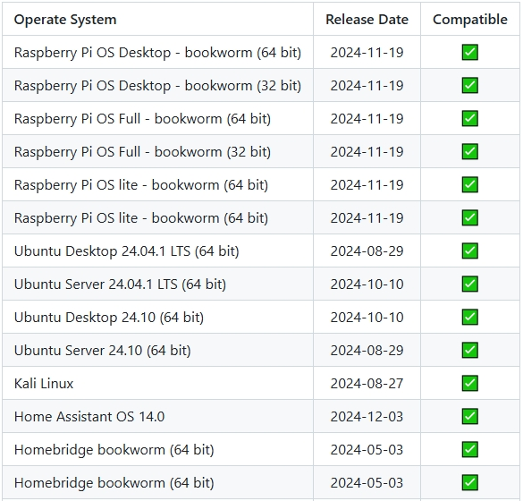

.. include:: /index.rst
   :start-after: start_hello_message
   :end-before: end_hello_message

FAQ
============

1. À propos des systèmes compatibles
-------------------------------------

Systèmes testés et approuvés avec le Raspberry Pi 5 :

2. À propos du bouton d'alimentation
--------------------------------------

Le bouton d'alimentation reprend les fonctions du bouton physique du Raspberry Pi 5.

.. image:: img/power_button.jpg
    :width: 400
    :align: center

* **Arrêt**

   * Si vous utilisez le système **Raspberry Pi OS Desktop**, vous pouvez appuyer deux fois rapidement sur le bouton d’alimentation pour éteindre.
   * Si vous utilisez le système **Raspberry Pi OS Lite** sans interface graphique, appuyez une seule fois sur le bouton d’alimentation pour lancer l’arrêt.
   * Pour forcer un arrêt brutal, maintenez le bouton d’alimentation enfoncé.

* **Allumage**

  * Si la carte Raspberry Pi est éteinte mais toujours alimentée, une simple pression permet de la rallumer.

* Si votre système ne prend pas en charge cette fonctionnalité, maintenez le bouton enfoncé pendant 5 secondes pour un arrêt forcé, puis appuyez une fois pour rallumer.

3. À propos du Raspberry Pi AI HAT+
--------------------------------------------

Le Raspberry Pi AI HAT+ n’est pas compatible avec le Pironman 5.

.. image::  img/output3.png
    :width: 400

Le kit AI Raspberry Pi combine le HAT+ M.2 et le module d’accélération Hailo AI.

.. image::  img/output2.jpg
    :width: 400

Vous pouvez détacher le module accélérateur Hailo AI du kit Raspberry Pi AI et l’insérer directement dans le HAT du Pironman 5 Mini.

   .. .. image::  img/output4.png
   ..      :width: 800

4. PI5 ne démarre pas (LED rouge) ?
-------------------------------------------

Ce problème peut être causé par une mise à jour du système, une modification de l’ordre de démarrage ou un chargeur de démarrage corrompu. Vous pouvez essayer les étapes suivantes pour le résoudre :

#. Reconnectez l’alimentation et vérifiez si le PI5 démarre correctement.

#. Restaurer le chargeur de démarrage

   * Si le PI5 ne démarre toujours pas, il est possible que le chargeur de démarrage soit corrompu. Vous pouvez suivre ce guide : :ref:`update_bootloader_mini` et choisir de démarrer depuis la carte SD ou NVMe/USB.  
   * Insérez la carte SD préparée dans le PI5, allumez-le et attendez au moins 10 secondes. Une fois la récupération terminée, retirez et reformatez la carte SD.  
   * Ensuite, utilisez Raspberry Pi Imager pour flasher la dernière version de Raspberry Pi OS, insérez à nouveau la carte et essayez de démarrer.

5. Les LED RVB ne fonctionnent pas ?
------------------------------------------

#. Les deux broches du Mini HAT sont utilisées pour connecter les LED RVB au GPIO10. Assurez-vous que le cavalier est correctement placé sur ces deux broches.

   .. image:: hardware/img/io_board_rgb_pin.png
      :width: 300
      :align: center

#. Vérifiez que votre Raspberry Pi exécute un système d’exploitation compatible. Le Pironman 5 prend en charge uniquement les versions suivantes :

   .. image:: img/compitable_os.png
      :width: 600
      :align: center

   Si vous utilisez un OS non pris en charge, suivez le guide pour installer un système compatible : :ref:`install_the_os_mini`.

#. Exécutez la commande ``sudo raspi-config`` pour ouvrir le menu de configuration. Accédez à **3 Interfacing Options** -> **I3 SPI** -> **YES**, puis cliquez sur **OK** et **Finish** pour activer SPI. Redémarrez ensuite le Pironman 5.

Si le problème persiste, veuillez contacter service@sunfounder.com. Nous vous répondrons dans les plus brefs délais.

6. Le ventilateur CPU ne fonctionne pas ?
---------------------------------------------

Si la température du CPU n’a pas atteint le seuil défini, le ventilateur ne se déclenche pas.

**Contrôle de la vitesse du ventilateur en fonction de la température**  

Le ventilateur PWM ajuste dynamiquement sa vitesse selon la température du Raspberry Pi 5 :  

* **< 50°C** : Ventilateur éteint (0 %)  
* **50°C** : Basse vitesse (30 %)  
* **60°C** : Vitesse moyenne (50 %)  
* **67,5°C** : Haute vitesse (70 %)  
* **≥ 75°C** : Vitesse maximale (100 %)  

Pour plus d’informations, consultez : :ref:`fan_mini`

7. Comment désactiver le tableau de bord web ?
--------------------------------------------------

Une fois le module ``pironman5`` installé, vous pouvez accéder au :ref:`view_control_dashboard_mini`.
      
Si vous ne souhaitez pas utiliser cette fonctionnalité pour économiser des ressources, désactivez-la lors de l’installation avec l’option ``--disable-dashboard`` :
      
.. code-block:: shell
      
   cd ~/pironman5
   sudo python3 install.py --disable-dashboard
      
Si ``pironman5`` est déjà installé, vous pouvez désinstaller le module ``dashboard`` et ``influxdb``, puis redémarrer le service :
      
.. code-block:: shell
      
   /opt/pironman5/env/bin/pip3 uninstall pm-dashboard influxdb
   sudo apt purge influxdb
   sudo systemctl restart pironman5

8. Comment contrôler les composants avec la commande ``pironman5`` ?
------------------------------------------------------------------------
Consultez le tutoriel suivant pour apprendre à piloter les composants du Pironman 5 avec la commande ``pironman5`` :

* :ref:`view_control_commands_mini`

9. Comment modifier l’ordre de démarrage via les commandes ?
---------------------------------------------------------------

Si vous êtes déjà connecté à votre Raspberry Pi, vous pouvez changer l’ordre de démarrage via commande. Suivez les instructions détaillées ici :

* :ref:`configure_boot_ssd_mini`

10. Comment modifier l’ordre de démarrage avec Raspberry Pi Imager ?
-----------------------------------------------------------------------

En plus de la modification de ``BOOT_ORDER`` dans la configuration EEPROM, vous pouvez utiliser **Raspberry Pi Imager** pour modifier l’ordre de démarrage.

Il est recommandé d’utiliser une carte SD secondaire pour cette étape.

* :ref:`update_bootloader_mini`

11. Comment copier le système de la carte SD vers un SSD NVMe ?
-------------------------------------------------------------------

Si vous avez un SSD NVMe mais aucun adaptateur pour le connecter à votre PC, vous pouvez d’abord installer le système sur une carte Micro SD. Une fois le Pironman 5 démarré, vous pourrez cloner le système vers le SSD NVMe. Suivez le guide ici :

* :ref:`copy_sd_to_nvme_mini`

12. Comment retirer le film protecteur des plaques acryliques ?
-------------------------------------------------------------------

Deux plaques acryliques sont incluses, chacune protégée des deux côtés par un film jaune ou transparent contre les rayures. Ce film peut être difficile à retirer. Utilisez un tournevis pour gratter doucement un coin, puis décollez lentement le film.

.. image:: img/peel_off_film.jpg
    :width: 500
    :align: center

.. _openssh_powershell_mini:

13. Comment installer OpenSSH via PowerShell ?
--------------------------------------------------

Lorsque vous utilisez la commande ``ssh <username>@<hostname>.local`` (ou ``ssh <username>@<IP address>``) pour vous connecter à votre Raspberry Pi et que l’erreur suivante s’affiche :

    .. code-block::

        ssh: The term 'ssh' is not recognized as the name of a cmdlet, function, script file, or operable program. Check the
        spelling of the name, or if a path was included, verify that the path is correct and try again.

Cela signifie que votre système d’exploitation est trop ancien et ne dispose pas de `OpenSSH <https://learn.microsoft.com/en-us/windows-server/administration/openssh/openssh_install_firstuse?tabs=gui>`_ préinstallé. Vous devez suivre le tutoriel ci-dessous pour l’installer manuellement.

#. Tapez ``powershell`` dans la barre de recherche de Windows, faites un clic droit sur ``Windows PowerShell``, puis sélectionnez ``Exécuter en tant qu’administrateur``.

   .. image:: img/powershell_ssh.png
      :width: 90%

#. Utilisez la commande suivante pour installer ``OpenSSH.Client`` :

   .. code-block::

        Add-WindowsCapability -Online -Name OpenSSH.Client~~~~0.0.1.0

#. Une fois l’installation terminée, la sortie suivante s’affichera :

   .. code-block::

        Path          :
        Online        : True
        RestartNeeded : False

#. Vérifiez l’installation avec cette commande :

   .. code-block::

        Get-WindowsCapability -Online | Where-Object Name -like 'OpenSSH*'

#. Le système vous confirmera que ``OpenSSH.Client`` est installé :

   .. code-block::

        Name  : OpenSSH.Client~~~~0.0.1.0
        State : Installed

        Name  : OpenSSH.Server~~~~0.0.1.0
        State : NotPresent

   .. warning::

        Si ce message n’apparaît pas, cela signifie que votre système Windows est encore trop ancien. Nous vous recommandons d’installer un outil SSH tiers comme |link_putty|.

#. Redémarrez PowerShell et exécutez-le de nouveau en tant qu’administrateur. Vous pourrez alors vous connecter à votre Raspberry Pi avec la commande ``ssh``, après quoi le mot de passe vous sera demandé.

   .. image:: img/powershell_login.png
