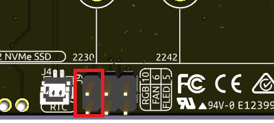

.. note:: 

    Ciao, benvenuto nella community di appassionati di Raspberry Pi, Arduino ed ESP32 di SunFounder su Facebook! Approfondisci le tue conoscenze su Raspberry Pi, Arduino ed ESP32 insieme ad altri membri della community.

    **Perché unirsi?**

    - **Supporto esperto**: Risolvi problemi post-vendita e difficoltà tecniche grazie al supporto del nostro team e della community.
    - **Impara e condividi**: Scambia suggerimenti e tutorial per migliorare le tue competenze.
    - **Anteprime esclusive**: Ottieni l’accesso anticipato agli annunci dei nuovi prodotti e alle anteprime.
    - **Sconti esclusivi**: Approfitta di offerte speciali sui nostri prodotti più recenti.
    - **Promozioni festive e giveaway**: Partecipa a concorsi ed eventi promozionali durante le festività.

    👉 Pronto a esplorare e creare con noi? Clicca su [|link_sf_facebook|] e unisciti oggi stesso!

FAQ
============

1. Sistemi compatibili
-------------------------------

Sistemi che hanno superato i test con Raspberry Pi 5:

.. image:: img/compitable_os.png
   :width: 600
   :align: center

2. Pulsante di accensione
-----------------------------

Il pulsante esterno replica il pulsante di accensione del Raspberry Pi 5 e ne mantiene le stesse funzionalità.

.. image:: img/power_button.jpg
    :width: 400
    :align: center

* **Spegnimento**

  * Su **Raspberry Pi OS Desktop**, premi due volte rapidamente per spegnere.
  * Su **Raspberry Pi OS Lite**, premi una volta per iniziare lo spegnimento.
  * Tieni premuto per un arresto forzato.

* **Accensione**

  * Se il Raspberry Pi è spento ma alimentato, premi una volta per accendere.

* Se il sistema non supporta lo spegnimento tramite pulsante, tieni premuto 5 secondi per forzare lo spegnimento, poi premi una volta per accendere.

3. Raspberry Pi AI HAT+
----------------------------------------------------------

Il Raspberry Pi AI HAT+ non è compatibile con il Pironman 5.

.. image::  img/output3.png
    :width: 400

Il kit AI Raspberry Pi combina l’HAT+ M.2 e il modulo acceleratore AI Hailo.

.. image::  img/output2.jpg
    :width: 400

Puoi staccare il modulo acceleratore AI Hailo dal Raspberry Pi AI Kit e inserirlo direttamente nell’HAT del Pironman 5 Mini.

   .. .. image::  img/output4.png
   ..      :width: 800

4. PI5 non si avvia (LED rosso)?
-------------------------------------------

Questo problema può essere causato da un aggiornamento del sistema, da modifiche all’ordine di avvio o da un bootloader danneggiato. Puoi provare i seguenti passaggi per risolvere il problema:

#. Ricollega l’alimentazione e verifica se il PI5 si avvia correttamente.

#. Ripristina il bootloader

   * Se il PI5 continua a non avviarsi, il bootloader potrebbe essere corrotto. Puoi seguire questa guida: :ref:`update_bootloader_mini` e scegliere se avviare da SD card o da NVMe/USB.
   * Inserisci la scheda SD preparata nel PI5, accendilo e attendi almeno 10 secondi. Una volta completato il ripristino, rimuovi e riformatta la scheda SD.
   * Poi utilizza Raspberry Pi Imager per installare l’ultima versione del Raspberry Pi OS, reinserisci la scheda e prova ad avviare nuovamente.

.. Il Pironman 5 Mini supporta i sistemi di retrogaming?
.. --------------------------------------------------------------

.. Sì, è compatibile. Tuttavia, la maggior parte dei sistemi di retrogaming sono versioni ottimizzate che non consentono l’installazione e l’esecuzione di software aggiuntivo. Questa limitazione può causare il malfunzionamento di alcuni componenti del Pironman 5 Mini, come la ventola RGB e i 4 LED RGB, poiché questi richiedono l’installazione dei pacchetti software del Pironman 5.

5. I LED RGB non funzionano?
-------------------------------

#. I due pin sull’HAT Mini vengono utilizzati per collegare i LED RGB a GPIO10. Assicurati che il ponticello sia correttamente inserito su questi due pin.

#. Verifica che il Raspberry Pi utilizzi un sistema compatibile:

.. image:: img/compitable_os.png
    :width: 600
    :align: center

Se il sistema non è compatibile, segui la guida per l’installazione: :ref:`install_the_os_mini`.

#. Abilita SPI con ``sudo raspi-config``: vai su **3 Interfacing Options** -> **I3 SPI** -> **YES**. Poi conferma e riavvia il dispositivo.

Se il problema persiste, scrivici a service@sunfounder.com.

6. La ventola della CPU non funziona?
----------------------------------------------

La ventola non parte finché la temperatura non supera una certa soglia.

**Controllo dinamico della velocità della ventola**  

* **< 50°C**: spenta (0%)
* **= 50°C**: bassa velocità (30%)
* **= 60°C**: media velocità (50%)
* **= 67.5°C**: alta velocità (70%)
* **≥ 75°C**: velocità massima (100%)

Per dettagli, consulta :ref:`fan_mini`.

7. Come disabilitare il pannello web?
------------------------------------------------------

Dopo aver installato il modulo ``pironman5``, puoi accedere al :ref:`view_control_dashboard_mini`.

Se non ti serve e vuoi risparmiare risorse, installa con il flag ``--disable-dashboard``:

.. code-block:: shell

   cd ~/pironman5
   sudo python3 install.py --disable-dashboard

Se hai già installato ``pironman 5``, puoi rimuovere i moduli ``dashboard`` e ``influxdb``, quindi riavviare pironman5 per applicare le modifiche:

.. code-block:: shell

   /opt/pironman5/env/bin/pip3 uninstall pm-dashboard influxdb
   sudo apt purge influxdb
   sudo systemctl restart pironman5

8. Come controllare i componenti con il comando ``pironman5``?
----------------------------------------------------------------------
Puoi fare riferimento al seguente tutorial per controllare i componenti del Pironman 5 utilizzando il comando ``pironman5``.

Segui la guida: :ref:`view_control_commands_mini`

9. Come cambiare l’ordine di avvio da terminale?
-------------------------------------------------------------

Se sei già connesso al Raspberry Pi, puoi usare i comandi indicati in: 

* :ref:`configure_boot_ssd_mini`

10. Come cambiare l’ordine di avvio con Raspberry Pi Imager?
---------------------------------------------------------------

Oltre a modificare il parametro ``BOOT_ORDER`` nella configurazione dell'EEPROM, puoi anche utilizzare il **Raspberry Pi Imager** per cambiare l'ordine di avvio del tuo Raspberry Pi.

Si consiglia di utilizzare una scheda di riserva per eseguire questo passaggio.

* :ref:`update_bootloader_mini`

11. Come copiare il sistema da SD a SSD NVMe?
--------------------------------------------------------------

Se non hai un adattatore NVMe, installa il sistema su microSD. Dopo l’avvio, copia tutto su SSD.

* :ref:`copy_sd_to_nvme_rpi_mini`

12. Come rimuovere la pellicola protettiva dai pannelli acrilici?
----------------------------------------------------------------------

I due pannelli acrilici hanno una pellicola protettiva su entrambi i lati. Rimuovila con cautela aiutandoti con un cacciavite.

.. image:: img/peel_off_film.jpg
    :width: 500
    :align: center

.. _openssh_powershell_mini:

13. Come installare OpenSSH tramite Powershell?
---------------------------------------------------

Quando provi a collegarti al tuo Raspberry Pi usando il comando ``ssh <username>@<hostname>.local`` (oppure ``ssh <username>@<IP address>``), ma compare il seguente messaggio di errore:

    .. code-block::

        ssh: The term 'ssh' is not recognized as the name of a cmdlet, function, script file, or operable program. Check the
        spelling of the name, or if a path was included, verify that the path is correct and try again.

Significa che il tuo sistema operativo è troppo vecchio e non ha `OpenSSH <https://learn.microsoft.com/en-us/windows-server/administration/openssh/openssh_install_firstuse?tabs=gui>`_ preinstallato. In tal caso, segui il tutorial qui sotto per installarlo manualmente.

#. Digita ``powershell`` nella barra di ricerca del desktop di Windows, fai clic destro su ``Windows PowerShell`` e seleziona ``Esegui come amministratore`` dal menu che appare.

   .. image:: img/powershell_ssh.png
      :width: 90%

#. Utilizza il seguente comando per installare ``OpenSSH.Client``.

   .. code-block::

        Add-WindowsCapability -Online -Name OpenSSH.Client~~~~0.0.1.0

#. Dopo l’installazione, verrà restituito il seguente output:

   .. code-block::

        Path          :
        Online        : True
        RestartNeeded : False

#. Verifica l’installazione con il comando:

   .. code-block::

        Get-WindowsCapability -Online | Where-Object Name -like 'OpenSSH*'

#. Ora ti verrà mostrato che ``OpenSSH.Client`` è stato installato correttamente:

   .. code-block::

        Name  : OpenSSH.Client~~~~0.0.1.0
        State : Installed

        Name  : OpenSSH.Server~~~~0.0.1.0
        State : NotPresent

   .. warning::

        Se questo messaggio non compare, significa che il tuo sistema Windows è ancora troppo obsoleto. In questo caso, ti consigliamo di installare uno strumento SSH di terze parti come |link_putty|.

#. Riavvia PowerShell e continua ad eseguirlo come amministratore. A questo punto potrai accedere al tuo Raspberry Pi con il comando ``ssh``, dove ti verrà chiesta la password che hai configurato precedentemente.

   .. image:: img/powershell_login.png
