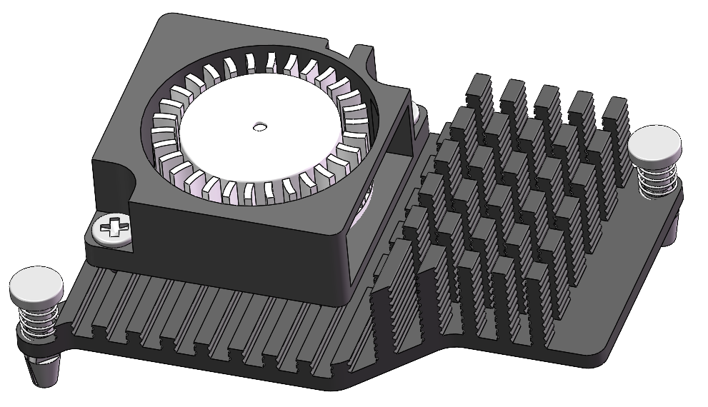

.. include:: /index.rst
   :start-after: start_hello_message
   :end-before: end_hello_message

.. _fan_mini:

ファン
============

アクティブクーラー
-------------------

Pironman 5 Mini に搭載されたアクティブクーラーは、Raspberry Pi システムによって制御されています。

Raspberry Pi 5 の冷却対策として、特に高負荷時において、Pironman 5 Mini はスマートな冷却システムを採用しています。  
本体にはメインのアクティブクーラーと補助的なGPIOファンが搭載されており、Raspberry Pi 5 の熱管理システムと密接に連携した冷却戦略が組み込まれています。

アクティブクーラーは、Raspberry Pi 5 の温度に応じて次のように動作します：

* 50°C未満：ファンは停止（速度0%）
* 50°C：ファンが低速で起動（速度30%）
* 60°C：中速で動作（速度50%）
* 67.5°C：高速動作（速度70%）
* 75°C以上：最大速度で動作（速度100%）

この温度とファン速度の関係は、温度が下がる場合にも適用され、各閾値から5°C下がった時点で次の段階に速度が減少します（ヒステリシス5°C）。

* アクティブクーラーの状態を確認するコマンド：

  .. code-block:: shell
  
    cat /sys/class/thermal/cooling_device0/cur_state

* アクティブクーラーの回転数を確認するコマンド：

  .. code-block:: shell

    cat /sys/devices/platform/cooling_fan/hwmon/*/fan1_input

Pironman 5 Mini において、アクティブクーラーは高負荷時でも安定した動作温度を維持するために不可欠な構成要素であり、Raspberry Pi 5 のパフォーマンスと信頼性を確保します。

GPIOファン
-------------------

.. image:: img/size_fan.png

* **外形寸法**：40×40×10mm  
* **重量**：13.5±5g／個  
* **寿命**：40,000時間（室温25°Cにて）  
* **最大風量**：2.46CFM  
* **最大静圧**：0.62mm-H2O  
* **動作音**：22.31dBA  
* **定格入力**：5V／0.1A  
* **定格回転数**：3500±10%RPM  
* **動作温度範囲**：-10℃〜+70℃  
* **保存温度範囲**：-30℃〜+85℃
