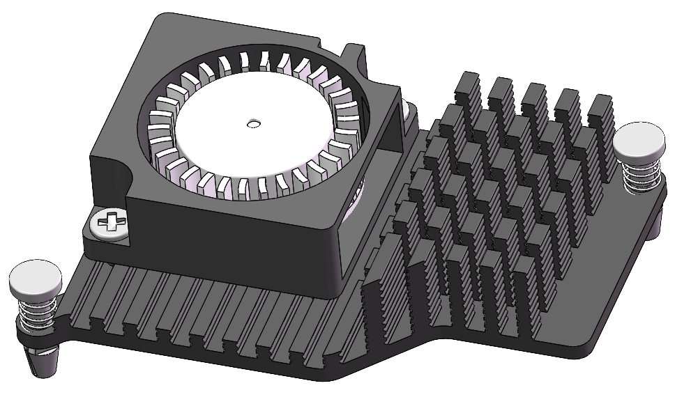

.. note::

    Hallo und herzlich willkommen in der SunFounder-Community für Raspberry Pi-, Arduino- und ESP32-Enthusiasten auf Facebook! Tauche gemeinsam mit anderen Technikbegeisterten tiefer in die Welt von Raspberry Pi, Arduino und ESP32 ein.

    **Warum solltest du beitreten?**

    - **Expertenunterstützung**: Erhalte Hilfe bei technischen Fragen und Problemen nach dem Kauf – direkt von unserer Community und unserem Support-Team.
    - **Lernen & Teilen**: Tausche Tipps und Tutorials aus, um dein Wissen und deine Fähigkeiten zu erweitern.
    - **Exklusive Vorschauen**: Erfahre als Erste:r von neuen Produktankündigungen und erhalte exklusive Einblicke.
    - **Sonderrabatte**: Genieße exklusive Rabatte auf unsere neuesten Produkte.
    - **Aktionen & Verlosungen**: Nimm an Gewinnspielen und saisonalen Aktionen teil.

    👉 Bereit, gemeinsam mit uns zu entdecken und kreativ zu werden? Klicke auf [|link_sf_facebook|] und werde noch heute Mitglied!

.. _fan_mini:

Lüfter
============

Aktivkühler
----------------

Der Aktivkühler im Pironman 5 Mini wird direkt vom Raspberry Pi-System gesteuert.

Für die Kühlung des Raspberry Pi 5 – insbesondere unter hoher Last – setzt das Design des Pironman 5 Mini auf ein intelligentes Kühlsystem. 
Es besteht aus einem Haupt-Aktivkühler (active cooler) sowie einem ergänzenden RGB-Lüfter. 
Diese Kühlstrategie ist eng mit dem thermischen Management des Raspberry Pi 5 verknüpft.

Die Lüftersteuerung des Aktivkühlers richtet sich nach der Temperatur des Raspberry Pi 5:

* Unter 50 °C: Lüfter bleibt aus (0 % Drehzahl)
* Ab 50 °C: niedrige Drehzahl (30 %)
* Ab 60 °C: mittlere Drehzahl (50 %)
* Ab 67,5 °C: hohe Drehzahl (70 %)
* Ab 75 °C: maximale Drehzahl (100 %)

Diese Temperatur-Drehzahl-Regelung gilt auch beim Abkühlen, wobei eine Hysterese von 5 °C angewendet wird. Die Lüfterdrehzahl sinkt also jeweils erst, wenn die Temperatur 5 °C unter die genannten Schwellen fällt.

* Befehl zum Überprüfen des Aktivkühlers. Um den Status des Aktivkühlers abzufragen:

  .. code-block:: shell
  
    cat /sys/class/thermal/cooling_device0/cur_state

* Um die aktuelle Drehzahl des Aktivkühlers zu sehen:

  .. code-block:: shell

    cat /sys/devices/platform/cooling_fan/hwmon/*/fan1_input

Im Pironman 5 Mini ist der Aktivkühler ein zentrales Element zur Aufrechterhaltung optimaler Betriebstemperaturen – besonders bei rechenintensiven Aufgaben – und sorgt so für einen stabilen und zuverlässigen Betrieb des Raspberry Pi 5.

RGB-Lüfter
-------------------

.. image:: img/size_fan.png

* **Außenmaße**: 40×40×10 mm  
* **Gewicht**: 13.5 ± 5 g pro Stück  
* **Lebensdauer**: 40.000 Stunden (bei 25 °C Raumtemperatur)  
* **Maximaler Luftstrom**: 2.46 CFM  
* **Maximaler Luftdruck**: 0.62 mm H₂O  
* **Geräuschentwicklung**: 22.31 dBA  
* **Nennleistung**: 5 V / 0.1 A  
* **Nenndrehzahl**: 3500 ± 10 % RPM  
* **Betriebstemperatur**: −10 °C bis +70 °C  
* **Lagertemperatur**: −30 °C bis +85 °C  
