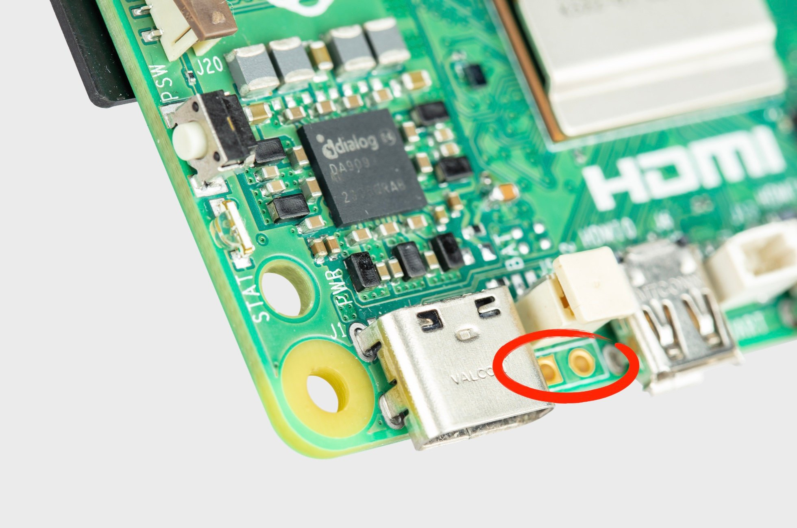
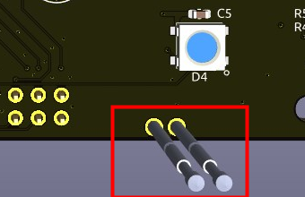
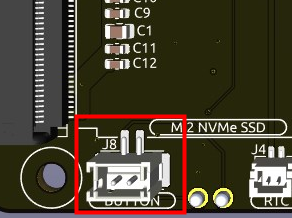
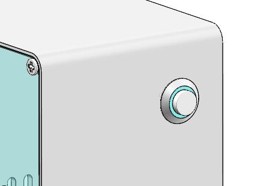
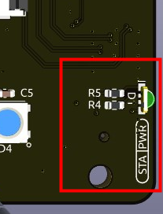
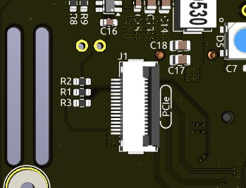
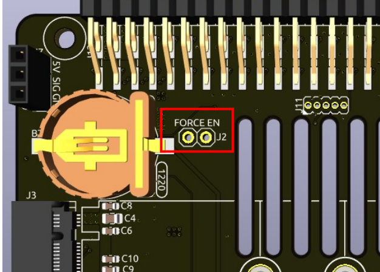

.. note::

    Hola, bienvenido a la comunidad de entusiastas de SunFounder Raspberry Pi, Arduino y ESP32 en Facebook. ¡Profundiza en el mundo de Raspberry Pi, Arduino y ESP32 junto a otros apasionados como tú!

    **¿Por qué unirse?**

    - **Soporte experto**: Resuelve problemas postventa y desafíos técnicos con ayuda de nuestra comunidad y equipo.
    - **Aprende y comparte**: Intercambia consejos y tutoriales para mejorar tus habilidades.
    - **Avances exclusivos**: Obtén acceso anticipado a nuevos lanzamientos y adelantos de productos.
    - **Descuentos especiales**: Aprovecha ofertas exclusivas en nuestros productos más recientes.
    - **Promociones y sorteos festivos**: Participa en sorteos y campañas especiales durante las festividades.

    👉 ¿Listo para explorar y crear con nosotros? Haz clic en [|link_sf_facebook|] y únete hoy.

Pironman 5 Mini HAT
===========================================

.. image:: img/pironman5mini_hat.png

LEDs RGB
--------------

.. image:: img/io_board_rgb.png

La placa incluye 4 LEDs RGB WS2812 con control personalizable. 
Puedes encenderlos o apagarlos, cambiar su color, ajustar el brillo, seleccionar modos de visualización y configurar la velocidad de cambio.

* Para encender o apagar los LEDs RGB, usa ``true`` para encenderlos, ``false`` para apagarlos.

.. code-block:: shell

  pironman5 -re true

* Para cambiar el color, introduce un valor hexadecimal, como ``fe1a1a``.

.. code-block:: shell

  pironman5 -rc fe1a1a

* Para modificar el brillo (rango: 0 ~ 100%):

.. code-block:: shell

  pironman5 -rb 100

* Para cambiar el modo de visualización, selecciona entre: ``solid/breathing/flow/flow_reverse/rainbow/rainbow_reverse/hue_cycle``:

.. note::

  Si eliges los modos ``rainbow``, ``rainbow_reverse`` o ``hue_cycle``, no podrás cambiar el color con ``pironman5 -rc``.

.. code-block:: shell

  pironman5 -rs breathing

* Para ajustar la velocidad del efecto (rango: 0 ~ 100%):

.. code-block:: shell

  pironman5 -rp 80

Pin de control RGB
-------------------------

El LED RGB funciona mediante SPI y está conectado a **GPIO10**, que también es el pin SPI MOSI. 
Los dos pines permiten conectar el RGB al GPIO10. Si no se utilizan, se puede quitar el puente.

.. image:: img/io_board_rgb_pin.png

Pines de salida RGB
-------------------------

.. image:: img/io_board_rgb_out.png

Los LEDs RGB WS2812 admiten conexión en serie, lo que permite añadir una tira LED RGB externa. Conecta el pin **SIG** al pin **DIN** de la tira para expandir.

La configuración por defecto incluye 4 LEDs RGB. Para añadir más y actualizar el número:

.. code-block:: shell

  pironman5 -rl 12

Pines del ventilador RGB
------------------------------

La placa de expansión IO es compatible con un ventilador de 5V sin PWM.

Debes conectar el cable del ventilador al puerto FAN.

.. image:: img/io_board_fan.png

Los pines debajo del J9 permiten activar/desactivar el ventilador y su LED RGB. Por defecto, los jumpers permiten que GPIO6 y GPIO5 los controlen. Si no se necesita esta función, se pueden retirar los jumpers.

.. image:: img/io_board_fan_j9.png

Puedes usar comandos para definir el modo de funcionamiento del ventilador RGB.

Por ejemplo, si eliges el modo **1: Performance**, el ventilador se activará a 50°C.

.. code-block:: shell

  pironman5 -gm 3

* **4: Quiet**: se activa a 70°C.
* **3: Balanced**: se activa a 67.5°C.
* **2: Cool**: se activa a 60°C.
* **1: Performance**: se activa a 50°C.
* **0: Always On**: siempre encendido.

Si conectas el pin de control del ventilador a otro pin, puedes cambiar el número con:

.. code-block:: shell

  sudo pironman5 -gp 18

Convertidor de botón de encendido
--------------------------------------

**Agregar botón de encendido**

* La Raspberry Pi 5 incluye el jumper **J2**, entre el conector de batería RTC y el borde de la placa. Permite añadir un botón de encendido externo conectando un interruptor momentáneo normalmente abierto (NO) a los dos pads.

* El Pironman 5 Mini extiende el jumper **J2** mediante dos pines pogo hacia un botón externo.

* Ahora puedes encender o apagar la Raspberry Pi 5 con el botón de encendido.

**Ciclo de encendido**

Al encender la Raspberry Pi 5 por primera vez, arrancará automáticamente sin pulsar el botón.

En el escritorio de Raspberry Pi, una pulsación breve abre un menú para apagar, reiniciar o cerrar sesión. Si presionas de nuevo, inicia el apagado limpio.

.. image:: img/button_shutdown.png

**Apagado**

* En **Bookworm Desktop**, pulsa dos veces rápidamente para apagar.
* En **Bookworm Lite**, basta una sola pulsación.
* Para forzar un apagado, mantén el botón presionado.

**Encendido**

* Si la Raspberry Pi está apagada pero con energía, una pulsación la encenderá.

.. note::

    En sistemas sin soporte para botón de apagado, mantén pulsado 5 segundos para apagar forzadamente, y una pulsación para encender.

Módulo NVMe
-------------------------------------------

El Pironman 5 Mini integra un adaptador PCIe para SSD NVMe. Soporta tamaños 2230, 2242, 2260 y 2280 con ranura M.2 tipo M.

.. image:: img/nvme_p.png

* **STA**: LED de estado.
* **PWR**: LED de energía.

Se conecta mediante un cable FFC de 16 pines o un FPC personalizado de impedancia controlada.

* **FORCE ENABLE**: El suministro de 3.3V se activa por una señal del PCIe. Si el sistema no soporta esta señal, puedes puentear J2 FORCE ENABLE para forzar la alimentación del NVMe.

**Sobre el modelo**

Los SSD M.2, conocidos por su tamaño compacto, se presentan en distintos tipos que se diferencian principalmente por su tipo de llave (la muesca del conector) y la interfaz que utilizan. A continuación, se describen los principales tipos:

* **M.2 SATA SSDs**: Utilizan la interfaz SATA, similar a los SSD SATA de 2.5 pulgadas, pero en un formato M.2 más pequeño. Su velocidad está limitada por el estándar SATA III, con un máximo de aproximadamente 600 MB/s. Estos SSD son compatibles con ranuras M.2 con llaves B y M.
* **M.2 NVMe SSDs**: Utilizan el protocolo NVMe sobre carriles PCIe y son considerablemente más rápidos que los SSD SATA M.2. Son ideales para tareas que requieren altas velocidades de lectura y escritura, como juegos, edición de video o trabajos con grandes volúmenes de datos. Normalmente, requieren ranuras con llave M. Estos dispositivos utilizan la interfaz PCIe (Peripheral Component Interconnect Express), con versiones como 3.0, 4.0 y 5.0. Cada nueva versión duplica efectivamente la velocidad de transferencia respecto a la anterior. Sin embargo, la Raspberry Pi 5 emplea una interfaz PCIe 3.0, capaz de alcanzar velocidades de hasta 3,500 MB/s.

Los SSD M.2 están disponibles en tres tipos de llave: llave B, llave M y llave B+M. Posteriormente se introdujo la llave B+M, que combina las funciones de las llaves B y M, reemplazando así a la llave B por separado. Consulta la imagen siguiente para más detalles.

.. image:: img/ssd_key.png

En general:
* SATA: llave B+M
* NVMe: llave M (PCIe x4)

.. image:: img/ssd_model2.png

**Sobre el tamaño**

El número (ej. 2280) indica 22 mm de ancho y 80 mm de largo.

Pironman 5 Mini es compatible con tamaños 2230, 2242, 2260 y 2280 (PCIe Gen 2.0/3.0).

.. image:: img/m2_ssd_size.png
  :width: 600

Soporte de batería RTC 1220
---------------------------------

.. image:: img/battery_holder.png

Incluye soporte para batería RTC 1220, conectado mediante cable SH1.0 2P inverso. 

Compatible con CR1220 y ML1220 (recargable).

**Activar carga por goteo (trickle charging)**

.. warning::

  Si estás utilizando una batería CR1220, no actives la carga por goteo, ya que podría causar daños irreparables a la batería y poner en riesgo la placa.

De forma predeterminada, la función de carga por goteo para la batería está desactivada. Los archivos ``sysfs`` indican el voltaje y los límites actuales de la carga por goteo:

.. code-block:: shell

    pi@raspberrypi:~ $ cat /sys/devices/platform/soc/soc:rpi_rtc/rtc/rtc0/charging_voltage
    0
    pi@raspberrypi:~ $ cat /sys/devices/platform/soc/soc:rpi_rtc/rtc/rtc0/charging_voltage_max
    4400000
    pi@raspberrypi:~ $ cat /sys/devices/platform/soc/soc:rpi_rtc/rtc/rtc0/charging_voltage_min
    1300000

Para habilitar la carga lenta, añade ``rtc_bbat_vchg`` al archivo ``/boot/firmware/config.txt``:

  * Abre el archivo ``/boot/firmware/config.txt``.
  
    .. code-block:: shell
    
      sudo nano /boot/firmware/config.txt
      
  * Añade ``rtc_bbat_vchg`` a ``/boot/firmware/config.txt``.
  
    .. code-block:: shell
    
      dtparam=rtc_bbat_vchg=3000000
  
Después de reiniciar, el sistema mostrará:

.. code-block:: shell

    pi@raspberrypi:~ $ cat /sys/devices/platform/soc/soc:rpi_rtc/rtc/rtc0/charging_voltage
    3000000
    pi@raspberrypi:~ $ cat /sys/devices/platform/soc/soc:rpi_rtc/rtc/rtc0/charging_voltage_max
    4400000
    pi@raspberrypi:~ $ cat /sys/devices/platform/soc/soc:rpi_rtc/rtc/rtc0/charging_voltage_min
    1300000

Esto confirma que la batería se encuentra en proceso de carga lenta. Para desactivar esta función, simplemente elimina la línea ``dtparam`` del archivo ``config.txt``.

Encabezados de Pines
-------------------------

.. image:: img/io_board_pin_header.png

Dos conectores de pines en ángulo recto extienden los GPIO de la Raspberry Pi, pero ten en cuenta que el receptor IR, el LED RGB y el ventilador utilizan algunos de estos pines. Quita los puentes correspondientes para reutilizarlos en otras funciones.

.. list-table:: 
  :widths: 25 25
  :header-rows: 1

  * - Pironman 5 Mini
    - Raspberry Pi 5
  * - FAN (Opcional)
    - GPIO6
  * - FAN RGB (Opcional)
    - GPIO5
  * - RGB (Opcional)
    - GPIO10