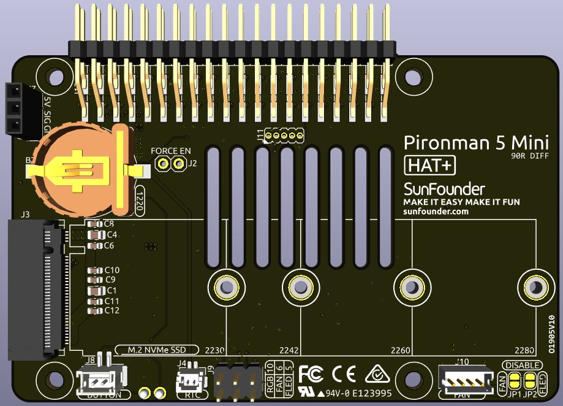
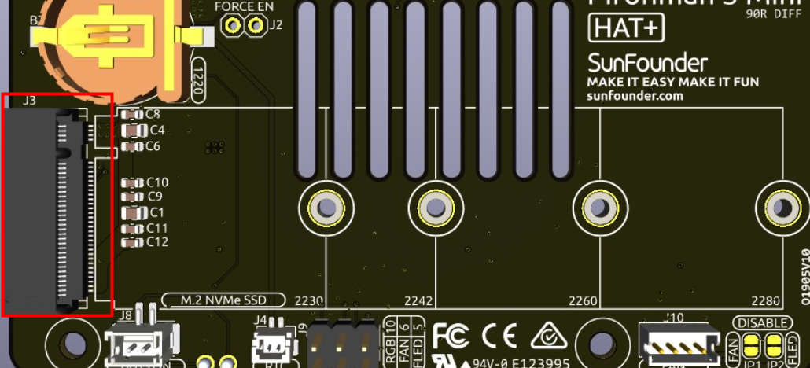
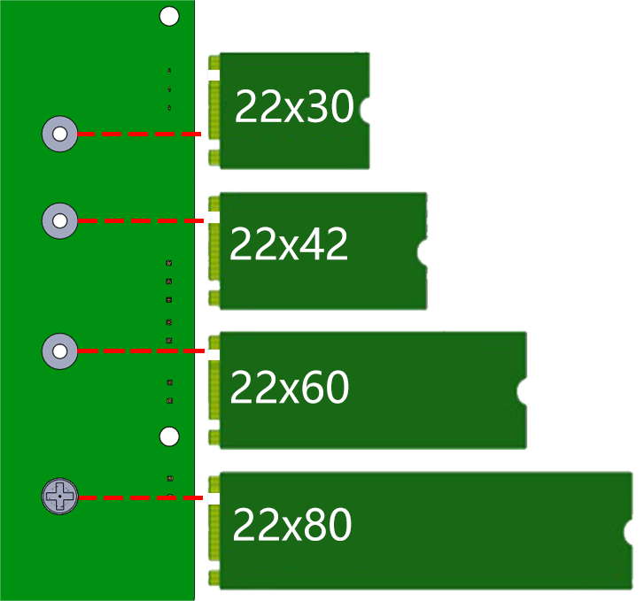
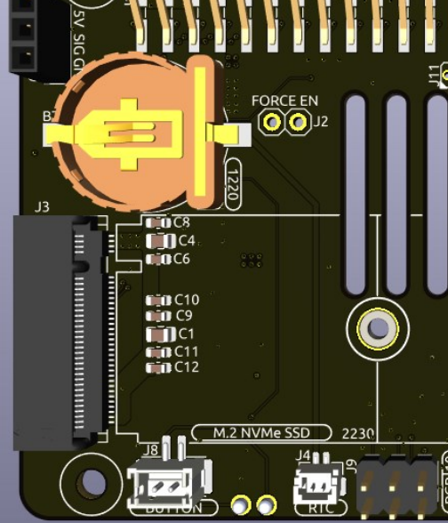

.. note:: 

    Bonjour et bienvenue dans la communauté Facebook des passionnés de Raspberry Pi, Arduino et ESP32 de SunFounder ! Rejoignez d'autres passionnés pour approfondir vos connaissances sur Raspberry Pi, Arduino et ESP32.

    **Pourquoi nous rejoindre ?**

    - **Support d’experts** : Bénéficiez d’une assistance pour les problèmes techniques et après-vente grâce à notre communauté et notre équipe.
    - **Apprendre et partager** : Échangez des conseils et des tutoriels pour développer vos compétences.
    - **Aperçus exclusifs** : Accédez en avant-première aux annonces de nouveaux produits et à des démonstrations exclusives.
    - **Réductions spéciales** : Profitez de remises exclusives sur nos dernières nouveautés.
    - **Promotions festives et cadeaux** : Participez à nos jeux-concours et campagnes promotionnelles pendant les fêtes.

    👉 Prêt à explorer et créer avec nous ? Cliquez sur [|link_sf_facebook|] et rejoignez-nous dès aujourd’hui !

Pironman 5 Mini HAT
===========================================

LED RGB
------------

.. image:: img/io_board_rgb.png

La carte est équipée de 4 LED RGB WS2812, entièrement personnalisables.  
Vous pouvez les allumer ou les éteindre, changer leur couleur, ajuster leur luminosité, sélectionner un mode d'affichage et régler la vitesse d’animation.

* Pour allumer ou éteindre les LED RGB, utilisez ``true`` pour les activer, ``false`` pour les désactiver :

.. code-block:: shell

  pironman5 -re true

* Pour changer leur couleur, entrez la valeur hexadécimale souhaitée, par exemple ``fe1a1a`` :

.. code-block:: shell

  pironman5 -rc fe1a1a

* Pour régler la luminosité des LED RGB (plage : 0 à 100 %) :

.. code-block:: shell

  pironman5 -rb 100

* Pour modifier le mode d’affichage RGB, choisissez parmi : ``solid/breathing/flow/flow_reverse/rainbow/rainbow_reverse/hue_cycle`` :

.. note::

  Si vous choisissez ``rainbow``, ``rainbow_reverse`` ou ``hue_cycle``, vous ne pourrez pas définir la couleur avec ``pironman5 -rc``.

.. code-block:: shell

  pironman5 -rs breathing

* Pour ajuster la vitesse d’animation (plage : 0 à 100 %) :

.. code-block:: shell

  pironman5 -rp 80

Broche de contrôle RGB
-------------------------

Les LED RGB sont pilotées via SPI et connectées à **GPIO10**, également utilisé comme broche MOSI SPI.  
Deux broches connectent les LED RGB à GPIO10. Si elles ne sont pas utilisées, vous pouvez retirer le cavalier.

 .. image:: img/io_board_rgb_pin.png

Sortie RGB
-------------------------

 .. image:: img/io_board_rgb_out.png

Les LED RGB WS2812 permettent une connexion en série. Vous pouvez ainsi raccorder un ruban LED RGB externe. Connectez la broche **SIG** à l’entrée **DIN** du ruban pour l’extension.

Par défaut, 4 LED RGB sont installées. Pour en ajouter, mettez à jour le nombre via :

.. code-block:: shell

  pironman5 -rl 12

Broches du ventilateur RGB
-------------------------------------

La carte d’extension prend en charge un ventilateur 5V sans PWM.  

Branchez les câbles du ventilateur sur le port FAN.

 .. image:: img/io_board_fan.png

Les deux rangées de broches situées sous J9 sont des broches d’activation pour le ventilateur et ses LED RGB.  
Par défaut, des cavaliers sont en place, permettant à GPIO6 et GPIO5 de contrôler l’état marche/arrêt du ventilateur et de ses LED.  
Si vous ne souhaitez pas les utiliser, vous pouvez retirer les cavaliers pour libérer les GPIO correspondantes.

 .. image:: img/io_board_fan_j9.png

Vous pouvez configurer le mode de fonctionnement du ventilateur RGB via commande. Ces modes déterminent à quelle température le ventilateur s’active.

Par exemple, en mode **1: Performance**, le ventilateur s’active à 50 °C.

  .. code-block:: shell

    pironman5 -gm 3

  * **4: Silencieux** : activation à 70 °C  
  * **3: Équilibré** : activation à 67,5 °C  
  * **2: Froid** : activation à 60 °C  
  * **1: Performance** : activation à 50 °C  
  * **0: Toujours actif** : le ventilateur reste en marche  

Si vous changez la broche de contrôle du ventilateur, utilisez la commande suivante pour la modifier :

.. code-block:: shell

  sudo pironman5 -gp 18

Convertisseur de bouton d’alimentation
-------------------------------------------

**Ajout du bouton d’alimentation**

* Le Raspberry Pi 5 dispose d’un cavalier **J2**, situé entre le connecteur de la batterie RTC et le bord de la carte. Il permet de connecter un bouton poussoir (NO) pour ajouter une fonction d’alimentation externe.

  .. image:: img/pi5_j2.jpg

* Le Pironman 5 Mini prolonge le cavalier **J2** vers un bouton d’alimentation externe à l’aide de deux broches pogo.

  .. image:: img/power_switch_j2.jpeg  

  .. image:: img/power_switch_j2_2.jpeg

* Le Raspberry Pi 5 peut ainsi être allumé ou éteint via le bouton d’alimentation.

  .. image:: img/pironman_button.JPG

**Allumage/Extinction**

Au premier démarrage, le Raspberry Pi s’allume automatiquement.

Sous Raspberry Pi Desktop, une pression courte affiche un menu pour éteindre, redémarrer ou se déconnecter.  
Une nouvelle pression valide le choix ou lance l’arrêt.

.. image:: img/button_shutdown.png

**Extinction**

* Sous **Bookworm Desktop** : appuyez deux fois rapidement pour éteindre.  
* Sous **Bookworm Lite** (sans interface graphique) : une seule pression suffit.  
* Maintenez le bouton pour forcer l’arrêt en cas de blocage.

**Allumage**

* Si le Pi est éteint mais encore alimenté : une pression suffit pour l’allumer.

.. note::

    Si votre système ne prend pas en charge la commande d’arrêt, maintenez le bouton 5 secondes pour forcer l’arrêt, et une pression pour rallumer.

Module NVMe
-------------------------------------------

Le Pironman 5 Mini intègre un module adaptateur PCIe pour SSD NVMe. Il prend en charge quatre formats : 2230, 2242, 2260 et 2280 via un connecteur M.2 clé M.

* **STA** : LED d’état  
* **PWR** : LED d’alimentation

  .. image:: img/nvme_led.png

* Le module se connecte via une nappe FFC inversée 16P 0,5 mm ou un câble FPC sur mesure.

  .. image:: img/nvme_pcie.png

* **FORCE ENABLE** : l’alimentation 3,3 V est activée par un signal PCIe.  
Si votre système ne le supporte pas, vous pouvez souder un pont sur J2 pour forcer l’activation.

  .. image:: img/nvme_j2.png

**À propos du modèle**

Les SSD M.2 existent en plusieurs variantes selon le type de connecteur (clé) et d’interface :

* **M.2 SATA** : utilisent l’interface SATA, jusqu’à 600 Mo/s. Compatibles avec les connecteurs B et M.  
* **M.2 NVMe** : exploitent le protocole NVMe via PCIe, bien plus rapides.  

Ils nécessitent généralement un connecteur de type M. Le Raspberry Pi 5 utilise le PCIe 3.0, avec des vitesses allant jusqu’à 3500 Mo/s.

Il existe trois types de clés : B, M et B+M.  
Le type B+M permet une compatibilité étendue. Voir image ci-dessous.

.. image:: img/ssd_key.png

En général, les SSD M.2 SATA possèdent une clé B+M (compatibles avec les connecteurs à clé B et M), tandis que les SSD M.2 NVMe utilisant une interface PCIe 3.0 x4 sont à clé M.

**À propos des dimensions**

Les modules M.2 existent en plusieurs tailles.  
Le Pironman 5 prend en charge les formats NVMe PCIe Gen 2.0 / 3.0 suivants : 2230, 2242, 2260 et 2280.  
"22" = largeur en mm, les deux chiffres suivants = longueur.  
Plus le module est long, plus sa capacité potentielle est élevée.

Support de pile RTC 1220
---------------------------------

Un support de pile RTC 1220 est intégré, avec un câble SH1.0 2P inversé pour se connecter à l’interface RTC du Raspberry Pi.  

Compatible avec les piles CR1220 et ML1220. Seule la ML1220 est rechargeable.

**Activer la charge d’appoint (trickle charging)**

.. warning::

    N’activez pas la recharge si vous utilisez une pile CR1220 : cela endommagerait la pile et la carte.

Par défaut, la charge d’appoint est désactivée. Vous pouvez vérifier les valeurs actuelles via :

.. code-block:: shell

    pi@raspberrypi:~ $ cat /sys/devices/platform/soc/soc:rpi_rtc/rtc/rtc0/charging_voltage
    0
    pi@raspberrypi:~ $ cat /sys/devices/platform/soc/soc:rpi_rtc/rtc/rtc0/charging_voltage_max
    4400000
    pi@raspberrypi:~ $ cat /sys/devices/platform/soc/soc:rpi_rtc/rtc/rtc0/charging_voltage_min
    1300000

Pour activer la recharge, ajoutez ``rtc_bbat_vchg`` à ``/boot/firmware/config.txt`` :

* Ouvrez le fichier ``/boot/firmware/config.txt``.

.. code-block:: shell

    sudo nano /boot/firmware/config.txt

* Ajoutez ``rtc_bbat_vchg`` dans le fichier ``/boot/firmware/config.txt``.

.. code-block:: shell

    dtparam=rtc_bbat_vchg=3000000

Après redémarrage, vérifiez :

.. code-block:: shell

    pi@raspberrypi:~ $ cat /sys/devices/platform/soc/soc:rpi_rtc/rtc/rtc0/charging_voltage
    3000000
    pi@raspberrypi:~ $ cat /sys/devices/platform/soc/soc:rpi_rtc/rtc/rtc0/charging_voltage_max
    4400000
    pi@raspberrypi:~ $ cat /sys/devices/platform/soc/soc:rpi_rtc/rtc/rtc0/charging_voltage_min
    1300000

Cela confirme que la batterie est désormais en cours de charge d’appoint. Pour désactiver cette fonctionnalité, il suffit de supprimer la ligne ``dtparam`` du fichier ``config.txt``.

Broches GPIO
-----------------

.. image:: img/io_board_pin_header.png

Deux connecteurs coudés étendent les broches GPIO du Raspberry Pi.  
Attention : certaines broches sont utilisées par le récepteur IR, les LED RGB et le ventilateur.  
Retirez les cavaliers pour les libérer si vous souhaitez les réutiliser.

.. list-table:: 
  :widths: 25 25
  :header-rows: 1

  * - Pironman 5 Mini
    - Raspberry Pi 5
  * - FAN (Optionnel)
    - GPIO6
  * - FAN RGB (Optionnel)
    - GPIO5
  * - RGB (Optionnel)
    - GPIO10