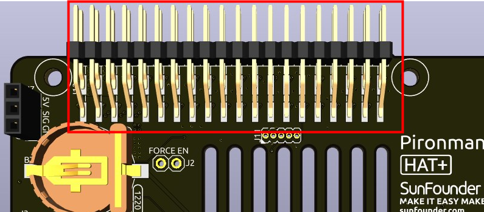

.. note::

    Hello, welcome to the SunFounder Raspberry Pi & Arduino & ESP32 Enthusiasts Community on Facebook! Dive deeper into Raspberry Pi, Arduino, and ESP32 with fellow enthusiasts.

    **Why Join?**

    - **Expert Support**: Solve post-sale issues and technical challenges with help from our community and team.
    - **Learn & Share**: Exchange tips and tutorials to enhance your skills.
    - **Exclusive Previews**: Get early access to new product announcements and sneak peeks.
    - **Special Discounts**: Enjoy exclusive discounts on our newest products.
    - **Festive Promotions and Giveaways**: Take part in giveaways and holiday promotions.

    👉 Ready to explore and create with us? Click [|link_sf_facebook|] and join today!

Pironman 5 Mini HAT
===========================================

.. image:: img/pironman5mini_hat.png

RGB LEDs
------------

.. image:: img/io_board_rgb.png

The board features 4 WS2812 RGB LEDs, 
offering customizable control. 
Users can turn them on or off, change the color, 
adjust the brightness, switch display modes, and set the speed of changes.

* To modify the on and off state of the RGB LEDs, ``true`` to turn on the RGB LEDs, ``false`` to turn them off.

.. code-block:: shell

  sudo pironman5 -re true

* To change their color, input the desired hexadecimal color values, such as ``fe1a1a``.

.. code-block:: shell

  sudo pironman5 -rc fe1a1a

* To change the brightness of the RGB LED (range: 0 ~ 100%):

.. code-block:: shell

  sudo pironman5 -rb 100

* To switch RGB LED display modes, choose from options: ``solid/breathing/flow/flow_reverse/rainbow/rainbow_reverse/hue_cycle``:

.. note::

  If you set the RGB LED display mode to ``rainbow``, ``rainbow_reverse``, or ``hue_cycle``, you will not be able to set the color using ``pironman5 -rc``.

.. code-block:: shell

  sudo pironman5 -rs breathing

* To modify the speed of change (range: 0 ~ 100%):

.. code-block:: shell

  sudo pironman5 -rp 80

RGB Control Pin
-------------------------

The RGB LED is driven by SPI and connected to **GPIO10**, which is also the SPI MOSI pin. 
The two pins are used to connect the RGB to GPIO10. If not needed, the jumper can be removed.

 .. image:: img/io_board_rgb_pin.png

RGB OUT Pins
-------------------------

 .. image:: img/io_board_rgb_out.png

The WS2812 RGB LEDs support serial connection, allowing for the attachment of an external RGB LED strip. Connect the **SIG** pin to the external strip's **DIN** pin for expansion.

The default setup includes 4 RGB LEDs. Connect additional LEDs and update the count using:

.. code-block:: shell

  sudo pironman5 -rl 12

RGB Fan Pins
---------------

The IO expansion board supports to a 5V non-PWM fan. 

You need to connect the fan's wire to FAN port.

 .. image:: img/io_board_fan.png

The two sets of pins below J9 are the enable pins for the fan and its RGB. By default, jumpers are inserted on these pins, allowing GPIO6 and GPIO5 to control the on and off states of the fan and its LED. If the fan and LED are not required to be operated, the corresponding jumpers can be removed to release GPIO6 or GPIO5.

 .. image:: img/io_board_fan_j9.png

You can use command to configure the operating mode of the RGB fan. These modes determine the conditions under which the RGB fan will activate.

  For instance, if set to **1: Performance** mode, the RGB fan will activate at 50°C.

  .. code-block:: shell

    sudo pironman5 -gm 3

  * **4: Quiet**: The RGB fan will activate at 70°C.
  * **3: Balanced**: The RGB fan will activate at 67.5°C.
  * **2: Cool**: The RGB fan will activate at 60°C.
  * **1: Performance**: The RGB fan will activate at 50°C.
  * **0: Always On**: The RGB fan will always on.

If you connect the control pin of the RGB fan to different pins on the Raspberry Pi, you can use the following command to change the pin number.

.. code-block:: shell

  sudo pironman5 -gp 18

Power Switch Conventor
--------------------------------------

**Adding the Power Button**

* The Raspberry Pi 5 features a **J2** jumper, situated between the RTC battery connector and the board edge. This breakout enables the addition of a custom power button to the Raspberry Pi 5 by connecting a Normally Open (NO) momentary switch across the two pads. Briefly engaging this switch mimics the onboard power button's functionality.

  .. image:: img/pi5_j2.jpg

* The Pironman 5 Mini extends the **J2** jumper to an external power button using two Pogo pins.

  .. image:: img/power_switch_j2.jpeg

  .. image:: img/power_switch_j2_2.jpeg

* Now, the Raspberry Pi 5 can be powered on and off using the Power Button.

  .. image:: img/pironman_button.JPG

**Power Cycling**

Upon initially powering your Raspberry Pi 5, it will automatically turn on and boot into the operating system without the need to press the button.

If running the Raspberry Pi Desktop, a brief press of the power button initiates a clean shutdown process. A menu will appear, offering options to shutdown, reboot, or logout. Selecting an option or pressing the power button again will start a clean shutdown.

.. image:: img/button_shutdown.png

**Shutdown**

    * If you run Raspberry Pi **Raspberry Pi OS Desktop** system, you can press the power button twice in quick succession to shutdown. 
    * If you run Raspberry Pi **Raspberry Pi OS Lite** system without a desktop, press the power button a single time to initiate a shutdown.
    * To force a hard shutdown, press and hold the power button.

**Power on**

    * If the Raspberry Pi board is shut down, but still powered, single-press to power on from a shutdown state.

.. note::

    If you are running a system that does not support a shutdown button, you can hold it for 5 seconds to force a hard shutdown, and single-press to power on from a shutdown state.

NVMe Module
-------------------------------------------

Pironman 5 mini integrates a PCIe adapter module for NVMe SSD. It supports four different sizes of NVMe SSDs: 2230, 2242, 2260, and 2280, all fitting into an M.2 M key slot.

.. image:: img/nvme_p.png

* **STA**: A Status LED indicator.
* **PWR**: A Power LED indicator.

  .. image:: img/nvme_led.png

* The module connects through a 16P 0.5mm reverse FFC (Flexible Flat Cable) or a custom impedance-matched FPC (Flexible Printed Circuit) cable.

  .. image:: img/nvme_pcie.png

* **FORCE ENABLE**: The onboard power supply is activated by the switch signal from the PCIe interface. After the Raspberry Pi is powered on, it sends a signal to turn on the 3.3V power supply. If some systems do not support the switch signal or for other reasons, you can short-circuit J2 FORCE ENABLE by soldering a wire between the two floating pads to force the onboard 3.3V power supply to power the NVMe.

  .. image:: img/nvme_j2.png

**About the Model**

M.2 SSDs, known for their compact size, come in various types mainly differentiated by their keying (notch design on the connector) and the interface they use. Here are the primary types:

* **M.2 SATA SSDs**: These use the SATA interface, similar to 2.5-inch SATA SSDs but in the smaller M.2 form factor. They are limited by the SATA III maximum speeds of around 600 MB/s. These SSDs are compatible with M.2 slots keyed for B and M keys.
* **M.2 NVMe SSDs**: These SSDs use the NVMe protocol over PCIe lanes and are significantly faster than M.2 SATA SSDs. They are suitable for applications requiring high read/write speeds like gaming, video editing, and data-intensive tasks. These SSDs typically require M-keyed slots. These drives utilize the PCIe (Peripheral Component Interconnect Express) interface, with different versions like 3.0, 4.0, and 5.0. Each new version of PCIe effectively doubles the data transfer speed of its predecessor. However, the Raspberry Pi 5 uses a PCIe 3.0 interface, capable of delivering transfer speeds up to 3,500 MB/s. 

M.2 SSDs come in three key types: B key, M key, and B+M key. However, later on, the B+M key was introduced, combining the functionalities of the B key and M key. As a result, it replaced the standalone B key. Please refer to the image below.

.. image:: img/ssd_key.png

In general, M.2 SATA SSDs are B+M-keyed (can fit in sockets for B-keyed and M-keyed modules), while M.2 NVMe SSDs for PCIe 3.0 x4 lane are M-keyed.

.. image:: img/ssd_model2.png

**About the Length**

M.2 modules come in different sizes and can also be utilized for Wi-Fi, WWAN, Bluetooth, GPS, and NFC.

Pironman 5 supports four (PCIe Gen 2.0 / PCIe Gen 3.0) NVMe M.2 SSD sizes based on their names: 2230, 2242, 2260, and 2280. The "22" is the width in millimeters (mm), and the two following numbers are the length. The longer the drive, the more NAND flash chips can be mounted; therefore, the more capacity.

1220RTC Battery Holder
---------------------------------

.. image:: img/battery_holder.png

A 1220RTC battery holder is incorporated for convenient installation of an RTC battery. It connects to the Raspberry Pi's RTC interface via an SH1.0 2P reverse cable. 

The battery holder is compatible with both CR1220 and ML1220 batteries. If using an ML1220 (Lithium Manganese Dioxide battery), charging can be configured directly on the Raspberry Pi. Note that the CR1220 is not rechargeable.

**Enabling Trickle Charging**

.. warning::

  If you're using a CR1220 battery, do not enable trickle charging as it can cause irreparable damage to the battery and risk damaging the board.

By default, the trickle charging feature for the battery is disabled. The ``sysfs`` files indicate the current trickle charging voltage and limits:

.. code-block:: shell

    pi@raspberrypi:~ $ cat /sys/devices/platform/soc/soc:rpi_rtc/rtc/rtc0/charging_voltage
    0
    pi@raspberrypi:~ $ cat /sys/devices/platform/soc/soc:rpi_rtc/rtc/rtc0/charging_voltage_max
    4400000
    pi@raspberrypi:~ $ cat /sys/devices/platform/soc/soc:rpi_rtc/rtc/rtc0/charging_voltage_min
    1300000

To enable trickle charging, add ``rtc_bbat_vchg`` to ``/boot/firmware/config.txt``:

  * Open the ``/boot/firmware/config.txt``.
  
    .. code-block:: shell
    
      sudo nano /boot/firmware/config.txt
      
  * Add ``rtc_bbat_vchg`` to ``/boot/firmware/config.txt``.
  
    .. code-block:: shell
    
      dtparam=rtc_bbat_vchg=3000000
  
After rebooting, the system will display:

.. code-block:: shell

    pi@raspberrypi:~ $ cat /sys/devices/platform/soc/soc:rpi_rtc/rtc/rtc0/charging_voltage
    3000000
    pi@raspberrypi:~ $ cat /sys/devices/platform/soc/soc:rpi_rtc/rtc/rtc0/charging_voltage_max
    4400000
    pi@raspberrypi:~ $ cat /sys/devices/platform/soc/soc:rpi_rtc/rtc/rtc0/charging_voltage_min
    1300000

This confirms the battery is now under trickle charging. To disable this feature, simply remove the ``dtparam`` line from ``config.txt``.

Pin Headers
--------------

Two right-angle header connectors extend the Raspberry Pi's GPIO, but note that the IR receiver, RGB LED, and fan occupy some pins. Remove the corresponding jumper caps to utilize these pins for other functions.

.. list-table:: 
  :widths: 25 25
  :header-rows: 1

  * - Pironman 5 Mini
    - Raspberry Pi 5
  * - FAN(Optional)
    - GPIO6
  * - FAN RGB(Optional)
    - GPIO5
  * - RGB(Optional)
    - GPIO10