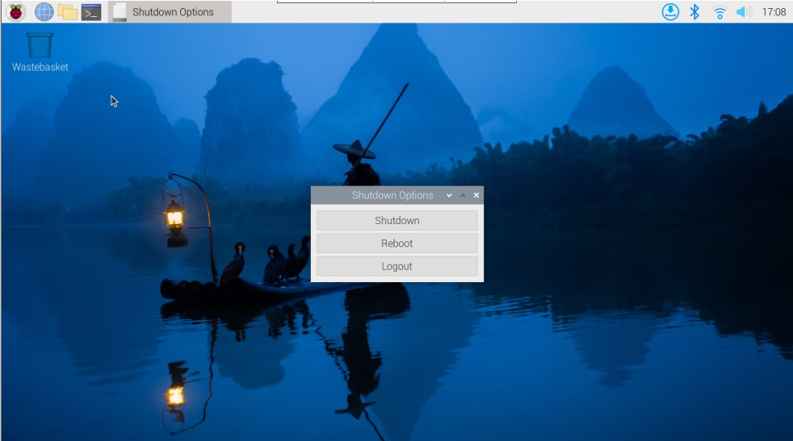

.. note::

    こんにちは！SunFounderのRaspberry Pi・Arduino・ESP32 愛好者向けFacebookコミュニティへようこそ！ 同じ情熱を持つ仲間たちと一緒に、Raspberry Pi・Arduino・ESP32の世界をさらに深く探求しましょう。

    **Why Join?**

    - **Expert Support**：購入後の問題や技術的な課題を、コミュニティと当社のチームがサポートします。
    - **Learn & Share**：チュートリアルやヒントを共有してスキルを高めましょう。
    - **Exclusive Previews**：新製品の発表や先行情報をいち早く入手できます。
    - **Special Discounts**：最新製品に限定割引でアクセスできます。
    - **Festive Promotions and Giveaways**：プレゼントキャンペーンやシーズンイベントに参加しましょう。

    👉 創造と発見の旅に出かけませんか？[|link_sf_facebook|] をクリックして今すぐ参加！

Pironman 5 Mini HAT
===========================================

.. image:: img/pironman5mini_hat.png

RGB LED
------------

.. image:: img/io_board_rgb.png

このボードには、制御可能なWS2812 RGB LEDが4個搭載されています。  
オン／オフの切り替え、色変更、輝度調整、表示モードの切り替え、点灯速度の調整が可能です。

* RGB LEDのオン／オフを切り替えるには、 ``true`` でオン、 ``false`` でオフに設定します。

.. code-block:: shell

  pironman5 -re true

* 色を変更するには、例： ``fe1a1a`` のような16進カラーコードを入力します。

.. code-block:: shell

  pironman5 -rc fe1a1a

* 輝度を変更（0〜100％）するには：

.. code-block:: shell

  pironman5 -rb 100

* 表示モードを変更するには、以下から選択します： ``solid/breathing/flow/flow_reverse/rainbow/rainbow_reverse/hue_cycle``

.. note::

  表示モードを ``rainbow``、 ``rainbow_reverse``、または ``hue_cycle`` に設定すると、 ``pironman5 -rc`` による色指定は無効になります。

.. code-block:: shell

  pironman5 -rs breathing

* 点灯速度の調整（0〜100％）：

.. code-block:: shell

  pironman5 -rp 80

RGB制御ピン
-------------------------

RGB LEDはSPI接続で動作し、 **GPIO10** （SPI MOSIピン）に接続されています。  
ジャンパーを介してGPIO10に接続されており、必要なければジャンパーを取り外すことでピンを解放できます。

.. image:: img/io_board_rgb_pin.png

RGB OUTピン
-------------------------

.. image:: img/io_board_rgb_out.png

WS2812 RGB LEDは直列接続に対応しており、外部のRGB LEDテープを追加可能です。  
**SIG** ピンを外部テープの **DIN** ピンに接続してください。

デフォルトでは4個のRGB LEDが設定されています。LEDを追加する場合は以下のように数を更新します：

.. code-block:: shell

  pironman5 -rl 12

RGBファンピン
---------------

I/O拡張ボードは5Vの非PWMファンに対応しています。  
ファンの電源線はFANポートに接続してください。

.. image:: img/io_board_fan.png

J9の下にある2組のピンは、ファンおよびそのRGBの制御用です。  
デフォルトではジャンパーが挿入されており、GPIO6とGPIO5でファンとLEDのON/OFFが制御されます。  
制御を不要とする場合、ジャンパーを外すことでGPIOピンを解放可能です。

.. image:: img/io_board_fan_j9.png

RGBファンの動作モードを設定するには以下のコマンドを使用します。  
モードに応じて、ファンが動作を開始する温度が変わります。

例： **1: Performance** モードでは、50°Cでファンが動作開始します。

.. code-block:: shell

  pironman5 -gm 3

* **4: Quiet**：70°Cで動作開始  
* **3: Balanced**：67.5°Cで動作開始  
* **2: Cool**：60°Cで動作開始  
* **1: Performance**：50°Cで動作開始  
* **0: Always On**：常時ON

他のGPIOピンに接続する場合は以下でピン番号を変更可能です：

.. code-block:: shell

  sudo pironman5 -gp 18

電源スイッチ変換器
--------------------------------------

**電源ボタンの追加について**

* Raspberry Pi 5には、 **J2** ジャンパーがRTCバッテリ端子と基板端の間にあります。  
  ここに通常開(N.O.)のモーメンタリスイッチを接続することで、電源ボタンとして機能させることができます。

  .. image:: img/pi5_j2.jpg

* Pironman 5 Miniは、 **J2** を2つのポゴピンで外部電源ボタンに延長しています。

  .. image:: img/power_switch_j2.jpeg  

  .. image:: img/power_switch_j2_2.jpeg

* これにより、Raspberry Pi 5は電源ボタンでオン／オフが可能になります。

  .. image:: img/pironman_button.JPG

**電源操作について**

初回起動時は自動的にOSが起動します。

Raspberry Pi Desktopを使用している場合は、ボタンを短く1回押すとシャットダウンメニューが表示されます。  
再度押すことで安全なシャットダウンが開始されます。

**シャットダウン**

* Raspberry Pi **Bookworm Desktop** ：電源ボタンをすばやく2回押す  
* Raspberry Pi **Bookworm Lite** （CLI）：電源ボタンを1回押す  
* 強制シャットダウン：電源ボタンを長押し

**起動**

* 電源が供給された状態で停止している場合、ボタンを1回押すと起動します。

.. note::

    シャットダウンボタン非対応のシステムでは、5秒以上長押しで強制シャットダウンが可能です。その後1回押すと起動します。

NVMeモジュール
-------------------------------------------

Pironman 5 MiniはNVMe SSD用のPCIeアダプタモジュールを内蔵しています。  
2230、2242、2260、2280サイズのNVMe M.2 SSD（Mキー）に対応しています。

.. image:: img/nvme_p.png

* **STA**：ステータスLED  
* **PWR**：電源LED  

  .. image:: img/nvme_led.png

* 16ピン 0.5mm ピッチのリバースFFCまたはインピーダンス調整済みFPCケーブルで接続します。

  .. image:: img/nvme_pcie.png

* **FORCE ENABLE**：一部システムでスイッチ信号が使用できない場合、J2の2つのパッドをショートして3.3V電源を強制的にオンにできます。

  .. image:: img/nvme_j2.png

**モデルについて**

M.2 SSDには接続方式とキーデザインによりいくつかのタイプがあります：

* **M.2 SATA SSD**：SATAインターフェース。通常BキーまたはB+Mキー。
* **M.2 NVMe SSD**：PCIe接続、Mキーが主流。高速転送が可能。

Raspberry Pi 5はPCIe 3.0 x1レーンを搭載しており、最大3,500MB/sの転送速度に対応します。

キーデザインは以下の通りです：

.. image:: img/ssd_key.png

NVMe SSDはMキー、またはB+Mキーに対応しており、以下のようなバリエーションがあります：

.. image:: img/ssd_model2.png

**長さについて**

Pironman 5は、2230／2242／2260／2280の4種類のM.2 SSDサイズに対応しています（PCIe Gen 2.0／Gen 3.0）

「22」は幅（mm）、「30」「42」などは長さ（mm）です。

.. image:: img/m2_ssd_size.png
  :width: 600

1220RTCバッテリホルダー
---------------------------------

.. image:: img/battery_holder.png

RTCバッテリー用の1220ホルダーが搭載されています。  
SH1.0 2PリバースケーブルでRaspberry PiのRTCインターフェースと接続します。

CR1220とML1220の両バッテリーに対応しています。  
ML1220は充電可能なタイプであり、設定によりトリクル充電を有効化できます（CR1220では不可）。

**トリクル充電の有効化**

.. warning::

  CR1220を使用している場合、トリクル充電を有効にしないでください。 バッテリーや基板の破損の原因となります。

デフォルトでは、バッテリーのトリクル充電機能は無効になっています。現在のトリクル充電の電圧および制限値は ``sysfs`` ファイルで確認できます：

.. code-block:: shell

    pi@raspberrypi:~ $ cat /sys/devices/platform/soc/soc:rpi_rtc/rtc/rtc0/charging_voltage
    0
    pi@raspberrypi:~ $ cat /sys/devices/platform/soc/soc:rpi_rtc/rtc/rtc0/charging_voltage_max
    4400000
    pi@raspberrypi:~ $ cat /sys/devices/platform/soc/soc:rpi_rtc/rtc/rtc0/charging_voltage_min
    1300000

トリクル充電を有効にするには、 ``/boot/firmware/config.txt`` に以下を追加：

  * ``/boot/firmware/config.txt`` を開きます。
  
    .. code-block:: shell
    
      sudo nano /boot/firmware/config.txt
      
  * ``/boot/firmware/config.txt`` に ``rtc_bbat_vchg`` を追加します。
  
    .. code-block:: shell
    
      dtparam=rtc_bbat_vchg=3000000

再起動後、以下のように表示されれば、トリクル充電が有効になっていることを確認できます：

.. code-block:: shell

    pi@raspberrypi:~ $ cat /sys/devices/platform/soc/soc:rpi_rtc/rtc/rtc0/charging_voltage
    3000000
    pi@raspberrypi:~ $ cat /sys/devices/platform/soc/soc:rpi_rtc/rtc/rtc0/charging_voltage_max
    4400000
    pi@raspberrypi:~ $ cat /sys/devices/platform/soc/soc:rpi_rtc/rtc/rtc0/charging_voltage_min
    1300000

この数値が表示されれば、バッテリーへのトリクル充電が正常に動作していることを示します。  
機能を無効化したい場合は、 ``config.txt`` から ``dtparam`` の行を削除してください。

ピンヘッダー
-------------------

.. image:: img/io_board_pin_header.png

Raspberry PiのGPIOを拡張するための2つのL字型ヘッダーが搭載されていますが、IR受信機、RGB LED、ファンが一部のピンを占有しています。  
これらのピンを他の用途で使用したい場合は、対応するジャンパーキャップを取り外してください。

.. list-table:: 
  :widths: 25 25
  :header-rows: 1

  * - Pironman 5 Mini
    - Raspberry Pi 5
  * - FAN(Optional)
    - GPIO6
  * - FAN RGB(Optional)
    - GPIO5
  * - RGB(Optional)
    - GPIO10