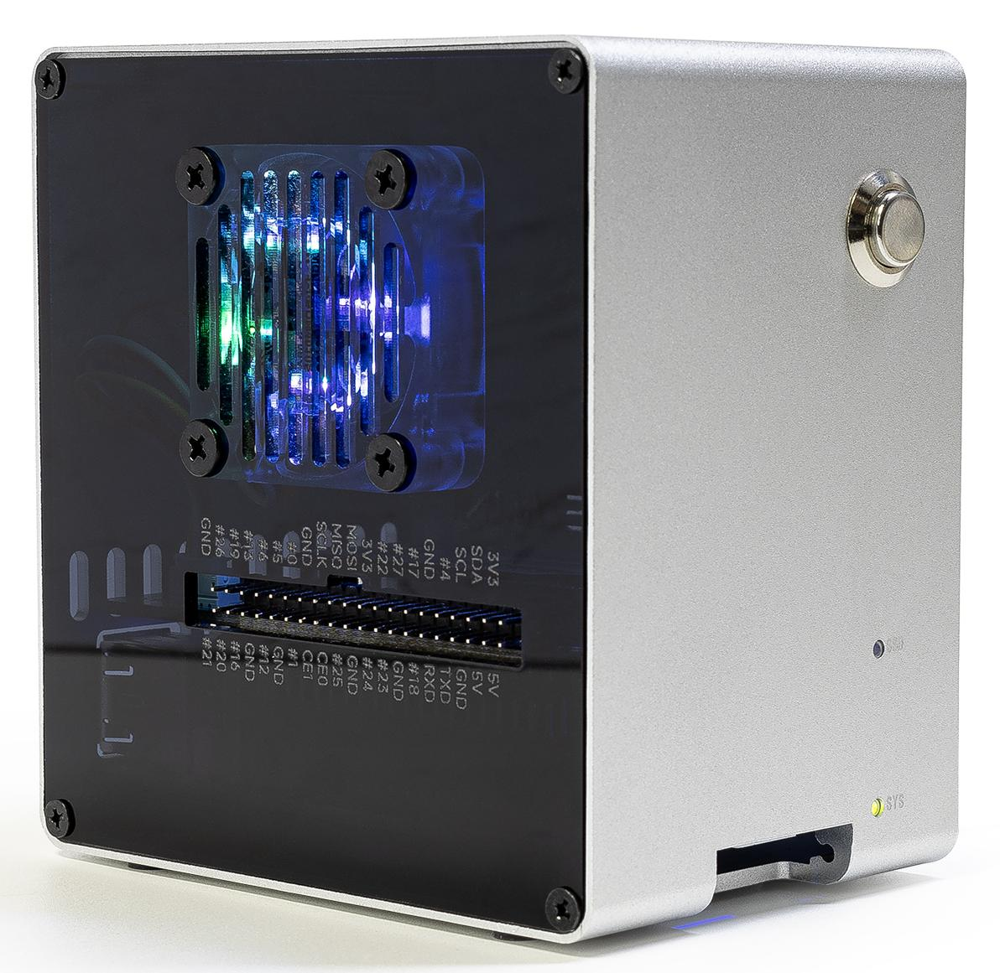
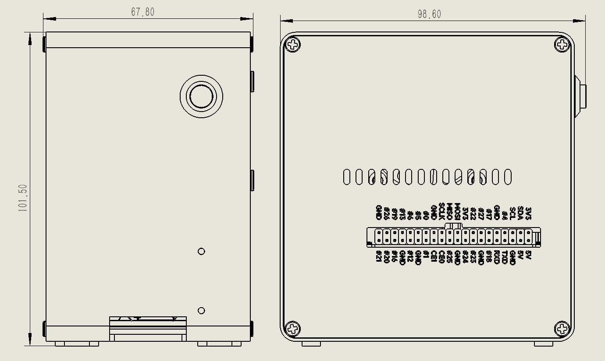

.. _intro_pironman5_mini: 

Pironman 5 Mini
=========================================

Merci d’avoir choisi notre |link_pironman5_mini|.

Le Pironman 5 Mini est le tout dernier modèle de la série de boîtiers Raspberry Pi Pironman. Conçu pour offrir une solution compacte mais complète aux passionnés de Raspberry Pi, il se distingue par son boîtier élégant en alliage d’aluminium argenté et ses panneaux latéraux en acrylique transparent, alliant ainsi esthétique et performance dans un format réduit.

Parmi ses caractéristiques principales : un bouton d’alimentation dédié, un système de refroidissement actif similaire à celui du ventilateur officiel Raspberry Pi, un ventilateur RGB latéral pour un meilleur flux d’air, une pile RTC, ainsi que des LED RGB WS2812-5050 colorées. Son extension GPIO permet de développer facilement les fonctionnalités de votre Raspberry Pi. Le boîtier prend également en charge les SSD NVMe via un emplacement PCIe 2.0 M.2 M key (formats 2230, 2242, 2260, 2280), ce qui en fait un choix idéal pour les projets nécessitant un stockage rapide et fiable.

.. toctree::
    :maxdepth: 1

    About this Kit <self>
    what_do_we_need    
    assembly_instructions
    install/install_the_os
    set_up/set_up_pironman5
    control/control_pironman5
    hardware/hardware
    compitable_nvme_ssd
    combine_with_lcd
    faq

**Paramètres**

* Dimensions : 67,8 x 98,6 x 101,5 mm
* Matériaux
    * Corps principal : Alliage d’aluminium argenté
    * Deux panneaux latéraux : Acrylique transparent
* Plateforme prise en charge : Raspberry Pi 5
* Alimentation : USB Type C, 5V/5A
* Interfaces
    * GPIO standard 40 broches pour Raspberry Pi
    * Lecteur de carte Micro SD
    * Entrée alimentation USB Type C
    * 2 x USB 2.0
    * 2 x USB 3.0
    * Port LAN Gigabit
    * 2 x ports Micro HDMI 4Kp60
* 1 x bouton d’alimentation en métal
* 1 x ventilateur RGB (40x40x10 mm)
* 4 x LED RGB WS2812-5050
* 1 x refroidisseur actif
* 1 x PCIe 2.0 M.2 M key (2230, 2242, 2260, 2280) pour SSD NVMe
* 1 x pile 1220 pour l’horloge RTC

**Plan de dimensions**

