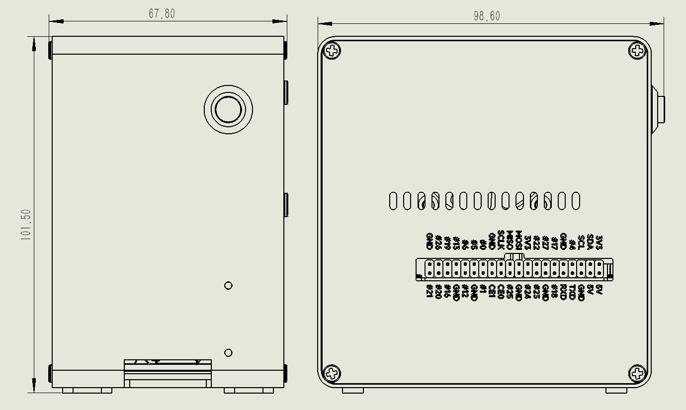

.. include:: /index.rst
   :start-after: start_hello_message
   :end-before: end_hello_message

.. _intro_pironman5_mini:

Pironman 5 Mini  
=========================================

Merci d’avoir choisi notre |link_pironman5_mini|.

.. image:: img/pironman5_mini_pic.jpg
    :width: 400
    :align: center

|link_pironman5_mini| est le modèle compact et simplifié de la série Pironman 5, offrant un format réduit sans compromis sur les fonctionnalités essentielles. Avec son corps élégant en alliage d’aluminium argenté et ses panneaux latéraux en acrylique transparent, il allie style et performance dans un design gain de place.

**Caractéristiques principales**

* **Commandes dédiées** : Bouton d’alimentation intégré pour une utilisation pratique.  
* **Refroidissement efficace** : Système de refroidissement actif similaire à celui du ventilateur officiel Raspberry Pi, avec en plus un Ventilateur GPIO latéral pour un meilleur flux d’air.  
* **Fonctionnalités supplémentaires** : Batterie RTC intégrée et 4 LED RGB WS2812-5050.  
* **Extension facile** : Extension GPIO pour des connexions matérielles flexibles.  
* **Stockage haute vitesse** : Emplacement PCIe 2.0 M.2 M-key prenant en charge les SSD NVMe aux formats **2230**, **2242**, **2260**, **2280**.  

Idéal pour les projets nécessitant **un stockage rapide, des performances stables et un design compact**, le Pironman 5 Mini apporte des fonctionnalités haut de gamme dans un format réduit.

.. note::

  Il est recommandé d’utiliser l’alimentation officielle 27W ou |link_sf_27w_supply| pour les produits de la série Pironman 5 afin d’éviter une alimentation insuffisante, ce qui pourrait entraîner un redémarrage du Raspberry Pi 5.

.. toctree::
    :maxdepth: 1

    À propos de ce kit <self>
    what_do_we_need    
    assembly_instructions
    install/install_the_os
    set_up/set_up_pironman5
    control/control_pironman5
    hardware/hardware
    optional_modules/optional_modules
    home_server/home_server
    compitable_nvme_ssd
    faq

**Paramètres**

* Dimensions : 67.8 x 98.6 x 101.5 mm  
* Matériau  
    * Corps principal : Alliage d’aluminium argenté  
    * Deux panneaux latéraux : Acrylique transparent noir  
* Plateforme prise en charge : Raspberry Pi 5  
* Entrée d’alimentation : USB Type C, 5V/5A  
* Interfaces  
    * GPIO standard Raspberry Pi 40 broches  
    * Logement Micro SD  
    * Entrée d’alimentation USB Type C  
    * 2 x USB 2.0  
    * 2 x USB 3.0  
    * Port LAN Gigabit  
    * 2 x Ports Micro HDMI 4Kp60  
* 1 x Bouton d’alimentation métallique  
* 1 x Ventilateur GPIO (40x40x10mm)  
* 4 x LED RGB WS2812-5050  
* 1 x Refroidisseur actif  
* 1 x PCIe 2.0 M.2 M-key (2230, 2242, 2260, 2280) pour SSD NVMe  
* 1 x Batterie 1220 pour RTC  

**Schéma dimensionnel**

