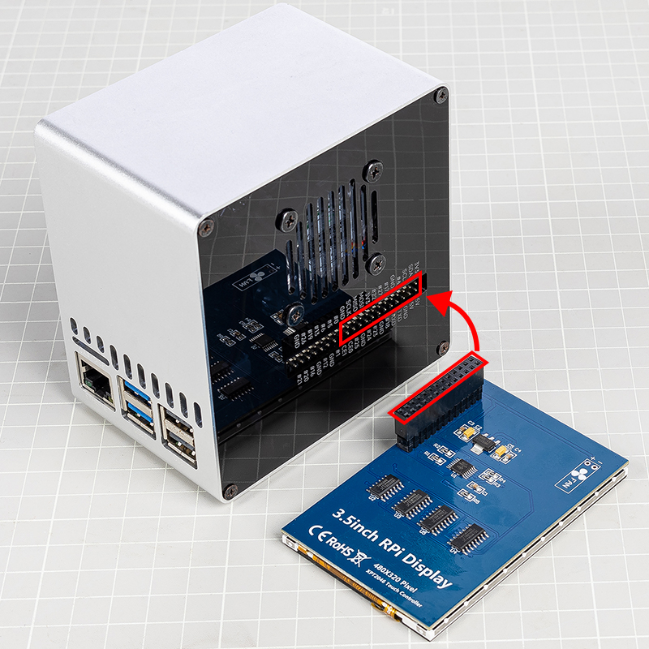
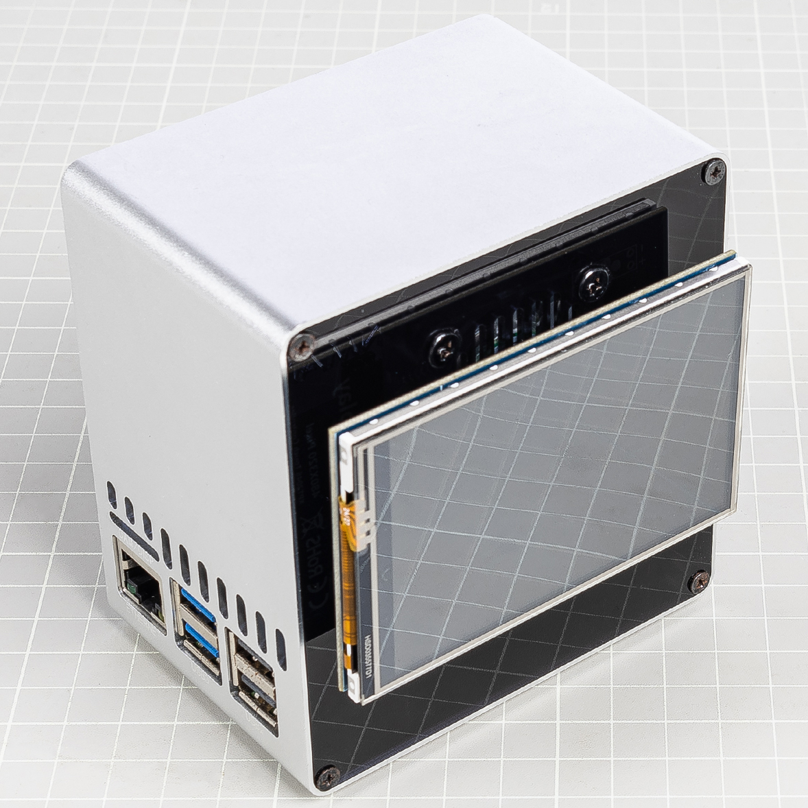

3.5-inch Touch Screen
=============================

This section is for Pironman 5 users who also purchased the `3.5-inch LCD screen <https://www.sunfounder.com/products/touchscreen-02?_pos=2&_sid=839d5db5b&_ss=r>`_.

The LCD screen can be directly mounted onto the Raspberry Pi's GPIO header, providing visual display and touch control functionality for the Pironman 5. Please follow the proper installation steps to ensure correct operation and to avoid any hardware damage.

You can learn more about the LCD screen and how to use it from the following link:
`3.5-inch LCD Documentation <http://wiki.sunfounder.cc/index.php?title=3.5_Inch_LCD_Touch_Screen_Monitor_for_Raspberry_Pi>`_.

**Assemble**

.. warning:: When installing the 3.5-inch LCD screen onto the Pironman 5, please make sure the pins are perfectly aligned. The LCD module's header must match the Raspberry Pi's GPIO interface exactly, with no offset or misalignment. Incorrect connections may damage the LCD screen or even the Raspberry Pi itself. Double-check all connections carefully before powering on!

**Remove RGB Jumper**

When using the Pironman 5 with the 3.5-inch touchscreen, note that the RGB LEDs on the IO Expander share the same SPI MOSI pin (GPIO10) as the display.
To prevent signal conflicts and ensure proper screen operation, disconnect the RGB LED jumper (above J9) to disable the LED connection.

Follow the steps below:

1. On the IO Expander, remove the jumper cap from the **RGB LED pins** (above J9) to disconnect the LEDs from the SPI MOSI pin (GPIO10).

   .. image:: img/lcd_to_mini0.jpg
      :width: 600
      :align: center
 

2. Run the following commands to **disable the RGB LED control service**:

   .. code-block:: bash

      pironman5 -re false
      sudo systemctl restart pironman5.service 

This will free up the SPI interface for the LCD screen, preventing any conflicts or display issues.

**Driver Installation**

This LCD module requires driver installation before use. The installation steps vary depending on the operating system.

* For Raspberry Pi OS, you can use the following command to install the driver:

   .. code-block:: bash

      sudo rm -rf LCD-show 
      git clone https://github.com/sunfounder/LCD-show.git 
      chmod -R 755 LCD-show 
      cd LCD-show/ 
      sudo ./LCD35-show

   After successful execution, you will see the Raspberry Pi desktop on the 3.5-inch LCD screen.

   If you want to rotate the display, you can run the following command:

   .. code-block:: bash

      cd LCD-show/
      sudo ./rotate.sh 90   

   After execution, the system will automatically reboot, and the screen will be rotated 90 degrees with correct display and touch. You can replace '90' with 0, 90, 180, or 270 to set the desired rotation angle.

* For Ubuntu, you can use the following command to install the driver:

   .. code-block:: bash

      sudo rm -rf LCD-show-ubuntu 
      git clone https://github.com/sunfounder/LCD-show-ubuntu.git 
      chmod -R 755 LCD-show-ubuntu 
      cd LCD-show-ubuntu/ 
      sudo ./LCD35-show

   After successful execution, you will see the Raspberry Pi desktop on the 3.5-inch LCD screen.

   If you want to rotate the display, you can run the following command:

   .. code-block:: bash

      cd LCD-show/
      sudo ./rotate.sh 90   

   After execution, the system will automatically reboot, and the screen will be rotated 90 degrees with correct display and touch. You can replace '90' with 0, 90, 180, or 270 to set the desired rotation angle.

* For Kali Linux, you can use the following command to install the driver:

   .. code-block:: bash

      sudo rm -rf LCD-show-kali 
      git clone https://github.com/sunfounder/LCD-show-kali.git 
      chmod -R 755 LCD-show-kali 
      cd LCD-show-kali/ 
      sudo ./LCD35-show

   After successful execution, you will see the Raspberry Pi desktop on the 3.5-inch LCD screen.

   If you want to rotate the display, you can run the following command:

   .. code-block:: bash

      cd LCD-show/
      sudo ./rotate.sh 90   

   After execution, the system will automatically reboot, and the screen will be rotated 90 degrees with correct display and touch. You can replace '90' with 0, 90, 180, or 270 to set the desired rotation angle.