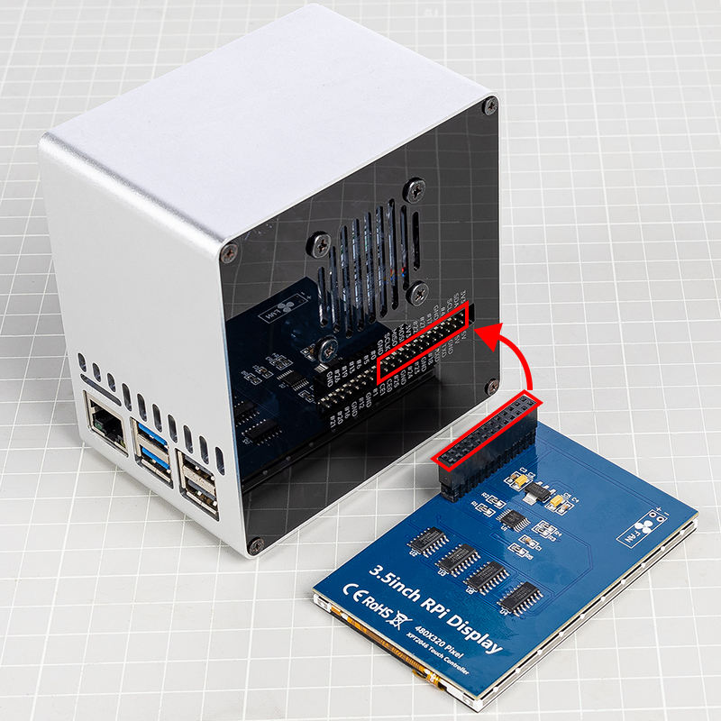
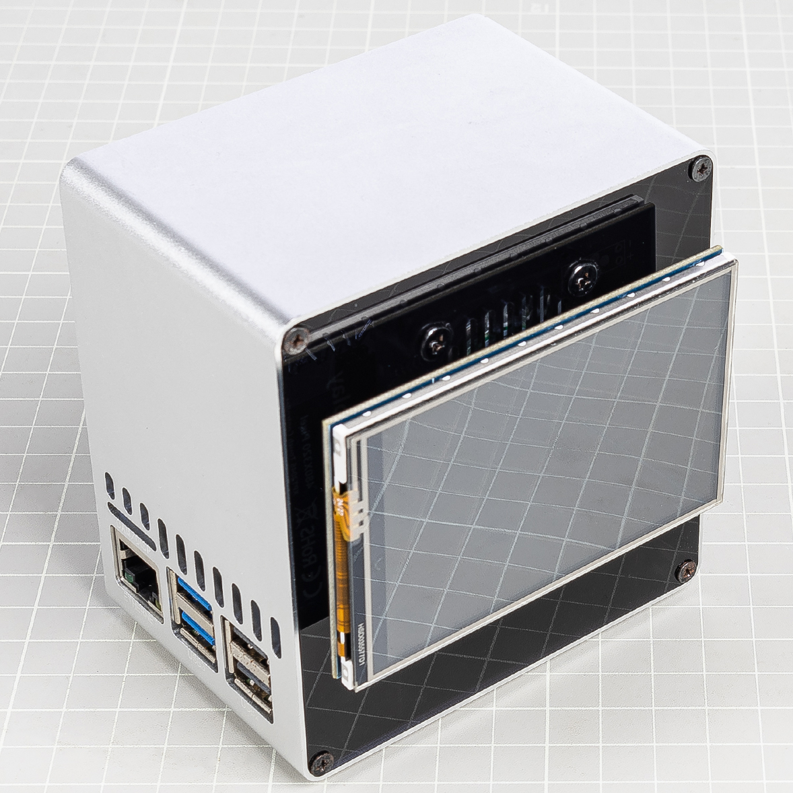

.. include:: /index.rst
   :start-after: start_hello_message
   :end-before: end_hello_message

Écran tactile 3,5 pouces  
=============================

.. note::

    La série Pironman 5 n’inclut pas d’écran tactile de 3,5 pouces.  
    Vous devrez en préparer un vous-même ou l’acheter sur notre site officiel :

   * `Écran tactile 3,5 pouces <https://www.sunfounder.com/products/touchscreen-02>`_

L’écran tactile de 3,5 pouces se connecte directement à l’en-tête GPIO du Raspberry Pi,  
fournissant à la fois l’affichage et le contrôle tactile pour le Pironman 5.  
Veuillez suivre attentivement les étapes afin de garantir une installation correcte et d’éviter tout dommage matériel.

Plus de détails peuvent être trouvés ici :  
`Documentation de l’écran tactile 3,5 pouces <http://wiki.sunfounder.cc/index.php?title=3.5_Inch_LCD_Touch_Screen_Monitor_for_Raspberry_Pi>`_.

**Assemblage**

.. warning:: 
   
   Lors de l’installation de l’écran tactile 3,5 pouces sur le Pironman 5, assurez-vous que les broches soient parfaitement alignées.  
   L’en-tête doit correspondre exactement à l’interface GPIO du Raspberry Pi, sans décalage.  
   Un mauvais alignement peut endommager l’écran ou même le Raspberry Pi.  
   Vérifiez soigneusement les connexions avant la mise sous tension !

**Retirer le cavalier RGB**

Lorsque vous utilisez le Pironman 5 avec l’écran tactile 3,5 pouces,  
notez que les LED RGB de l’IO Expander partagent la même broche SPI MOSI (GPIO10) que l’écran.  
Pour éviter les conflits et garantir un fonctionnement correct :

1. Sur l’IO Expander, retirez le cavalier des **broches RGB LED** (au-dessus de J9).

   .. image:: img/lcd_to_mini0.jpg
      :width: 600
      :align: center

2. Désactivez le service de contrôle des LED RGB :

   .. code-block:: bash

      sudo pironman5 -re false
      sudo systemctl restart pironman5.service

Cela libère l’interface SPI pour l’écran tactile 3,5 pouces et évite les problèmes d’affichage.

**Installation du pilote**

Pour des instructions détaillées, veuillez consulter |link_3.5_screen|, qui décrit l'installation du pilote pour différents systèmes.