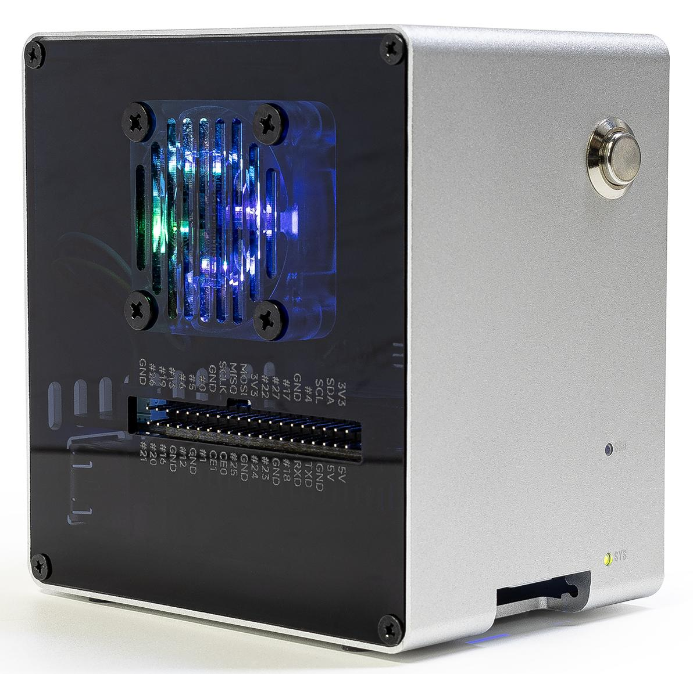

.. include:: /index.rst
   :start-after: start_hello_message
   :end-before: end_hello_message

Configuration sur Raspberry Pi OS/Ubuntu/Kali Linux/Homebridge
======================================================================

Si vous avez installé Raspberry Pi OS, Ubuntu, Kali Linux ou Homebridge sur votre Raspberry Pi, vous devrez configurer le Pironman 5 Mini en utilisant la ligne de commande. Vous trouverez ci-dessous des tutoriels détaillés.

.. note::

  Avant de procéder à la configuration, vous devez démarrer et vous connecter à votre Raspberry Pi.  
  Si vous n’êtes pas sûr de la procédure de connexion, vous pouvez visiter le site officiel de Raspberry Pi : |link_rpi_get_start|.

Configuration de l’arrêt pour couper l’alimentation GPIO
------------------------------------------------------------------------------

Pour éviter que le Ventilateur GPIO, alimenté par le GPIO du Raspberry Pi, reste actif après l’arrêt, il est essentiel de configurer le Raspberry Pi afin de désactiver l’alimentation GPIO.

#. Ouvrez l’outil de configuration EEPROM :

   .. code-block::

      sudo raspi-config

#. Accédez à **Advanced Options → A12 Shutdown Behaviour**.

   .. image:: img/shutdown_behaviour.png

#. Sélectionnez **B1 Full Power Off**.

   .. image:: img/run_power_off.png

#. Enregistrez les modifications. Il vous sera demandé de redémarrer afin que les nouveaux paramètres prennent effet.

.. _mini_download_pironman5_module:

Téléchargement et installation du module ``pironman5``
-----------------------------------------------------------

.. .. note::

..    Pour les systèmes « lite », installez d’abord des outils comme ``git``, ``python3``, ``pip3``, ``setuptools``, etc.

..    .. code-block:: shell

..       sudo apt-get install git -y
..       sudo apt-get install python3 python3-pip python3-setuptools -y

#. Téléchargez et installez le module ``pironman5`` depuis GitHub.

   .. code-block:: shell

      curl -sSL "https://raw.githubusercontent.com/sunfounder/sunfounder-installer-scripts/main/pironman5/install.sh" | sudo bash

   .. note::

      1. Si vous utilisez **Ubuntu**, installez ``curl`` d’abord : ``sudo apt install curl -y``

      2. Si vous utilisez la série Pironman 5 avec **PiPower 5**, exécutez plutôt la commande suivante :

      .. code-block:: shell

         curl -sSL "https://raw.githubusercontent.com/sunfounder/sunfounder-installer-scripts/main/pironman5/install.sh" | sudo bash -s -- --pipower5

#. Après avoir lancé l’installateur, sélectionnez votre modèle Pironman 5 (1~4).

   .. code-block:: shell

      Pironman 5 Installer v1.0.1
      Supports: 5 | 5 Mini | 5 Max | 5 Pro Max

      Please select your product model:
      1) Pironman 5
      2) Pironman 5 Mini
      3) Pironman 5 Max
      4) Pironman 5 Pro Max

      Enter number [1-4]:

#. Une fois l’installation terminée, redémarrez le Raspberry Pi comme demandé. Le premier démarrage peut prendre jusqu’à 30 secondes le temps que les services s’initialisent.

   Au redémarrage, le service ``pironman5.service`` sera lancé automatiquement.  
   Voici les principales configurations du Pironman 5 Mini :
   
   * Quatre LED WS2812 RGB s’allumeront en bleu avec un effet de respiration.
     
   .. note::
    
     * Les Ventilateurs GPIO sont configurés par défaut sur **Toujours activé**.  
       Pour définir des températures de déclenchement différentes, consultez :ref:`cc_control_fan_mini`.

#. Vous pouvez utiliser l’outil ``systemctl`` pour ``start``, ``stop``, ``restart`` ou vérifier le ``status`` du service ``pironman5.service``.

   .. code-block:: shell
     
      sudo systemctl restart pironman5.service
   
   * ``restart`` : Utilisez cette commande pour appliquer les modifications apportées aux paramètres du Pironman 5 Mini.  
   * ``start/stop`` : Active ou désactive le service ``pironman5.service``.  
   * ``status`` : Vérifie l’état de fonctionnement du programme ``pironman5`` à l’aide de l’outil ``systemctl``.

.. note::

   À ce stade, vous avez configuré avec succès le Pironman 5 Mini et il est prêt à être utilisé.  
   Pour un contrôle avancé de ses composants, consultez :ref:`control_commands_dashboard_mini`.
