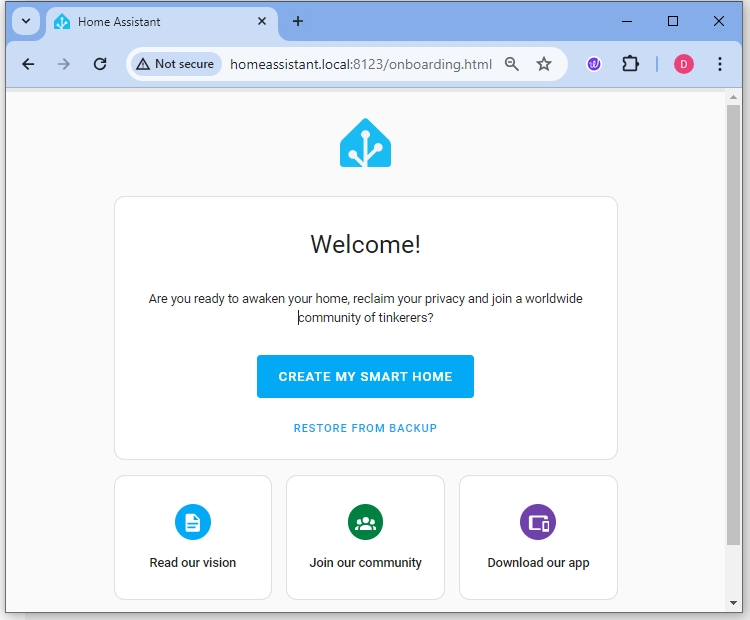
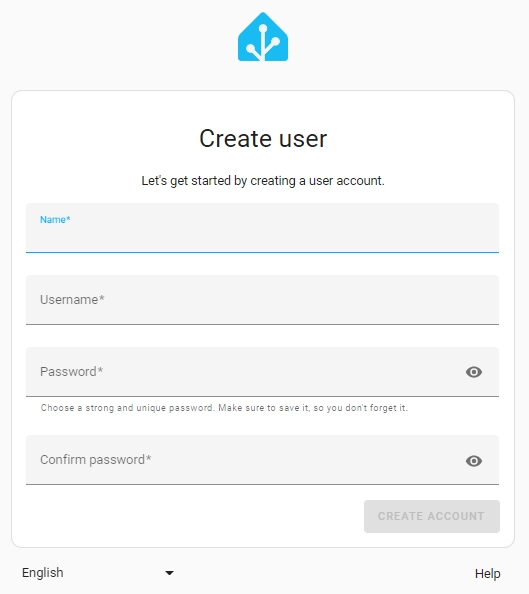
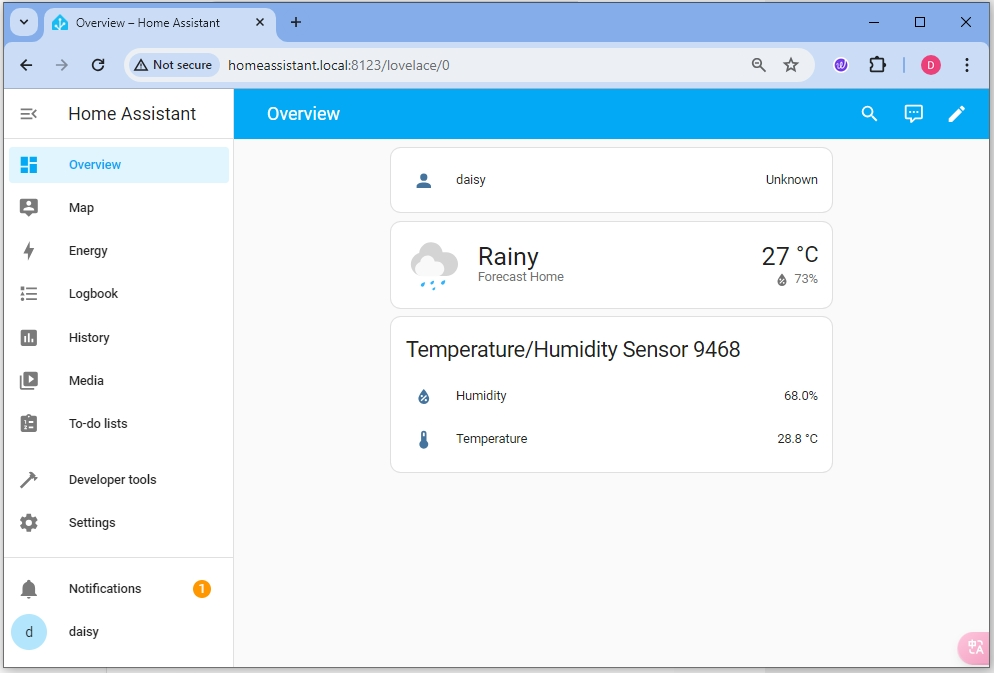

.. note::

    こんにちは、SunFounderのRaspberry Pi & Arduino & ESP32愛好家コミュニティへようこそ！Facebook上でRaspberry Pi、Arduino、ESP32についてもっと深く掘り下げ、他の愛好家と交流しましょう。

    **参加する理由は？**

    - **エキスパートサポート**：コミュニティやチームの助けを借りて、販売後の問題や技術的な課題を解決します。
    - **学び＆共有**：ヒントやチュートリアルを交換してスキルを向上させましょう。
    - **独占的なプレビュー**：新製品の発表や先行プレビューに早期アクセスしましょう。
    - **特別割引**：最新製品の独占割引をお楽しみください。
    - **祭りのプロモーションとギフト**：ギフトや祝日のプロモーションに参加しましょう。

    👉 私たちと一緒に探索し、創造する準備はできていますか？[|link_sf_facebook|]をクリックして今すぐ参加しましょう！

Pironman5をHome Assistantでセットアップ
============================================

1. Home Assistantにログインする
---------------------------------

* Pironman 5を起動した後、イーサネットケーブルを直接接続することをお勧めします。この方法で、コンピュータのブラウザを開き、 ``homeassistant.local:8123`` と入力してHome Assistantにアクセスできます。

* **CREATE MY SMART HOME** を選択し、アカウントを作成します。

* 指示に従って、場所やその他の設定を選択します。完了すると、Home Assistantのダッシュボードに入ります。

2. SunFounderアドオンリポジトリを追加する
----------------------------------------------------

Pironman 5の機能は、アドオンの形式でHome Assistantにインストールされます。まず、 **SunFounder** アドオンリポジトリを追加する必要があります。

#. **Settings** -> **Add-ons** を開きます。

    .. image:: img/home_setting_addon.png

#. 右下のプラス記号をクリックしてアドオンストアに入ります。

    .. image:: img/home_addon.png

#. アドオンストアで、右上のメニューをクリックし、 **Repositories** を選択します。

    .. image:: img/home_add_res.png

#. **SunFounder** アドオンリポジトリのURL「https://github.com/sunfounder/home-assistant-addon」を入力し、 **ADD** をクリックします。

    .. image:: img/home_res_add.png

#. 追加に成功したら、ポップアップウィンドウを閉じてページをリフレッシュします。SunFounderアドオンリストを見つけます。

    .. image:: img/home_addon_list.png
        
3. **Pi Config Wizard** アドオンをインストールする
------------------------------------------------------

**Pi Config Wizard** は、Pironman 5に必要なI2CやSPIの設定を有効にするのに役立ちます。その後必要がなければ、削除することもできます。

#. SunFounderアドオンリストで **Pi Config Wizard** を見つけてクリックします。

    .. image:: img/home_pi_config.png
    
#. **Pi Config Wizard** ページで、 **INSTALL** をクリックします。インストールが完了するまで待ちます。

    .. image:: img/home_config_install.png

#. インストールが完了したら、 **Log** ページに切り替えてエラーがないか確認します。

    .. image:: img/home_log.png
    
#. エラーがなければ、 **Info** ページに戻り、 **START** をクリックしてこのアドオンを起動します。

    .. image:: img/home_start.png
    
#. 次にWEB UIを開きます。

    .. image:: img/home_open_web_ui.png

#. Web UIでは、ブートパーティションをマウントするオプションが表示されます。 **MOUNT** をクリックしてパーティションをマウントします。

    .. image:: img/home_mount_boot.png

#. マウントに成功すると、I2CやSPIの設定およびconfig.txtファイルの編集オプションが表示されます。I2CとSPIを有効にするには、それぞれにチェックを入れます。表示が有効になったら、下部の再起動ボタンをクリックしてRaspberry Piを再起動します。

    .. image:: img/home_i2c_spi.png

#. 再起動後、ページをリフレッシュします。再びブートパーティションのマウントページに戻ります。再度 **MOUNT** をクリックします。

    .. image:: img/home_mount_boot.png
    
#. 通常、SPIは有効になっているが、I2Cは有効になっていません。I2Cを有効にするには、もう一度再起動が必要です。I2Cを再度有効にして、Raspberry Piを再起動します。

    .. image:: img/home_enable_i2c.png

#. 再起動後、再び **MOUNT** ページに戻ります。I2CとSPIの両方が有効になっていることが確認できます。

    .. image:: img/home_i2c_spi_enable.png

.. note::

    * ページをリフレッシュしてもマウントパーティションページに入らない場合は、 **Settings** -> **Add-ons** -> **Pi Config Wizard** を再度クリックしてください。
    * このアドオンが開始されているか確認します。開始されていない場合は、 **START** をクリックしてください。
    * 開始後、 **OPEN WEB UI** をクリックし、 **MOUNT** をクリックしてI2CとSPIが有効になっているか確認します。

4. **Pironman 5** アドオンをインストールする
---------------------------------------------

ここで、 **Pironman 5** アドオンのインストールを正式に開始します。

#. **Settings** -> **Add-ons** を開きます。

    .. image:: img/home_setting_addon.png

#. 右下のプラス記号をクリックしてアドオンストアに入ります。

    .. image:: img/home_addon.png

#. **SunFounder** アドオンリストで **Pironman 5** を見つけてクリックします。

    .. image:: img/home_pironman5_addon.png

#. ここでPironman 5アドオンをインストールします。

    .. image:: img/home_install_pironman5.png

#. インストールが完了したら、 **START** をクリックしてこのアドオンを起動します。OLEDスクリーンにRaspberry PiのCPU、温度、その他の関連情報が表示されます。四つのWS2812 RGB LEDが青色のブリージングモードで点灯します。

    .. image:: img/home_start_pironman5.png

#. これで **OPEN WEB UI** をクリックしてPironman 5のウェブページを開くことができます。また、Web UIをサイドバーに表示するオプションをチェックすることもできます。これにより、Home Assistantの左側のサイドバーにPironman 5オプションが表示され、クリックしてPironman 5ページを開くことができます。

    .. image:: img/home_web_ui.png

#. これでRaspberry Piの情報を確認し、RGBを設定し、ファンを制御するなどができます。

    .. image:: img/home_web.png
    
.. note::

    このPironman 5ウェブページの詳細情報と使用方法については、 :ref:`view_control_dashboard` を参照してください。
